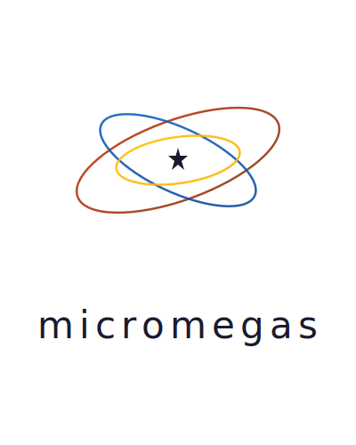

   
  <strong>A unified observability platform for logs, metrics, and traces, built for high-volume environments.</strong>

  
  
  

  <a href="https://madesroches.github.io/micromegas/docs/">Documentation</a> •
  <a href="https://madesroches.github.io/micromegas/rustdoc/micromegas/">Rust API Docs</a> •
  <a href="https://madesroches.github.io/micromegas/docs/grafana/">Grafana Plugin</a> •
  <a href="#presentations">Presentations</a>

---

Micromegas is an observability system designed to provide unified insights into complex applications. It allows you to collect and analyze logs, metrics, and traces in a single, scalable database. Our goal is to help you spend less time reproducing bugs and more time understanding and improving your software's quality and performance.

## Objectives

*   Empower developers with comprehensive insights, eliminating time-consuming bug reproduction.
*   Quantify issue frequency and severity to allow better priority management.
*   Provide detailed traces based on high-frequency telemetry to enable a deep understanding of every issue.

## Key Features

*   **🚀 Unified Observability:** Store and query logs, metrics, and traces together to get a complete picture of your application's behavior.
*   **⚡ Low-Overhead Instrumentation:** Client-side instrumentation adds minimal overhead, averaging just **20 ns per event** in the calling thread.
*   **🌊 High-Frequency Data Collection:** Built to handle up to **100,000 events per second** from a single instrumented process.
*   **☁️ Scalable & Cloud-Native:** The backend is designed to scale horizontally, capable of ingesting data from millions of concurrent processes using object storage (S3) and PostgreSQL.
*   **💰 Cost-Efficient by Design:** Keep costs low with tail sampling and on-demand ETL. Raw data is stored cheaply and only processed when you need to query it.
*   **🔍 Powerful SQL Interface:** Query your data using a powerful and familiar SQL interface, powered by [Apache DataFusion](https://datafusion.apache.org/) and accessible via [Apache Arrow FlightSQL](https://arrow.apache.org/blog/2022/02/16/introducing-arrow-flight-sql/).
*   **🔐 Enterprise Authentication:** Secure your data with OIDC authentication supporting both human users (browser-based login) and service accounts (OAuth 2.0 client credentials).

## How It Works

Micromegas consists of several key components:

1.  **Instrumentation Libraries:** Lightweight libraries for your applications (available in Rust and Unreal Engine) to send telemetry data.
2.  **Ingestion Service (`telemetry-ingestion-srv`):** A scalable service that receives telemetry data and writes it to blob storage.
3.  **Analytics Service (`flight-sql-srv`):** A DataFusion-powered service that exposes a FlightSQL endpoint for running queries against your data.
4.  **PostgreSQL Database:** Stores metadata about processes, streams, and data blocks, keeping the object storage indexable and fast to query.
5.  **Object Storage (S3/GCS):** Stores all raw telemetry payloads and materialized query results in Parquet format.

## Cost-Effectiveness

Unlike traditional observability platforms with opaque and often escalating costs, Micromegas offers a transparent and **orders of magnitude more efficient** solution. With Micromegas, you can afford to record billions of events without relying heavily on sampling, gaining a complete and accurate picture of your systems. By leveraging your own cloud infrastructure, Micromegas drastically reduces your observability spend, especially at scale.

Discover how Micromegas achieves this unparalleled cost efficiency and compare it with traditional solutions in our detailed [Cost Effectiveness](https://madesroches.github.io/micromegas/docs/cost-effectiveness/) document.

## Presentations

Learn more about Micromegas through our technical presentations:

- **[Unified Observability for Games](https://madesroches.github.io/micromegas/unified-observability-for-games/)** (January 2026) - Why a unified architecture is easier to use and more powerful
- **[High-Frequency Observability: Cost-Efficient Telemetry at Scale](https://madesroches.github.io/micromegas/high-frequency-observability/)** (October 2025) - How to record more data for less money with tail sampling and lakehouse architecture
- **[Design Presentation](https://madesroches.github.io/micromegas/doc/design-presentation/design.html)** (February 2025) - Architecture and design principles
- **[Unreal Engine Guide](https://madesroches.github.io/micromegas/doc/unreal-observability/unreal-observability.html)** (July 2024) - Integrating Micromegas with Unreal Engine

## Getting Started

To get started with Micromegas, please refer to the [Getting Started](https://madesroches.github.io/micromegas/docs/getting-started/) guide.

## Current Status & Roadmap

### Unreleased
* **Analytics Web App:**
  * User-defined screens for customizable dashboards
  * MVC view state refactor and XYChart generalization
  * Dynamic page titles and API consolidation under `/api` prefix
  * Production build improvements (disabled source maps)
* **Analytics & Query Features:**
  * `expand_histogram` table function with bar chart toggle
* **Data Integrity:**
  * `delete_duplicate_streams` and `delete_duplicate_processes` UDFs
* **Infrastructure:**
  * Automatic `micromegas_app` database creation on service startup
* **Security:** Multiple dependabot fixes for diff, grafana plugin, and other dependencies

### January 2026 - v0.18.0
* **Reliability & Data Integrity:**
  * Periodic duplicate block cleanup in maintenance daemon
  * Prevention of duplicate insertions for blocks, streams, and processes
  * New `delete_duplicate_blocks` UDF for manual cleanup
* **Ingestion Improvements:**
  * Proper HTTP error codes with client retry logic
* **Analytics & Performance:**
  * Arrow IPC streaming for query API
  * SHOW TABLES and information_schema support
  * Global LRU metadata cache for faster partition queries
  * New `jsonb_object_keys` UDF for JSON exploration
* **Analytics Web App:**
  * Migrated from Next.js to Vite for dynamic base path support
  * Property timeline for metrics visualization
  * Improved navigation and UI cleanup
* **Tracing & Instrumentation:**
  * `spawn_with_context` helper for proper async span parenting
  * Improved `#[span_fn]` rustdoc documentation
* **Unreal Engine:**
  * Additional metrics and process info in telemetry
* **Security Fixes:**
  * CVE-2026-21441 (urllib3), qs/rsa vulnerabilities, esbuild fix

### December 2025 - v0.17.0
* **Analytics Web App** - Complete UI redesign with dark theme and Micromegas branding:
  * **SQL Query Editor** with syntax highlighting, query history, and macros that integrate with UI controls
  * **Performance Analytics** - Visualize thread activity timelines and export traces to [Perfetto](https://ui.perfetto.dev/) for deep performance analysis
  * Grafana-style time range picker with relative and absolute time support
  * Process metrics screen with time-series charting
  * Multi-word search for process list and logs
* Per-service Docker images and modernized build scripts
* BASE_PATH and MICROMEGAS_PORT env vars for reverse proxy deployments
* Unreal Engine: scalability and VSync context in telemetry

For a detailed history of changes, please see the [CHANGELOG.md](./CHANGELOG.md) file.

## Contributing

We welcome contributions from the community! If you're interested in helping improve Micromegas, please see our [Contribution Guidelines](https://madesroches.github.io/micromegas/docs/contributing/) for more details on how to get involved.

Whether it's bug reports, feature requests, or code contributions, your input is valuable.

## License

Micromegas is licensed under the [Apache License, Version 2.0](./LICENSE).
