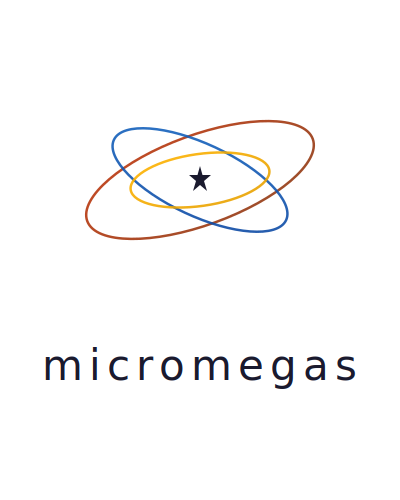

   
  <strong>A unified observability platform for logs, metrics, and traces, built for high-volume environments.</strong>

  
  
  

  <a href="https://micromegas.info/">Website</a> •
  <a href="https://micromegas.info/docs/">Documentation</a> •
  <a href="https://micromegas.info/rustdoc/micromegas/">Rust API Docs</a> •
  <a href="https://micromegas.info/docs/grafana/">Grafana Plugin</a> •
  <a href="#presentations">Presentations</a>

---

Micromegas is an observability system designed to provide unified insights into complex applications. It allows you to collect and analyze logs, metrics, and traces in a single, scalable database. Our goal is to help you spend less time reproducing bugs and more time understanding and improving your software's quality and performance.

## Objectives

*   Empower developers with comprehensive insights, eliminating time-consuming bug reproduction.
*   Quantify issue frequency and severity to allow better priority management.
*   Provide detailed traces based on high-frequency telemetry to enable a deep understanding of every issue.

## Key Features

*   **🚀 Unified Observability:** Store and query logs, metrics, and traces together to get a complete picture of your application's behavior.
*   **🔌 OpenTelemetry Compatible:** Native OTLP/HTTP ingestion alongside the high-performance native protocol — point any OTel SDK at the ingestion service and have logs, metrics, and traces land in the lakehouse.
*   **⚡ Low-Overhead Instrumentation:** Client-side instrumentation adds minimal overhead, averaging just **20 ns per event** in the calling thread.
*   **🌊 High-Frequency Data Collection:** Built to handle up to **100,000 events per second** from a single instrumented process.
*   **☁️ Scalable & Cloud-Native:** The backend is designed to scale horizontally, capable of ingesting data from millions of concurrent processes using object storage (S3) and PostgreSQL.
*   **💰 Cost-Efficient by Design:** Keep costs low with tail sampling and on-demand ETL. Raw data is stored cheaply and only processed when you need to query it.
*   **🔍 Powerful SQL Interface:** Query your data using a powerful and familiar SQL interface, powered by [Apache DataFusion](https://datafusion.apache.org/) and accessible via [Apache Arrow FlightSQL](https://arrow.apache.org/blog/2022/02/16/introducing-arrow-flight-sql/).
*   **📓 Interactive Notebooks:** A built-in web app for exploring data through composable notebook cells — queries, charts, flame graphs, maps, and logs — over the same SQL engine.
*   **🔐 Enterprise Authentication:** Secure your data with OIDC authentication supporting both human users (browser-based login) and service accounts (OAuth 2.0 client credentials).

## How It Works

Micromegas consists of several key components:

1.  **Instrumentation Libraries:** Lightweight libraries that send telemetry from your applications — native SDKs for Rust and Unreal Engine, a C ABI (`micromegas-capi`) for C/C++ and other FFI-capable languages, and a Blender add-on. See [Optimism](https://github.com/madesroches/optimism) for an example Bevy project using Micromegas.
2.  **Ingestion Service (`telemetry-ingestion-srv`):** A scalable service that receives telemetry (native transit/CBOR and OTLP/HTTP) and writes it to blob storage.
3.  **Analytics Service (`flight-sql-srv`):** A DataFusion-powered service that exposes a FlightSQL endpoint for running queries against your data.
4.  **Analytics Web App (`analytics-web-srv`):** A browser UI for exploring data through interactive notebooks.
5.  **Maintenance Daemon (`telemetry-admin`):** Runs the on-demand and continuous ETL that materializes raw blocks into Parquet views, so data is only processed when it's worth querying.
6.  **PostgreSQL Database:** Stores metadata about processes, streams, and data blocks, keeping the object storage indexable and fast to query.
7.  **Object Storage (S3/GCS):** Stores all raw telemetry payloads and materialized query results in Parquet format.

These roles can run as independent, horizontally-scalable services or bundled into a single `micromegas-monolith` process for local development and single-machine deployments. An optional shared read cache (`object-cache-srv`) can front the object store to cut egress cost and read latency across services.

## Cost-Effectiveness

Unlike traditional observability platforms with opaque and often escalating costs, Micromegas offers a transparent and **orders of magnitude more efficient** solution. With Micromegas, you can afford to record billions of events without relying heavily on sampling, gaining a complete and accurate picture of your systems. By leveraging your own cloud infrastructure, Micromegas drastically reduces your observability spend, especially at scale.

Discover how Micromegas achieves this unparalleled cost efficiency and compare it with traditional solutions in our detailed [Cost Effectiveness](https://micromegas.info/docs/cost-effectiveness/) document.

## Presentations

Learn more about Micromegas through our technical presentations:

- **[An Introduction to Micromegas](https://micromegas.info/intro-micromegas/)** (April 2026) - 30-minute overview: the unified pipeline, low-overhead instrumentation, and SQL on Arrow
- **[Interactive Notebooks for Observability](https://micromegas.info/notebooks/)** (February 2026) - Composable notebook cells with an in-browser query engine
- **[Unified Observability for Games](https://micromegas.info/unified-observability-for-games/)** (January 2026) - Why a unified architecture is easier to use and more powerful
- **[High-Frequency Observability: Cost-Efficient Telemetry at Scale](https://micromegas.info/high-frequency-observability/)** (October 2025) - How to record more data for less money with tail sampling and lakehouse architecture
- **[Design Presentation](https://micromegas.info/doc/design-presentation/design.html)** (February 2025) - Architecture and design principles

## Getting Started

To get started with Micromegas, please refer to the [Getting Started](https://micromegas.info/docs/getting-started/) guide.

## Recent Releases

### v0.26.0 (June 2026)
* `micromegas-monolith`: single-process deployment running all roles (`ingestion`, `analytics`, `web`, `admin`) in one binary — simplifies self-hosted and single-machine deployments
* Image streams: instrumented apps can send screenshots as telemetry via `send_image()`; queryable via the `images` SQL table; Unreal `telemetry.screenshot` console command with `telemetry.images.enable` CVar
* `#[micromegas_main]` extended with optional arguments (`ctrlc_handling`, `local_sink_enabled`, `local_sink_max_level`, `install_log_capture`, `system_metrics`, `telemetry_url`, `api_key`) for inline `TelemetryGuardBuilder` configuration
* Resilient Unreal telemetry sink: `FHttpRetrySystem` with exponential backoff, four priority queues (Metadata/Logs/Metrics/Traces), idle-aware spike sampling, `TimeSinceLastInput` metric
* ARM64 cross-compilation support in all production Dockerfiles; `build_docker_images.py --arm64` flag
* Deep `/ready` readiness probe for all services (PostgreSQL pool + blob storage verification, 503 on unhealthy)
* Graceful SIGTERM shutdown for all services with configurable drain period
* jemalloc global allocator for all production service binaries
* Image notebook cell: carousel viewer for images stored in the `images` view
* Chart threshold indicators: reference lines, per-row colors, series color assignment
* Map cell: orthographic camera mode, camera-relative keyboard controls, hover tooltip preview for markers
* Swimlane cell: optional color and label columns
* Log cell: resizable columns, one-click copy icon
* OTLP/JSON content-type support (`application/json`) on all three OTLP/HTTP routes
* `make_histogram` accepts runtime scalar bounds (CTEs, subqueries, CROSS JOIN columns)
* `format_value(value, unit)` template function for adaptive unit formatting in detail templates
* Batched expiry pipeline: bounded memory and transaction sizes for partition retirement, block deletion, and temporary-file cleanup; `DELETE…RETURNING` for atomic operation
* DataFusion 53.1; react-router 6.30.4 (CVE), esbuild 0.28.1, dompurify 3.4.11, undici ≥6.27.0 security updates

### v0.25.0 (May 2026)
* Native OTLP/HTTP ingestion for logs, metrics, and traces with `otel_spans` JIT view
* Map notebook cell: GLB models, native UE coordinates, primitive overlays with column-bound visual channels, admin Maps management UI
* `net_spans` JIT view with bandwidth flame chart for connection/object/property/RPC scopes
* Color and math UDFs: `rgba`, `lerp_color`, `color_scale`, `bin_center`, `lerp`, `unlerp`
* HTTP gateway `/gateway/health` liveness endpoint
* Unreal net trace instrumentation
* React 19 / R3F 9 / drei 10 / RTL 16 upgrade; Yarn 1 → Yarn 4 (Berry) migration
* Dev-worker ephemeral runner mode with persistent build caches
* 20+ Dependabot security updates across Rust, Python, and JS dependencies

### v0.24.0 (April 2026)
* `parse_block` table UDF for generic block inspection with transit-to-JSONB conversion
* Unified diff output in `micromegas-screens plan`/`apply`
* Flamechart WASD zoom fix for Chrome key-release edge cases
* Sub-microsecond flamechart span durations in nanoseconds
* Notebook variable URL desync and datasource revert fixes
* DataFusion 52.5, `rand` 0.9 migration, pyarrow ^23
* 20+ Dependabot security updates across Rust, Python, and JS dependencies

### v0.23.0 (March 2026)
* JSONB array UDFs: `jsonb_array_elements` (UDTF) and `jsonb_array_length` (scalar)
* CSV table provider with auto-discovery via `MICROMEGAS_STATIC_TABLES_URL`
* `FlightSqlServer` builder and `LakehouseContext::from_env()` convenience APIs
* Screens-as-code CLI (`micromegas-screens`) with Terraform-inspired workflow
* Object store env var credential support for S3/GCS/Azure
* Bearer token auth for analytics-web-srv
* Notebook cell selection macros in table column overrides
* DataFusion 52.4.0

### v0.22.0 (March 2026)
* Flame graph cell type with Three.js WebGL rendering
* Async span depth fixes with `SpanContextFuture`
* Default system properties (exe, hostname, CPU, memory, OS) on process metadata
* JSONPath UDFs (`jsonb_path_query`, `jsonb_path_query_first`) for JSONB columns
* Interactive row selection in table cells with `$cell.selected.column` macros
* `process_spans` table function for cross-thread and async span analysis
* Database migration: unique indexes on processes, streams, and blocks
* DataFusion 52.3

For the full history, see [CHANGELOG.md](./CHANGELOG.md).

## Contributing

We welcome contributions from the community! If you're interested in helping improve Micromegas, please see our [Contribution Guidelines](https://micromegas.info/docs/contributing/) for more details on how to get involved.

Whether it's bug reports, feature requests, or code contributions, your input is valuable.

## License

Micromegas is licensed under the [Apache License, Version 2.0](./LICENSE).
