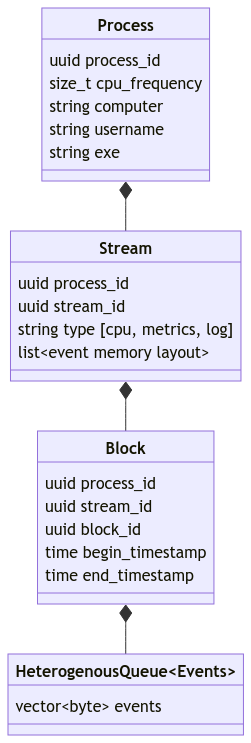

<script type="module">
  import mermaid from 'https://cdn.jsdelivr.net/npm/mermaid@10/dist/mermaid.esm.min.mjs';
  mermaid.initialize({ startOnLoad: true });
</script>

# Micromegas
Scalable Observability

Frebruary 2025

https://github.com/madesroches/micromegas/

Marc-Antoine Desroches <madesroches@gmail.com>

---
# Scalable Observability
 * The big picture: objectives and strategies to achieve them
 * High-frequency telemetry
 * Unified observability
 * Just-in-time ETL and tail sampling
 * Live ETL when possible
 * Incremental data reduction

---
# The Big Picture

## Objectives

 * Spend less time reproducing problems
   * Collect enough data to understand how to correct the problems. 
   * Quantify the frequency and severity of the issues instead of debugging the first one you can reproduce.
 * Unified observability: logs, metrics and traces in the same database.
 * Achieve better quality
   * Live dashboards to monitor the current state and react quickly
   * Retrospective dashboards to quantify trends and promote a global understanding
   
---

# The Big Picture
## Data flow
<div class="mermaid">
graph LR;
    rust-->ingestion-srv
    unreal-->ingestion-srv
    ingestion-srv-->postgresql[(PostgreSQL)]
    ingestion-srv-->s3[(S3)]
    postgresql-->flight-sql-srv
    s3-->flight-sql-srv
    flight-sql-srv-->grafana
    flight-sql-srv-->python_api[Python API]
</div>

---

# The Big Picture
## Data flow
<div class="mermaid">
graph LR;
    rust-->ingestion-srv
    unreal-->ingestion-srv
    ingestion-srv-->postgresql[(PostgreSQL)]
    ingestion-srv-->s3[(S3)]
    postgresql-->flight-sql-srv
    s3-->flight-sql-srv
    daemon<-->postgresql
    daemon<-->s3
    flight-sql-srv-->grafana
    flight-sql-srv-->python_api[Python API]
</div>

---
# The Big Picture

## High-frequency telemetry: collecting enough data

 * CPU traces: up to 200 000 events / second / process
   * Lots of data
 * Cheap to instrument 
   * 20 ns overhead in calling thread when recording high-frequency events
 * Cheap to ingest
   * Compressed payload sent directly to S3
 * Cheap to store
   * Most of the storage is cheap object storage

---

# Low Overhead Instrumentation (unreal)
## Data structures
Streams
 * log
 * metrics
 * thread (1 per thread, lock-free writing)

 

--- 

## Purposeful, manual instrumentation
Generated guard on the stack only holds one pointer to a static object that requires no initialization.

```c++
namespace MicromegasTracing
{
	CORE_API void BeginScope(const BeginThreadSpanEvent& event);
	CORE_API void EndScope(const EndThreadSpanEvent& event);

	struct SpanGuard
	{
		const SpanMetadata* Desc;
		explicit SpanGuard(const SpanMetadata* desc)
			: Desc(desc)
		{
			BeginScope(BeginThreadSpanEvent(desc, FPlatformTime::Cycles64()));
		}

		~SpanGuard()
		{
			EndScope(EndThreadSpanEvent(Desc, FPlatformTime::Cycles64()));
		}
	};
} // namespace MicromegasTracing

#define MICROMEGAS_SPAN_SCOPE(target, name)                                                                                     \
	static const MicromegasTracing::SpanMetadata PREPROCESSOR_JOIN(spanMeta, __LINE__)(name, target, TEXT(__FILE__), __LINE__); \
	MicromegasTracing::SpanGuard PREPROCESSOR_JOIN(spanguard, __LINE__)(&PREPROCESSOR_JOIN(spanMeta, __LINE__))

 ```

---

## Events are tiny and can reference static data.
```c++
namespace MicromegasTracing
{
	struct SpanMetadata
	{
		const TCHAR* Name;
		const TCHAR* Target;
		const TCHAR* File;
		uint32 Line;

		SpanMetadata(const TCHAR* name,
			const TCHAR* target,
			const TCHAR* file,
			uint32 line)
			: Name(name)
			, Target(target)
			, File(file)
			, Line(line)
		{
		}
	};

	struct BeginThreadSpanEvent
	{
		const SpanMetadata* Desc;
		uint64 Timestamp;

		BeginThreadSpanEvent(const SpanMetadata* desc, uint64 timestamp)
			: Desc(desc)
			, Timestamp(timestamp)
		{
		}
	};

	struct EndThreadSpanEvent
	{
		const SpanMetadata* Desc;
		uint64 Timestamp;

		EndThreadSpanEvent(const SpanMetadata* desc, uint64 timestamp)
			: Desc(desc)
			, Timestamp(timestamp)
		{
		}
	};
} // namespace MicromegasTracing
```
---
## Event buffers are sent as a simple memory copy
The memory layout of the events is determined using reflection and is necessary to read the data.

```c++

	template <>
	struct GetEventMetadata<BeginThreadSpanEvent>
	{
		UserDefinedType operator()()
		{
			return UserDefinedType(
				TEXT("BeginThreadSpanEvent"),
				sizeof(BeginThreadSpanEvent),
				false,
				{ MAKE_UDT_MEMBER_METADATA(BeginThreadSpanEvent, "thread_span_desc", Desc, SpanMetadata*, true),
					MAKE_UDT_MEMBER_METADATA(BeginThreadSpanEvent, "time", Timestamp, uint64, false) });
		}
	};


```

---

## fast & compact transmission

 1. Extract dependencies (references to static objects)
 1. Compress dependencies & events buffers using lz4
 1. Send using https

 ---
 ## Extract dependencies
 
 ```c++

 typedef MicromegasTracing::HeterogeneousQueue<
	MicromegasTracing::StaticStringDependency,
	MicromegasTracing::SpanMetadataDependency>
	ThreadDependenciesQueue;

struct ExtractThreadDependencies
{
	TSet<const void*> Ids;
	ThreadDependenciesQueue Dependencies;

	ExtractThreadDependencies()
		: Dependencies(1024 * 1024)
	{
	}

	void operator()(const MicromegasTracing::StaticStringRef& str)
	{
		bool alreadyInSet = false;
		Ids.Add(reinterpret_cast<void*>(str.GetID()), &alreadyInSet);
		if (!alreadyInSet)
		{
			Dependencies.Push(MicromegasTracing::StaticStringDependency(str));
		}
	}

	void operator()(const MicromegasTracing::SpanMetadata* desc)
	{
		bool alreadyInSet = false;
		Ids.Add(desc, &alreadyInSet);
		if (!alreadyInSet)
		{
			(*this)(MicromegasTracing::StaticStringRef(desc->Name));
			(*this)(MicromegasTracing::StaticStringRef(desc->Target));
			(*this)(MicromegasTracing::StaticStringRef(desc->File));
			Dependencies.Push(MicromegasTracing::SpanMetadataDependency(desc));
		}
	}

	void operator()(const MicromegasTracing::BeginThreadSpanEvent& event)
	{
		(*this)(event.Desc);
	}

	void operator()(const MicromegasTracing::EndThreadSpanEvent& event)
	{
		(*this)(event.Desc);
	}

	ExtractThreadDependencies(const ExtractThreadDependencies&) = delete;
	ExtractThreadDependencies& operator=(const ExtractThreadDependencies&) = delete;
};
```

 ---

# Scalable ingestion service

<div class="mermaid">
graph LR;
    rust-->ingestion-srv;
    unreal-->ingestion-srv;
    ingestion-srv-->datalake[(Data Lake)];
    datalake-->postgresql[("`**PostgreSQL**
    processes
    streams
    blocks`")]
    datalake-->S3[("`**S3**
    payloads`")]
</div>

---

# Scalable ingestion service
Event block as seen from ingestion-srv
```rust
/// payload sent by instrumented processes
#[derive(Debug, Clone, Serialize, Deserialize)]
pub struct BlockPayload {
    pub dependencies: Vec<u8>,
    pub objects: Vec<u8>,
}

/// block metadata sent by instrumented processes
#[derive(Debug, Clone, Serialize, Deserialize)]
pub struct Block {
    pub block_id: uuid::Uuid,
    pub stream_id: uuid::Uuid,
    pub process_id: uuid::Uuid,
    /// we send both RFC3339 times and ticks to be able to calibrate the tick
    pub begin_time: String,
    pub begin_ticks: i64,
    pub end_time: String,
    pub end_ticks: i64,
    pub payload: BlockPayload,
    pub object_offset: i64,
    pub nb_objects: i32,
}
```

---
# Scalable ingestion service
Recording an event block
```rust
{
    let begin_put = now();
    self.lake
        .blob_storage
        .put(&obj_path, encoded_payload.into())
        .await
        .with_context(|| "Error writing block to blob storage")?;
    imetric!("put_duration", "ticks", (now() - begin_put) as u64);
}

debug!("recording block_id={block_id} stream_id={stream_id} process_id={process_id}");
let begin_insert = now();
let insert_time = sqlx::types::chrono::Utc::now();
sqlx::query("INSERT INTO blocks VALUES($1,$2,$3,$4,$5,$6,$7,$8,$9,$10,$11);")
    .bind(block_id)
    .bind(stream_id)
    .bind(process_id)
    .bind(begin_time)
    .bind(block.begin_ticks)
    .bind(end_time)
    .bind(block.end_ticks)
    .bind(block.nb_objects)
    .bind(block.object_offset)
    .bind(payload_size as i64)
    .bind(insert_time)
    .execute(&self.lake.db_pool)
    .await
    .with_context(|| "inserting into blocks")?;
imetric!("insert_duration", "ticks", (now() - begin_insert) as u64);
```

---
# Unified observability

 * One extensible format for all data streams
   * Logs, metrics and traces stream contain different events, but they share the same format
 * One custom ingestion protocol
 * One database
 * One query language: SQL
 * One query protocol: FlightSQL
   * Grafana plugin forked from FlightSQL Grafana datasource
   * Custom python FlightSQL client

---

# Just-in-time ETL and tail sampling
## flight-sql-srv

Transformation of opaque binary data into tables

<div class="mermaid">
graph RL;
    cli[Python API]-->flight-sql-srv;
    grafana-->flight-sql-srv;
    flight-sql-srv-->etl[JIT ETL];
    etl-->datalake[(Datalake)];
    etl-->lakehouse[(Lakehouse)];
    lakehouse-->postgres[("`**PostgreSQL**
    tables partitions`")]
    lakehouse-->s3[("`**S3**
    parquet files`")]
    flight-sql-srv-->datafusion[Datafusion SQL engine];
    datafusion-->lakehouse
</div>

---

# Just-in-time ETL and tail sampling

```python
#materialize and query the view specific to that process using view_instance
sql = """
SELECT *
FROM view_instance('log_entries', '2faf371c-6941-46df-b4fb-236c999f0539')
ORDER BY time DESC
LIMIT 10
;"""
log = client.query(sql) #FlightSQL request
log # pandas dataframe
```

* flight-sql-srv receives SQL query
* `view_instance` function is called
   * fetch blocks tagged `log` from process `2faf371c-6941-46df-b4fb-236c999f0539`
   * decompress, parse, write parquet files containing log entries
* let Apache DataFusion run on the generated parquet files
* return Apache Arrow record batches

---

## Datalake vs Lakehouse vs Data Warehouse

|              | Datalake                               | Lakehouse | Data Warehouse |
|--------------|:--------------------------------------:|-----------:|--------------:|
| File format  | custom (memcopied events)              | Apache Parquet (columnar typed table) | hidden (columnar) |
|              | opaque                                 | industry standard                     |        |
| Writing      | easy & cheap                           | complex                               | slow  |
|              |                                        |                                       | requires a running cluster |
| Reading      | complex                                | fast & cheap                          | fast, but not cheap
|              | monolitic blob                         | segmented & indexed |

---

# Tail sampling

 * Because heavy data streams are unprocessed until requested...
 * And because it's cheap to delete data
 * And because it's cheap to keep data in S3
 * It's cheap to delay the decision to query or delete
 * Use information in low-frequency streams to sample high-frequency stream

---

# Live ETL when possible

 * Every second
   * `log` blocks received are processed into a global `log_entries` view.
   * `metrics` blocks received are processed into a global `measures` view.
 * Every minute
   * second partitions are merged into minute partitions
 * Every hour
   * minute partitions are merged into hours partitions
 * Global views grow quickly.
   * &#9989; simple queries on a small & recent time window
   * &#10060; queries on a large time window with joins


---

# Incremental data reduction: SQL-defined view

 * every second
   * execute `transform` SQL query to materialize
 * every minute
   * execute `merge` SQL query to merge already created partitions
 * every hour
   * execute `merge` SQL query to merge already created partitions

---

# Incremental data reduction: SQL-defined view
Example: log_entries_per_process_per_minute transform query

```SQL
SELECT date_bin('1 minute', time) as time_bin,
       min(time) as min_time,
       max(time) as max_time,
       process_id,
       sum(fatal) as nb_fatal,
       sum(err)   as nb_err,
       sum(warn)  as nb_warn,
       sum(info)  as nb_info,
       sum(debug) as nb_debug,
       sum(trace) as nb_trace
FROM (SELECT process_id,
            time,
            CAST(level==1 as INT) as fatal,
            CAST(level==2 as INT) as err,
            CAST(level==3 as INT) as warn,
            CAST(level==4 as INT) as info,
            CAST(level==5 as INT) as debug,
            CAST(level==6 as INT) as trace
     FROM log_entries
     WHERE insert_time >= '{begin}'
     AND insert_time < '{end}' )
GROUP BY process_id, time_bin
ORDER BY time_bin, process_id;
```

---

# Incremental data reduction: SQL-defined view
Example: log_entries_per_process_per_minute merge query

```SQL
SELECT time_bin,
       min(min_time) as min_time,
       max(max_time) as max_time,
       process_id,
       sum(nb_fatal) as nb_fatal,
       sum(nb_err)   as nb_err,
       sum(nb_warn)  as nb_warn,
       sum(nb_info)  as nb_info,
       sum(nb_debug) as nb_debug,
       sum(nb_trace) as nb_trace
FROM   {source}
GROUP BY process_id, time_bin
ORDER BY time_bin, process_id;
```
---

# Incremental data reduction

   * &#9989; queries on weeks of reduced data for trends and problem detection
   * :arrow_right: pivot to process-specific views for detailed traces

---

# Join the fun

https://github.com/madesroches/micromegas

Liberally licensed under the Apache 2.0 license


Marc-Antoine Desroches <madesroches@gmail.com>
