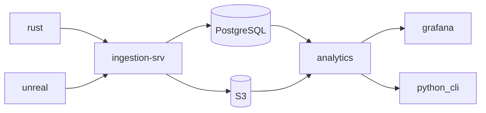
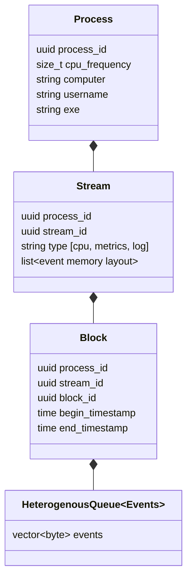
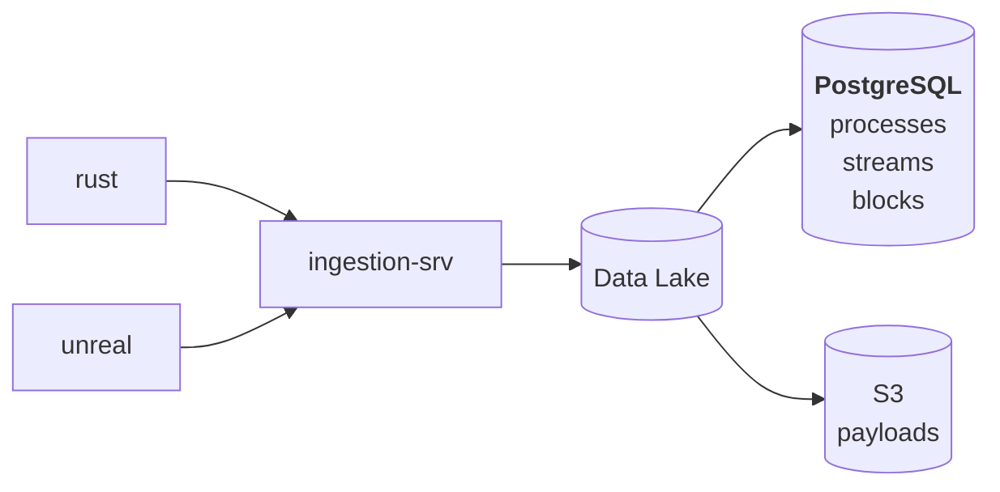
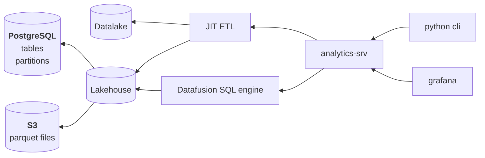

# Micromegas - high frequency telemetry

## Big Picture

### data flow

## Instrumentation

### Data structures

## low overhead instrumentation

## fast & compact transmission

## scalable ingestion

### ingestion

### analytics

## just-in-time extract-transform-load
