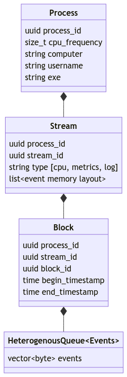

<script type="module">
  import mermaid from 'https://cdn.jsdelivr.net/npm/mermaid@10/dist/mermaid.esm.min.mjs';
  mermaid.initialize({ startOnLoad: true });
</script>

# Micromegas
High Frequency Telemetry

April 2024

https://github.com/madesroches/micromegas/

Marc-Antoine Desroches <madesroches@gmail.com>

---
# High Frequency Telemetry
 * The big picture
 * Low overhead instrumentation (unreal)
 * Scalable ingestion service
 * JIT analytics service
---
# The Big Picture
## Data flow
<div class="mermaid">
graph LR;
    rust-->ingestion-srv
    unreal-->ingestion-srv
    ingestion-srv-->postgresql[(PostgreSQL)]
    ingestion-srv-->s3[(S3)]
    postgresql-->analytics-srv
    s3-->analytics-srv
    analytics-srv-->grafana
    analytics-srv-->python_cli
</div>

---

# Low Overhead Instrumentation (unreal)
## Data structures
Streams
 * log
 * metrics
 * thread (1 per thread, lock-free writing)

 

--- 

## Purposeful, manual instrumentation
Generated guard on the stack only holds one pointer to a static object that requires no initialization.

```c++
namespace MicromegasTracing
{
	CORE_API void BeginScope(const BeginThreadSpanEvent& event);
	CORE_API void EndScope(const EndThreadSpanEvent& event);

	struct SpanGuard
	{
		const SpanMetadata* Desc;
		explicit SpanGuard(const SpanMetadata* desc)
			: Desc(desc)
		{
			BeginScope(BeginThreadSpanEvent(desc, FPlatformTime::Cycles64()));
		}

		~SpanGuard()
		{
			EndScope(EndThreadSpanEvent(Desc, FPlatformTime::Cycles64()));
		}
	};
} // namespace MicromegasTracing

#define MICROMEGAS_SPAN_SCOPE(target, name)                                                                                     \
	static const MicromegasTracing::SpanMetadata PREPROCESSOR_JOIN(spanMeta, __LINE__)(name, target, TEXT(__FILE__), __LINE__); \
	MicromegasTracing::SpanGuard PREPROCESSOR_JOIN(spanguard, __LINE__)(&PREPROCESSOR_JOIN(spanMeta, __LINE__))

 ```

---

## Events are tiny and can reference static data.
```c++
namespace MicromegasTracing
{
	struct SpanMetadata
	{
		const TCHAR* Name;
		const TCHAR* Target;
		const TCHAR* File;
		uint32 Line;

		SpanMetadata(const TCHAR* name,
			const TCHAR* target,
			const TCHAR* file,
			uint32 line)
			: Name(name)
			, Target(target)
			, File(file)
			, Line(line)
		{
		}
	};

	struct BeginThreadSpanEvent
	{
		const SpanMetadata* Desc;
		uint64 Timestamp;

		BeginThreadSpanEvent(const SpanMetadata* desc, uint64 timestamp)
			: Desc(desc)
			, Timestamp(timestamp)
		{
		}
	};

	struct EndThreadSpanEvent
	{
		const SpanMetadata* Desc;
		uint64 Timestamp;

		EndThreadSpanEvent(const SpanMetadata* desc, uint64 timestamp)
			: Desc(desc)
			, Timestamp(timestamp)
		{
		}
	};
} // namespace MicromegasTracing
```
---
## Memory layout of events using reflection

```c++

	template <>
	struct GetEventMetadata<BeginThreadSpanEvent>
	{
		UserDefinedType operator()()
		{
			return UserDefinedType(
				TEXT("BeginThreadSpanEvent"),
				sizeof(BeginThreadSpanEvent),
				false,
				{ MAKE_UDT_MEMBER_METADATA(BeginThreadSpanEvent, "thread_span_desc", Desc, SpanMetadata*, true),
					MAKE_UDT_MEMBER_METADATA(BeginThreadSpanEvent, "time", Timestamp, uint64, false) });
		}
	};


```

---

## fast & compact transmission

 1. Extract dependencies (references to static objects)
 1. Compress dependencies & events buffers using lz4
 1. Send using https

 ---
 ## Extract dependencies
 
 ```c++

 typedef MicromegasTracing::HeterogeneousQueue<
	MicromegasTracing::StaticStringDependency,
	MicromegasTracing::SpanMetadataDependency>
	ThreadDependenciesQueue;

struct ExtractThreadDependencies
{
	TSet<const void*> Ids;
	ThreadDependenciesQueue Dependencies;

	ExtractThreadDependencies()
		: Dependencies(1024 * 1024)
	{
	}

	void operator()(const MicromegasTracing::StaticStringRef& str)
	{
		bool alreadyInSet = false;
		Ids.Add(reinterpret_cast<void*>(str.GetID()), &alreadyInSet);
		if (!alreadyInSet)
		{
			Dependencies.Push(MicromegasTracing::StaticStringDependency(str));
		}
	}

	void operator()(const MicromegasTracing::SpanMetadata* desc)
	{
		bool alreadyInSet = false;
		Ids.Add(desc, &alreadyInSet);
		if (!alreadyInSet)
		{
			(*this)(MicromegasTracing::StaticStringRef(desc->Name));
			(*this)(MicromegasTracing::StaticStringRef(desc->Target));
			(*this)(MicromegasTracing::StaticStringRef(desc->File));
			Dependencies.Push(MicromegasTracing::SpanMetadataDependency(desc));
		}
	}

	void operator()(const MicromegasTracing::BeginThreadSpanEvent& event)
	{
		(*this)(event.Desc);
	}

	void operator()(const MicromegasTracing::EndThreadSpanEvent& event)
	{
		(*this)(event.Desc);
	}

	ExtractThreadDependencies(const ExtractThreadDependencies&) = delete;
	ExtractThreadDependencies& operator=(const ExtractThreadDependencies&) = delete;
};
```

 ---

# Scalable ingestion service

<div class="mermaid">
graph LR;
    rust-->ingestion-srv;
    unreal-->ingestion-srv;
    ingestion-srv-->datalake[(Data Lake)];
    datalake-->postgresql[("`**PostgreSQL**
    processes
    streams
    blocks`")]
    datalake-->S3[("`**S3**
    payloads`")]
</div>

---

## analytics service

 * Transformation of opaque binary data into tables
 * Can be batched or just-in-time
<div class="mermaid">
graph RL;
    cli[python cli]-->analytics-srv;
    grafana-->analytics-srv;
    analytics-srv-->etl[JIT ETL];
    etl-->datalake[(Datalake)];
    etl-->lakehouse[(Lakehouse)];
    lakehouse-->postgres[("`**PostgreSQL**
    tables partitions`")]
    lakehouse-->s3[("`**S3**
    parquet files`")]
    analytics-srv-->datafusion[Datafusion SQL engine];
    datafusion-->lakehouse
</div>

---

## Datalake vs Lakehouse

|              | Datalake                               | Lakehouse |
|--------------|:--------------------------------------:|-----------:|
| File format  | custom binary files (memcopied events) | Apache Parquet (columnar typed table) |
|              | opaque                                 | industry standard |
| Writing      | easy & cheap                           | complex |
| Reading      | complex                                | fast & cheap |
|              | monolitic blob                         | segmented & indexed |

---

## Materialized views
To be implemented
 * thread spans (jit per thread)
 * log entries (jit per process)
 * metrics (jit per process)
 * metric stats (jit per process)
 * log entries for all processes (batches of ~ 1 minute)
 * metrics for all processes (batches of ~ 1 minute)
 * high frequency metrics for a subset of processes (batches of ~ 10 seconds)


