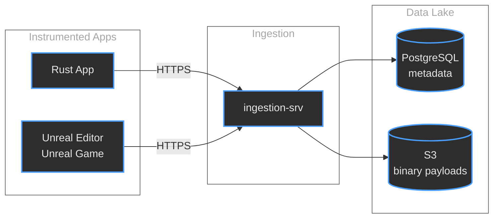
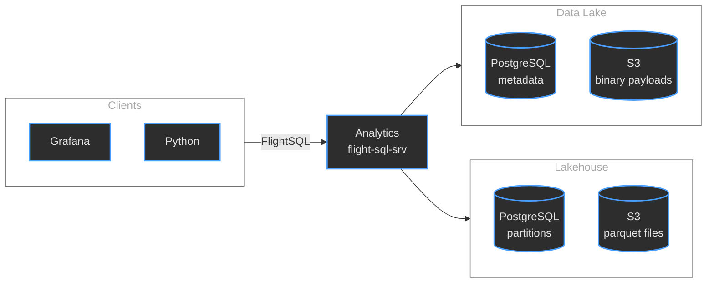

# Micromegas
## Unified Observability for Video Games

### Marc-Antoine Desroches
#### madesroches@gmail.com
#### [github.com/madesroches/micromegas](https://github.com/madesroches/micromegas)

---

## Disclaimer

These are my personal opinions and experiences.

I'm not speaking for my employer.

---

## The Objective

Quantify **how often** and **how bad** issues are, with enough context to **fix** them.

<p class="fragment" style="margin-top: 2em; color: var(--color-secondary);">no need to reproduce</p>

---

## The Problem

Traditional tooling force a choice:

<ul>
<li class="fragment">🔍 <strong>High-frequency debugging tools</strong> - great detail, but you need to reproduce the bug yourself</li>
<li class="fragment">📊 <strong>Low-frequency analytics tools</strong> - will report statistics, not detailed traces</li>
</ul>

<p class="fragment"><strong>We refuse to choose.</strong></p>

---

## The Challenge

Video games at 60fps generate enormous telemetry volumes:

<ul>
<li class="fragment"><strong>~10s of log entries/sec</strong></li>
<li class="fragment"><strong>~1k measures/sec</strong> - 10s/frame</li>
<li class="fragment"><strong>~60k-200k CPU trace events/sec</strong> - 1000s/frame</li>
<li class="fragment"><strong>Thousands</strong> of concurrent processes</li>
<li class="fragment"><strong>Unified system</strong> for logs, metrics, and traces</li>
</ul>

---

## Operating Costs - real production example

<div style="display: grid; grid-template-columns: 1fr 1fr; gap: 2rem; font-size: 0.75em; width: 100%; padding: 0 1rem; box-sizing: border-box;">
<div>

**Data volume**

<div style="margin-top: 0.5em; line-height: 1.3;">
<span class="fragment">Retention: 90 days</span><br/>
<span class="fragment">9 billion log entries</span><br/>
<span class="fragment">275 billion metrics</span><br/>
<span class="fragment">165 billion sampled trace events</span><br/>
<span class="fragment"><strong>Total: 449 billion events</strong></span><br/>
<span class="fragment">Spikes of <strong>266M events/min</strong></span>
</div>

</div>
<div>

**Monthly cost breakdown**

<div style="margin-top: 0.5em; line-height: 1.3;">
<span class="fragment">Compute: ~$300</span><br/>
<span class="fragment">PostgreSQL: ~$200</span><br/>
<span class="fragment">S3 Storage: ~$500</span>
</div>

<div class="fragment" style="margin-top: 1.5em; font-size: 1.4em;"><strong>Total: ~$1,000/month</strong></div>

</div>
</div>

---

## How

<div style="font-size: 0.75em;">

Recording & querying high volumes of data can be cheap:

<div style="margin-top: 0.5em; line-height: 1.3; text-align: left;">
<span class="fragment"><strong>Stage 1.</strong> Low-overhead always-on instrumentation - 20ns/event</span><br/>
<span class="fragment"><strong>Stage 2.</strong> Cheap ingestion & storage</span><br/>
<span class="fragment"><strong>Stage 3.</strong> Daemon processes low-frequency streams (logs & metrics)</span><br/>
<span class="fragment"><strong>Stage 4.</strong> Analytics service executes SQL queries</span><br/>
<span class="fragment"><strong>Stage 5.</strong> Frugal user interface</span>
</div>

<p class="fragment" style="margin-top: 1em;">Nothing in here is specific to games</p>

</div>

---

## Architecture Overview

### Ingestion Flow


--

### Analytics Flow


---

## Stage 1: Low-Overhead Instrumentation

<div style="font-size: 0.6em;">

**Optimized instrumentation libraries**

<ul style="margin-top: 0.5em; line-height: 1.3; text-align: left; width: 100%;">
<li class="fragment">Events are <strong>tiny</strong> (a few bytes)</li>
<li class="fragment">Events can contain <strong>pointers</strong> to avoid repetition (metric names, file paths, …)</li>
<li class="fragment">Instrumented threads only <strong>queue events</strong> - work done in background thread</li>
<li class="fragment">Overhead <strong>~20ns/cpu trace event</strong> in calling thread</li>
<li class="fragment"><strong>Sampling logic</strong> applies to event batches<br/>ex: does this section of the trace include slow frames?</li>
<li class="fragment">Serialization is mostly <strong>memcpy</strong></li>
<li class="fragment"><strong>Event layout</strong> is the native memory format</li>
<li class="fragment">Event layout <strong>changes from one process to another</strong></li>
<li class="fragment">Fast compression using <strong>LZ4</strong></li>
</ul>

</div>

--

## Code Example
### Rust instrumentation

```rust
use micromegas_tracing::prelude::*;

#[span_fn]
async fn process_request(user_id: u32) -> Result<Response> {
    info!("request user_id={user_id}");
    let begin_ticks = now();
    let response = handle_request(user_id).await?;
    let end_ticks = now();
    let duration = end_ticks - begin_ticks;
    imetric!("request_duration", "ticks", duration as u64);
    info!("response status={}", response.status());
    Ok(response)
}
```

--

## Code Example
### Unreal instrumentation

```cpp
#include "MicromegasTracing/Macros.h"

float AMyActor::TakeDamage(float Damage, ...)
{
    MICROMEGAS_SPAN_FUNCTION("Combat");
    float ActualDamage = Super::TakeDamage(...);
    MICROMEGAS_FMETRIC("Combat",
        MicromegasTracing::Verbosity::High,
        TEXT("DamageDealt"), TEXT("points"),
        ActualDamage);
    return ActualDamage;
}
```

---

## Stage 2: Ingestion & Storage

**Simple, horizontally scalable design**

<ul>
<li class="fragment">HTTP service accepts LZ4-compressed payloads</li>
<li class="fragment">Metadata → PostgreSQL (for fast lookups)</li>
<li class="fragment">Payloads → S3 (for cheap storage)</li>
</ul>

<p class="fragment"><strong>Data lake</strong>: optimized for cheap writes</p>

---

## Stages 3 & 4: daemon & analytics

Bridge between **data lake** (cheap writes) and **lakehouse** (fast reads)

<ul>
<li class="fragment">Extract <strong>binary payload</strong> data in compressed custom format</li>
<li class="fragment">Transform into <strong>Parquet</strong></li>
<li class="fragment">Let <strong>DataFusion</strong> execute SQL queries on the parquet files</li>
</ul>

---

## Stage 3: Daemon

Different streams, different strategies:

<ul>
<li class="fragment"><strong>Logs</strong> (low frequency)<br/>Process eagerly → Parquet</li>
<li class="fragment"><strong>Metrics</strong> (medium frequency)<br/>Process eagerly → Parquet<br/>Keeps aggregated views up to date</li>
<li class="fragment">Ignores <strong>CPU traces</strong> (very high frequency)</li>
</ul>

---

## Incremental Data Reduction

Allows to query data over multiple days

Example: SQL-defined **log_stats** view

```sql
SELECT date_bin('1 minute', time) as time_bin,
       process_id,
       level,
       target,
       count(*) as count
FROM log_entries
WHERE insert_time >= '{begin}'
AND insert_time < '{end}'
GROUP BY process_id, level, target, time_bin
```

**Query data over multiple days.**

---

## Stage 4: Analytics

Serves SQL queries over Arrow FlightSQL

<ul>
<li class="fragment">Transform payloads into Parquet if daemon did not already do it</li>
<li class="fragment"><strong>CPU traces</strong><br/>Process-specific views</li>
<li class="fragment">Let <strong>DataFusion SQL engine</strong> do its magic</li>
<li class="fragment">DataFusion is augmented by extensions:<ul>
<li><strong>JSONB</strong></li>
<li><strong>Histograms</strong> (median, p99, …)</li>
</ul></li>
</ul>

---

## Stage 5: User Interfaces

Three main interfaces:

<ol>
<li class="fragment"><strong>Grafana</strong> - Dashboards and alerting</li>
<li class="fragment"><strong>Jupyter Notebooks</strong> - Python API for data exploration</li>
<li class="fragment"><strong>Perfetto</strong> - Deep trace visualization</li>
</ol>

---

## Grafana Dashboard

<div style="display: flex; align-items: center; gap: 2rem;">
<div style="flex: 1;">

Real-time monitoring and alerting.

</div>
<div style="flex: 1;">

</div>
</div>

---

## Jupyter Notebooks

<div style="display: flex; align-items: center; gap: 2rem;">
<div style="flex: 1;">

**Python API** for flexible **data exploration** and custom analysis.

</div>
<div style="flex: 1;">

</div>
</div>

---

## Perfetto Trace Viewer


Detailed CPU trace analysis

---

## Thank You

**Micromegas would not be possible without open source**

<p>  </p>

<p> </p>

<p></p>

<p></p>

<p>And many other amazing projects</p>

---

## Micromegas is Open Source

🌟 **https://github.com/madesroches/micromegas**

<ul>
<li class="fragment">Drop a star (always makes my day!)</li>
<li class="fragment">Try it out, use it as a library, copy the code</li>
<li class="fragment">Open an issue, tell me what's missing</li>
<li class="fragment">Share your use cases</li>
</ul>

<p class="fragment" style="text-decoration: underline; color: var(--color-secondary);">madesroches@gmail.com</p>