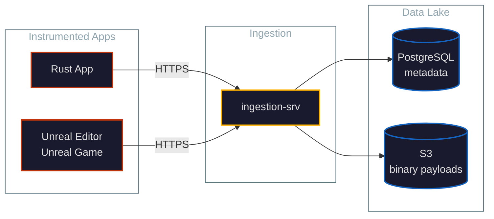
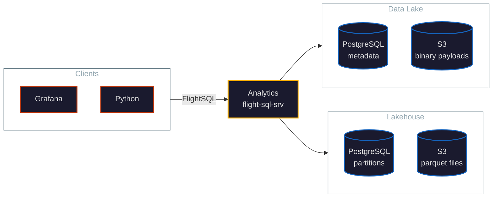

<!-- .slide: data-state="hide-sidebar" -->


## An Introduction to Micromegas

<p style="font-size: 0.55em; margin-top: 0.5em;">Unified observability built for high-frequency capture</p>

<p style="font-size: 0.55em; margin-top: 1.5em;">Marc-Antoine Desroches · <a href="mailto:madesroches@gmail.com">madesroches@gmail.com</a><br><a href="https://micromegas.info/">micromegas.info</a></p>

---

## Stats Tell You Something Is Wrong

<ul>
<li class="fragment">Dashboards say: <em>"p99 latency spiked at 14:32"</em></li>
<li class="fragment">Metrics say: <em>"errors went up 3x in region eu-west-1"</em></li>
<li class="fragment">You still need to <strong>reproduce</strong> the issue to actually fix it</li>
<li class="fragment">Reproduction is expensive — sometimes impossible<br/><span style="font-size: 0.75em; color: var(--color-text-secondary);">race conditions, specific hardware, network timing</span></li>
</ul>

---

## The Goal

<p style="font-size: 1.2em; margin-top: 1em;"><strong>Capture enough detail to fix issues without reproducing them.</strong></p>

<div style="font-size: 0.7em; margin-top: 2em;">
<ul>
<li class="fragment">Quantify <strong>how often</strong> issues happen</li>
<li class="fragment">Quantify <strong>how bad</strong> they are</li>
<li class="fragment">Have enough <strong>context</strong> — logs + metrics + traces — to fix</li>
</ul>
</div>

---

## Why This Is Hard

<ul>
<li class="fragment">Detailed traces are expensive to <strong>capture</strong></li>
<li class="fragment">Detailed traces are expensive to <strong>store</strong></li>
<li class="fragment">Detailed traces are expensive to <strong>query</strong></li>
<li class="fragment">Most platforms force you to choose: detail OR scale OR cost. Pick two.</li>
</ul>

<p class="fragment" style="margin-top: 1.5em; color: var(--color-secondary);"><strong>Micromegas refuses to choose.</strong></p>

---

## Unified Observability, End to End

<div style="display: grid; grid-template-columns: repeat(4, 1fr); gap: 1rem; font-size: 0.65em; margin-top: 1em;">

<div style="border: 1px solid var(--color-border); border-radius: 6px; padding: 0.8em; background: var(--color-bg-2);">
<div style="color: var(--color-wheat); font-weight: 600;">1. Instrumentation</div>
<div style="margin-top: 0.5em; color: var(--color-text-secondary); font-size: 0.85em;">Capture events from your apps</div>
</div>

<div style="border: 1px solid var(--color-border); border-radius: 6px; padding: 0.8em; background: var(--color-bg-2);">
<div style="color: var(--color-wheat); font-weight: 600;">2. Ingestion</div>
<div style="margin-top: 0.5em; color: var(--color-text-secondary); font-size: 0.85em;">Receive and persist them</div>
</div>

<div style="border: 1px solid var(--color-border); border-radius: 6px; padding: 0.8em; background: var(--color-bg-2);">
<div style="color: var(--color-wheat); font-weight: 600;">3. Analytics</div>
<div style="margin-top: 0.5em; color: var(--color-text-secondary); font-size: 0.85em;">Transform and query</div>
</div>

<div style="border: 1px solid var(--color-border); border-radius: 6px; padding: 0.8em; background: var(--color-bg-2);">
<div style="color: var(--color-wheat); font-weight: 600;">4. Presentation</div>
<div style="margin-top: 0.5em; color: var(--color-text-secondary); font-size: 0.85em;">Grafana, notebooks, Python</div>
</div>

</div>

<p style="margin-top: 2em; font-size: 0.8em; color: var(--color-text-secondary);">One pipeline. Logs, metrics, and traces share the same path.</p>

---

## Simpler

<p style="font-size: 0.8em; margin: 0.3em 0;">One pipeline, not three.</p>

<ul style="font-size: 0.75em;">
<li class="fragment"><strong>One SDK</strong> to integrate — not one for logs, one for metrics, one for traces</li>
<li class="fragment"><strong>One query language</strong> (SQL) — no PromQL + Lucene + vendor DSL</li>
<li class="fragment"><strong>One place to look</strong> — stop asking "which tool has this data?"</li>
<li class="fragment"><strong>One retention, one budget, one team</strong> — capacity planning in one place</li>
</ul>

<p class="fragment" style="margin-top: 0.8em; font-size: 0.65em; color: var(--color-text-secondary);">Three observability stacks is three things to learn, three things to operate, three things to pay for.</p>

---

## More Powerful: Automatic Correlation

<p style="font-size: 0.65em; margin: 0.3em 0;">Every event shares a schema model: <code>process_id</code>, <code>thread_id</code>, <code>time</code>, <code>session</code>, plus signal-specific fields.</p>

<p style="font-size: 0.65em; margin-top: 0.6em;">Questions you can ask in <strong>one query</strong>:</p>

<ul style="font-size: 0.65em;">
<li class="fragment">"Show me the CPU trace <strong>and</strong> the logs <strong>and</strong> the metrics from the frame where this request hitched"</li>
<li class="fragment">"What was the server doing when this client reported an error?"</li>
<li class="fragment">"All events from this user's session, 10 seconds before the crash"</li>
</ul>

<p class="fragment" style="margin-top: 0.8em; font-size: 0.85em;"><strong>Fragmented:</strong> hours hunting through three tools.<br/><strong>Unified:</strong> one query.</p>

---

## The Pipeline

### Ingestion Flow


--

### Analytics Flow


---

## Cost-Efficient by Design

<ul style="font-size: 0.6em;">
<li class="fragment">Raw payloads in <strong>object storage</strong> — cents per GB-month, not dollars</li>
<li class="fragment"><strong>On-demand ETL</strong> — payloads sit in the data lake until queried</li>
<li class="fragment"><strong>Lakehouse</strong> materializes hot queries into Parquet — repeated queries are fast and cheap</li>
<li class="fragment">Self-hosted on your cloud — no per-event vendor pricing</li>
</ul>

<p class="fragment" style="margin-top: 0.7em; font-size: 1.1em;"><strong>900 billion events / 90 days / ~$1,750 a month</strong></p>

<p class="fragment" style="margin-top: 0.4em; font-size: 0.55em; color: var(--color-text-secondary);">At this volume, traditional vendor SaaS pricing is orders of magnitude higher.</p>

---

## The Biggest Difference

<div style="font-size: 0.65em;">

Modern observability stacks share an unstated assumption — events are <strong>expensive</strong>:

<ul>
<li class="fragment">Allocate, format, serialize per event</li>
<li class="fragment">Sampling is mandatory at scale</li>
<li class="fragment">Tuned for service-level telemetry, not high-frequency capture</li>
</ul>

<p class="fragment" style="margin-top: 1em;">Micromegas was built on the opposite assumption — events should be <strong>cheap</strong>.</p>

</div>

<p class="fragment" style="margin-top: 1.5em; font-size: 0.8em;">Same goals. Very different cost model. Everything else follows from that.</p>

---

## How: Sub-microsecond Instrumentation

<div style="font-size: 0.7em;">

<ul>
<li class="fragment"><strong>~20 ns per event</strong> in the calling thread</li>
<li class="fragment">Events are <strong>tiny</strong> (a few bytes) and use <strong>native memory layout</strong></li>
<li class="fragment">The hot path is a <strong>memcpy into a thread-local buffer</strong> — no allocation, no formatting, no serialization</li>
<li class="fragment">Background thread drains buffers, compresses with <strong>LZ4</strong>, ships to ingestion</li>
<li class="fragment"><strong>Sampling decisions</strong> happen at the batch level — was this trace section interesting? — not per event</li>
</ul>

</div>

---

## What This Unlocks

<ul>
<li class="fragment"><strong>60k–200k events/second per process</strong> without breaking the host app</li>
<li class="fragment"><strong>Always-on tracing</strong> in production — not just in dev or under flag</li>
<li class="fragment">Sub-microsecond spans are visible — you can see what your inner loop is doing</li>
</ul>

--

## Code Example

```rust
use micromegas_tracing::prelude::*;

#[span_fn]
async fn process_request(user_id: u32) -> Result<Response> {
    info!("request user_id={user_id}");
    let begin_ticks = now();
    let response = handle_request(user_id).await?;
    let end_ticks = now();
    let duration = end_ticks - begin_ticks;
    imetric!("request_duration", "ticks", duration as u64);
    info!("response status={}", response.status());
    Ok(response)
}
```

---

## Why SQL

<ul>
<li class="fragment">Everyone knows it (or AI can help)</li>
<li class="fragment">No proprietary DSL — no PromQL, no Lucene-flavored query bar, no vendor SDK</li>
<li class="fragment">Joins across logs, metrics, traces — for free, because they share a schema model</li>
<li class="fragment">Standard tooling Just Works — Grafana, Python, BI tools, Jupyter</li>
</ul>

---

## Built on Standards

<div style="font-size: 0.7em; text-align: left; margin: 0 auto; max-width: 80%;">

<p class="fragment"> <strong>Apache Arrow</strong> — columnar, zero-copy, the lingua franca of analytics</p>

<p class="fragment"> <strong>Apache Parquet</strong> — durable columnar storage; compresses well, scans fast</p>

<p class="fragment"> <strong>DataFusion</strong> — Rust-native SQL engine, embeddable, fast</p>

<p class="fragment"><strong>FlightSQL</strong> — gRPC-based wire protocol, language-agnostic clients</p>

</div>

<p class="fragment" style="margin-top: 1.5em; font-size: 0.8em; color: var(--color-secondary);">We didn't reinvent the analytics stack. We assembled it.</p>

---

## What That Buys You

<ul>
<li class="fragment"><strong>No lock-in</strong> — your data is in Parquet, query it with anything that speaks DataFusion or Arrow</li>
<li class="fragment"><strong>The same engine runs in the browser via WASM</strong> — used by notebooks</li>
<li class="fragment"><strong>Domain UDFs where it matters</strong> — JSONB (<code>jsonb_path_query</code>, <code>jsonb_array_elements</code>), histogram aggregates (median, p99 over very large samples)</li>
</ul>

---

## Python API

<ul>
<li class="fragment"><code>pip install micromegas</code> — official client; thin wrapper over FlightSQL returning Pandas / PyArrow</li>
<li class="fragment"><strong>CLI included</strong>: <code>micromegas-query "SELECT ..."</code> for ad-hoc queries from the shell</li>
<li class="fragment">Use cases: Jupyter notebooks, automation scripts, ML feature pipelines, custom dashboards</li>
</ul>

<pre class="fragment" style="font-size: 0.55em; margin-top: 1em;"><code class="language-python">df = client.query("SELECT * FROM log_entries WHERE ...")
</code></pre>

---

## HTTP Gateway + Warehouse Federation

<ul style="font-size: 0.6em;">
<li class="fragment">HTTP gateway translates JSON-over-HTTP to FlightSQL — curl-friendly, browser-friendly, firewall-friendly</li>
<li class="fragment"><strong>Databricks Lakehouse Federation</strong> reaches Micromegas through the gateway</li>
<li class="fragment"><strong>Join telemetry with business data</strong> — no ETL, no copies</li>
<li class="fragment"><strong>Move queries, not data</strong> — predicates push down, only results transfer</li>
</ul>

<p class="fragment" style="margin-top: 0.6em; font-size: 0.75em; color: var(--color-secondary);">Your observability data joins your data warehouse, on demand.</p>

---

## Notebooks at a Glance

<div style="display: flex; align-items: center; gap: 1.5rem;">
<div style="flex: 1.2;">

</div>
<div style="flex: 1; font-size: 0.55em; text-align: left;">

Grafana handles monitoring and alerting.<br/>
Notebooks are for the <strong>iterative investigation</strong> that monitoring dashboards can't support.

<p style="margin-top: 1em;">SQL cells feed tables, charts, logs, swimlanes, flame graphs — all composable in one page.</p>

</div>
</div>

---

## Composability

<div style="display: flex; align-items: center; gap: 1.5rem;">
<div style="flex: 1.2;">

</div>
<div style="flex: 1; font-size: 0.55em; text-align: left;">

<ul>
<li class="fragment">Change a <strong>variable</strong> in the title bar → every dependent cell re-runs</li>
<li class="fragment"><strong>Drag-to-zoom</strong> on any chart → the time range propagates to every cell</li>
<li class="fragment"><strong>Cell results are queryable by other cells, in-browser</strong> — DataFusion in WASM, same engine as the server</li>
</ul>

<p class="fragment" style="margin-top: 1em; color: var(--color-secondary);">One page, one URL — share an investigation like a dashboard.</p>

</div>
</div>

---

## What You Get

<ul style="font-size: 0.85em;">
<li class="fragment"><strong>Detail without overhead</strong> — instrumentation that disappears</li>
<li class="fragment"><strong>Unified storage</strong> — one schema model, automatic correlation</li>
<li class="fragment"><strong>Standard query interface</strong> — SQL on Arrow, no lock-in</li>
<li class="fragment"><strong>Open integration</strong> — Python API, HTTP gateway, Databricks federation</li>
<li class="fragment"><strong>Affordable at scale</strong> — 900B events for $1,750/month, on your own cloud</li>
</ul>

---

<!-- .slide: data-state="hide-sidebar" -->


## Thank You

<p style="font-size: 0.8em; margin-top: 0.5em;"><a href="https://micromegas.info/">micromegas.info</a></p>

<p style="font-size: 0.6em; margin-top: 0.5em;"><a href="https://github.com/madesroches/micromegas">github.com/madesroches/micromegas</a> · <a href="mailto:madesroches@gmail.com">madesroches@gmail.com</a></p>

<p style="font-size: 0.55em; margin-top: 1.5em; color: var(--color-text-secondary);">Open source. Apache 2.0. Self-hosted on your cloud.</p>
