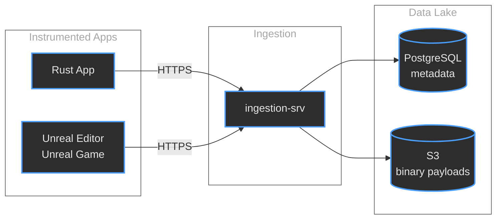
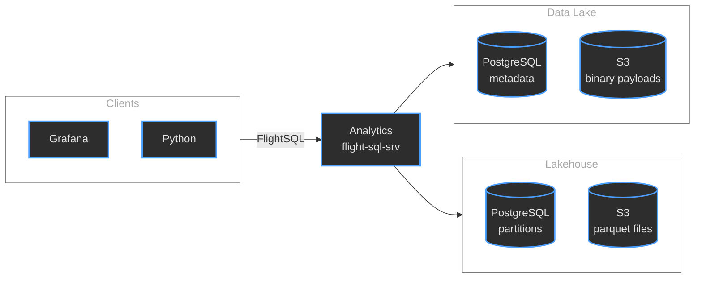

# Micromegas
## Unified Observability for Video Games

### Marc-Antoine Desroches
#### madesroches@gmail.com
#### [github.com/madesroches/micromegas](https://github.com/madesroches/micromegas)

---

## The Challenge

Video games running at 60fps generate enormous amounts of telemetry:

- **100,000+ events/second** per process
- **Thousands** of concurrent processes
- **Logs, metrics, and traces** in one unified system

---

## The Problem

Traditional tools force a choice:

- 🔍 **High-frequency debugging tools** - great detail, but you need to reproduce the bug yourself
- 📊 **Low-frequency analytics tools** - will report statistics, not detailed traces

**We refuse to choose.**

---

## Make recording data cheap

1. **Low-overhead instrumentation** 20ns/event
2. **Cheap ingestion** minimal processing of inbound data
3. **Cheap storage** mostly S3
4. Queries on **Aggregated metrics** to find the needle in the haystack
5. **Tail sampling** of trace events - because it's the needle

---

## Architecture Overview

### Ingestion Flow


--

### Analytics Flow


---

## Stage 1: Low-Overhead Instrumentation

**optimized instrumentation librarires**

How?
- **Thread-local** event queues for high-frequency streams
- Serialization that's mostly **memcpy**
- Events can contain **references** to avoid repetition
- **LZ4** has negative overhead

--

## Code Example
### Rust instrumentation

```rust
use micromegas_tracing::prelude::*;

#[span_fn]
async fn process_request(user_id: u32) -> Result<Response> {
    info!("request user_id={user_id}");
    let begin_ticks = now();
    let response = handle_request(user_id).await?;
    let end_ticks = now();
    let duration = end_ticks - begin_ticks;
    imetric!("request_duration", "ticks", duration as u64);
    info!("response status={}", response.status());
    Ok(response)
}
```

--

## Code Example
### Unreal instrumentation

```cpp
#include "MicromegasTracing/Macros.h"

float AMyActor::TakeDamage(float Damage, ...)
{
    MICROMEGAS_SPAN_FUNCTION("Combat");
    float ActualDamage = Super::TakeDamage(...);
    MICROMEGAS_FMETRIC("Combat",
        MicromegasTracing::Verbosity::High,
        TEXT("DamageDealt"), TEXT("points"),
        ActualDamage);
    return ActualDamage;
}
```

---

## Stage 2: Ingestion & Storage

**Simple, horizontally scalable design**

- HTTP service accepts compressed payloads
- Metadata → PostgreSQL (for fast lookups)
- Payloads → S3/GCS (for cheap storage)

**Datalake**: Optimized for cheap writes

---

## Stage 3: SQL Analytics

**Lakehouse Architecture**

Bridge between datalake (cheap writes) and warehouse (fast reads)

- Raw data in custom format (efficiency)
- Transformed to Parquet (columnar, fast queries)

---

## Tail Sampling Strategy

Different streams, different strategies:

- **Logs** (low frequency): Process eagerly → Parquet
- **Metrics** (medium frequency): Process eagerly → Parquet
- **CPU traces** (very high frequency): Keep raw, process just-in-time when queried

**Process only what you need, when you need it.**

---

## Query Interface

**Apache Arrow FlightSQL + DataFusion**

```sql
SELECT
  process_id,
  AVG(frame_time_ms) as avg_frame_time,
  MAX(frame_time_ms) as max_frame_time
FROM metrics
WHERE stream_type = 'performance'
  AND timestamp > NOW() - INTERVAL '1 hour'
GROUP BY process_id
ORDER BY avg_frame_time DESC;
```

---

## Incremental Data Reduction

SQL-defined views that progressively aggregate:

```sql
CREATE MATERIALIZED VIEW hourly_performance AS
SELECT
  DATE_TRUNC('hour', timestamp) as hour,
  process_id,
  AVG(frame_time_ms) as avg_frame_time
FROM raw_metrics
GROUP BY hour, process_id;
```

**Reduce storage, speed up queries.**

---

## Stage 4: User Interfaces

Three main interfaces:

1. **Notebooks** - Jupyter integration for data exploration
2. **Grafana** - Dashboards and alerting
3. **Perfetto** - Deep trace visualization

---

## Grafana Dashboard


Real-time monitoring and alerting for your game metrics.

---

## Perfetto Trace Viewer


Detailed CPU trace analysis at microsecond resolution.

---

## SQL Query Examples

```sql
-- Find slowest frames in the last hour
SELECT timestamp, frame_time_ms, process_id
FROM metrics
WHERE timestamp > NOW() - INTERVAL '1 hour'
  AND metric_name = 'frame_time_ms'
  AND frame_time_ms > 33.0  -- Slower than 30fps
ORDER BY frame_time_ms DESC
LIMIT 10;
```

---

## Operating Costs

**Real production example:**

- **449 billion events** over 90 days
- **~$1,000/month** total cost
  - 8.5 TB storage
  - 9B logs, 275B metrics, 165B trace events
  - ~1,900 events/second average

---

## Cost Breakdown

| Component | Monthly Cost |
|-----------|-------------|
| Compute | ~$300 |
| PostgreSQL | ~$200 |
| S3 Storage | ~$500 |
| **Total** | **~$1,000** |

**~$0.002 per million events**

---

## Why So Cheap?

**Tail sampling advantage:**

- Store everything in cheap object storage
- Only process when you query
- No continuous ETL overhead
- Pay for storage, not compute

**Orders of magnitude cheaper than commercial SaaS.**

---

## Thank You

**Micromegas would not be possible without open source:**

- DataFusion, Arrow, Parquet, FlightSQL
- PostgreSQL
- Rust ecosystem

---

## Micromegas is Open Source

🌟 **https://github.com/madesroches/micromegas**

- Drop a star (always makes my day!)
- Try it out or use it as a library
- Share your use cases

---

# Questions?

Feel free to reach out!

**Marc-Antoine Desroches**

madesroches@gmail.com

[github.com/madesroches/micromegas](https://github.com/madesroches/micromegas)
