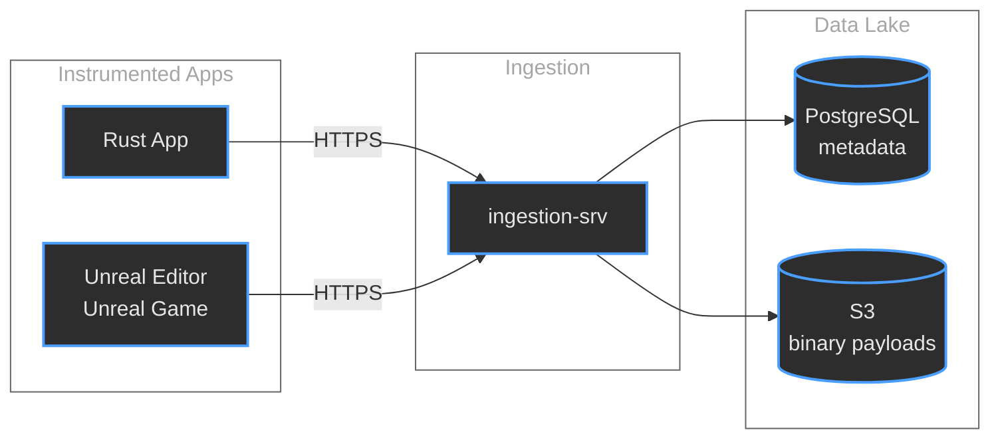
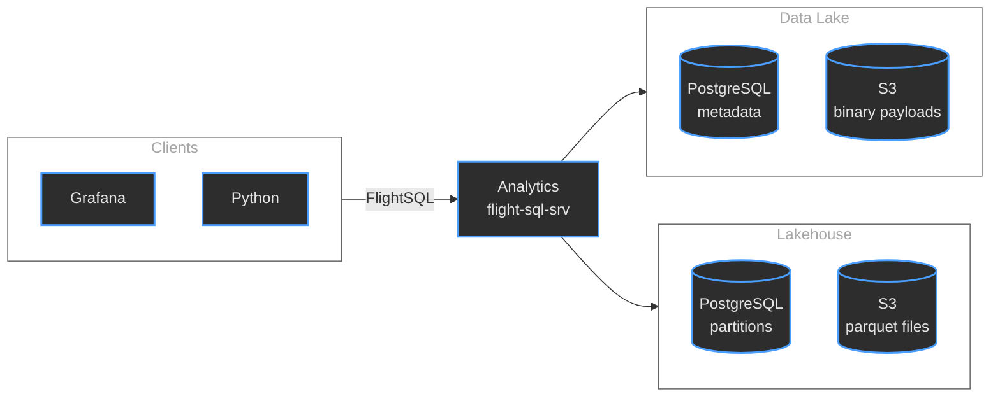

# Micromegas
## Unified Observability for Video Games

### Marc-Antoine Desroches
#### madesroches@gmail.com
#### [github.com/madesroches/micromegas](https://github.com/madesroches/micromegas)

---

## Disclaimer

These are my personal opinions and experiences.

I'm not speaking for my employer.

---

## The Challenge

Video games at 60fps generate enormous telemetry volumes:

<ul>
<li class="fragment"><strong>~10s of log entries/sec</strong></li>
<li class="fragment"><strong>~1k measures/sec</strong> - 10s/frame</li>
<li class="fragment"><strong>~60k-200k CPU trace events/sec</strong> - 1000s/frame</li>
<li class="fragment"><strong>Thousands</strong> of concurrent processes</li>
<li class="fragment"><strong>Unified system</strong> for logs, metrics, and traces</li>
</ul>

---

## The Problem

Traditional tools force a choice:

<ul>
<li class="fragment">🔍 <strong>High-frequency debugging tools</strong> - great detail, but you need to reproduce the bug yourself</li>
<li class="fragment">📊 <strong>Low-frequency analytics tools</strong> - will report statistics, not detailed traces</li>
</ul>

<p class="fragment"><strong>We refuse to choose.</strong></p>

---

## The Objective

Quantify **how often** and **how bad** issues are, with enough context to **fix** them—no need to **reproduce**.

---

## Make recording data cheap

<ol>
<li class="fragment"><strong>Low-overhead instrumentation</strong> 20ns/event</li>
<li class="fragment"><strong>Cheap ingestion</strong> minimal processing of inbound data</li>
<li class="fragment"><strong>Cheap storage</strong> mostly S3</li>
<li class="fragment">Queries on <strong>Aggregated metrics</strong> to find the needle in the haystack</li>
<li class="fragment"><strong>Tail sampling</strong> of trace events - because it's the needle</li>
</ol>

---

## Architecture Overview

### Ingestion Flow


--

### Analytics Flow


---

## Stage 1: Low-Overhead Instrumentation

**optimized instrumentation librarires**

How?
<ul>
<li class="fragment"><strong>Thread-local</strong> event queues for high-frequency streams</li>
<li class="fragment">Serialization that's mostly <strong>memcpy</strong></li>
<li class="fragment">Events can contain <strong>references</strong> to avoid repetition</li>
<li class="fragment">Some <strong>sampling</strong> at the source</li>
</ul>

--

## Code Example
### Rust instrumentation

```rust
use micromegas_tracing::prelude::*;

#[span_fn]
async fn process_request(user_id: u32) -> Result<Response> {
    info!("request user_id={user_id}");
    let begin_ticks = now();
    let response = handle_request(user_id).await?;
    let end_ticks = now();
    let duration = end_ticks - begin_ticks;
    imetric!("request_duration", "ticks", duration as u64);
    info!("response status={}", response.status());
    Ok(response)
}
```

--

## Code Example
### Unreal instrumentation

```cpp
#include "MicromegasTracing/Macros.h"

float AMyActor::TakeDamage(float Damage, ...)
{
    MICROMEGAS_SPAN_FUNCTION("Combat");
    float ActualDamage = Super::TakeDamage(...);
    MICROMEGAS_FMETRIC("Combat",
        MicromegasTracing::Verbosity::High,
        TEXT("DamageDealt"), TEXT("points"),
        ActualDamage);
    return ActualDamage;
}
```

---

## Stage 2: Ingestion & Storage

**Simple, horizontally scalable design**

<ul>
<li class="fragment">HTTP service accepts LZ4-compressed payloads</li>
<li class="fragment">Metadata → PostgreSQL (for fast lookups)</li>
<li class="fragment">Payloads → S3 (for cheap storage)</li>
</ul>

<p class="fragment"><strong>Datalake</strong>: Optimized for cheap writes</p>

---

## Stage 3: SQL Analytics

**Lakehouse Architecture**

Bridge between datalake (cheap writes) and lakehouse (fast reads)

<ul>
<li class="fragment"> Payload data in custom format</li>
<li class="fragment">🗄️ Transformed to Parquet (columnar, fast queries)</li>
<li class="fragment">Let  loose on the parquet files</li>
</ul>

---

## Incremental Data Reduction

Example: SQL-defined **log_stats** view

```sql
SELECT date_bin('1 minute', time) as time_bin,
       process_id,
       level,
       target,
       count(*) as count
FROM log_entries
WHERE insert_time >= '{begin}'
AND insert_time < '{end}'
GROUP BY process_id, level, target, time_bin
```

**Query data over multiple days.**

---

## Tail Sampling Strategy

Different streams, different strategies:

<ul>
<li class="fragment"><strong>Logs</strong> (low frequency): Process eagerly → Parquet</li>
<li class="fragment"><strong>Metrics</strong> (medium frequency): Process eagerly → Parquet</li>
<li class="fragment"><strong>CPU traces</strong> (very high frequency): Keep raw, process just-in-time when queried</li>
</ul>

<p class="fragment"><strong>Use lower frequency streams to tail-sample high-frequency ones</strong></p>

---

## Stage 4: User Interfaces

Three main interfaces:

<ol>
<li class="fragment"><strong>Grafana</strong> - Dashboards and alerting</li>
<li class="fragment"><strong>Jupyter Notebooks</strong> - Python API for data exploration</li>
<li class="fragment"><strong>Perfetto</strong> - Deep trace visualization</li>
</ol>

---

## Grafana Dashboard


Real-time monitoring and alerting.

---

## SQL Query Examples

```sql
-- Find slowest frames in the last hour
SELECT timestamp, frame_time_ms, process_id
FROM metrics
WHERE timestamp > NOW() - INTERVAL '1 hour'
  AND metric_name = 'frame_time_ms'
  AND frame_time_ms > 33.0  -- Slower than 30fps
ORDER BY frame_time_ms DESC
LIMIT 10;
```

---

## Perfetto Trace Viewer


Detailed CPU trace analysis at microsecond resolution.

---

## Operating Costs

**Data volume**

<ul>
<li class="fragment">Retention of 90 days</li>
<li class="fragment">9B log entries</li>
<li class="fragment">275B metrics</li> 
<li class="fragment">165B trace events</li>
<li class="fragment"><strong>449 billion events</strong></li>
</ul>

---

## Cost Breakdown

| Component | Monthly Cost |
|-----------|-------------|
| Compute | ~$300 |
| PostgreSQL | ~$200 |
| S3 Storage | ~$500 |
| **Total** | **~$1,000** |

**~$0.002 per million events**

---

## Thank You

**Micromegas would not be possible without open source**

<p>  </p>

<p></p>

<p></p>

---

## Micromegas is Open Source

🌟 **https://github.com/madesroches/micromegas**

<ul>
<li class="fragment">Drop a star (always makes my day!)</li>
<li class="fragment">Try it out, use it as a library, copy the code</li>
<li class="fragment">Share your use cases</li>
</ul>

---

# Questions?

Feel free to reach out!

**Marc-Antoine Desroches**

madesroches@gmail.com

[github.com/madesroches/micromegas](https://github.com/madesroches/micromegas)
