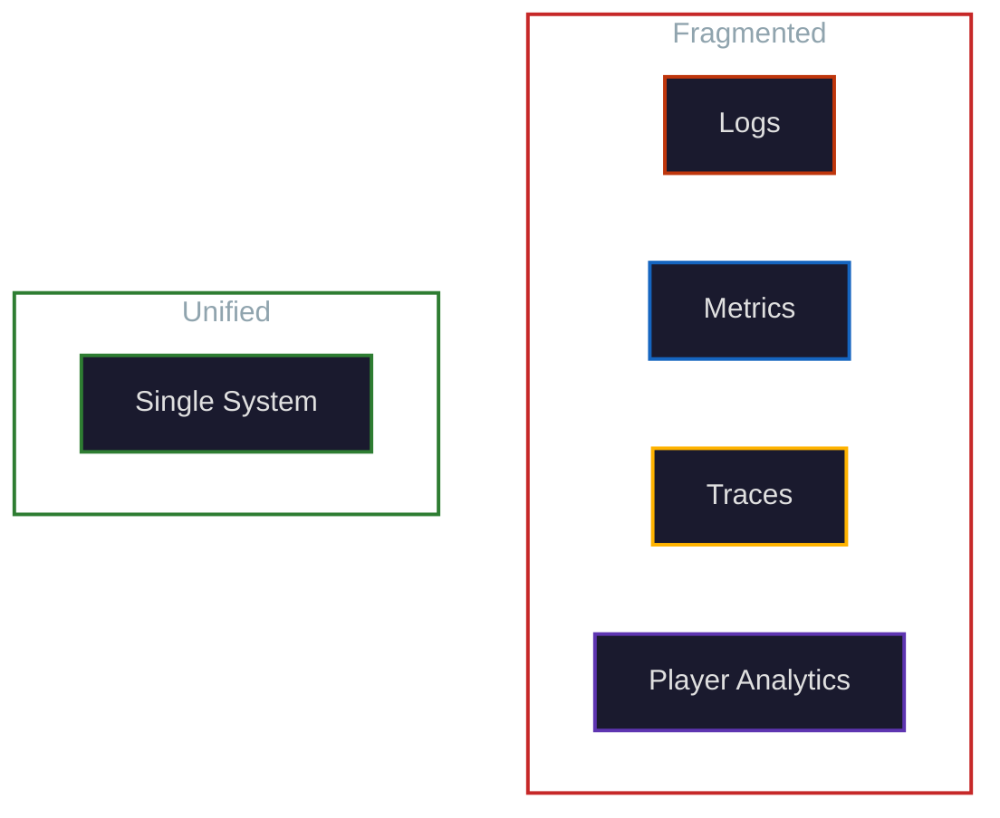

<!-- .slide: data-state="title-slide" -->


## Unified Observability for Game Teams

<p style="font-size: 0.6em;">Marc-Antoine Desroches · <a href="mailto:madesroches@gmail.com">madesroches@gmail.com</a><br><a href="https://github.com/madesroches/micromegas">github.com/madesroches/micromegas</a></p>

---

## The Pitch

**Stop reproducing bugs. Collect enough data to understand them directly.**

<p class="fragment" style="margin-top: 1em;">A unified observability stack makes this practical:</p>

<ul>
<li class="fragment"><strong>Easier</strong>: One system to learn, one query language, one place to look</li>
<li class="fragment"><strong>More powerful</strong>: Automatic correlation unlocks insights fragmented tools can't provide</li>
</ul>

---

## The Pain

The debugging loop everyone hates:

<ol style="font-size: 0.8em;">
<li class="fragment">Receive bug report: "Game hitched during combat"</li>
<li class="fragment">Try to reproduce → fail</li>
<li class="fragment">Ask for more details → wait</li>
<li class="fragment">Try again → can't replicate exact conditions</li>
<li class="fragment">Mark as "cannot reproduce" or waste days guessing</li>
</ol>

--

## The Hard Truth

<ul>
<li class="fragment">Some bugs <strong>can't</strong> be reproduced: race conditions, specific hardware, network timing</li>
<li class="fragment">You only know about <strong>reported</strong> issues - how many players quit silently?</li>
<li class="fragment">Test machines aren't production</li>
</ul>

<p class="fragment" style="margin-top: 2em; color: var(--color-secondary);">What if you could understand issues without reproducing them?</p>

---

## The Goal: Reproduce Less, Fix More

Instead of reproducing issues, collect enough data to **understand them directly**:

<ul>
<li class="fragment">Know <strong>how often</strong> issues happen across your entire player base</li>
<li class="fragment">Know <strong>how bad</strong> they are: severity, duration, impact</li>
<li class="fragment">Have <strong>enough context</strong> to fix them without guessing</li>
</ul>

--

## What You Need

<ul>
<li class="fragment"><strong>Logs</strong> - what happened</li>
<li class="fragment"><strong>Metrics</strong> - how bad</li>
<li class="fragment"><strong>Traces</strong> - why it happened</li>
<li class="fragment">All <strong>correlated</strong>, all <strong>queryable</strong></li>
</ul>

<p class="fragment" style="margin-top: 1.5em;">Do you build this as separate systems, or as one?</p>

---

## The Fragmented Reality

Typical internal tooling landscape:

<ul style="font-size: 0.85em;">
<li class="fragment"><strong>Logs</strong>: Some system - maybe custom, maybe files on disk</li>
<li class="fragment"><strong>Metrics</strong>: Some system - probably different from logs</li>
<li class="fragment"><strong>Traces</strong>: Local profiling, or nothing for remote sessions</li>
<li class="fragment"><strong>Player events</strong>: Separate pipeline, often a different team</li>
</ul>

<p class="fragment">Each built to solve a specific problem. None talking to each other.</p>

--

## The Friction

<div style="font-size: 0.7em;">

| Task | Fragmented Reality |
|------|-------------------|
| "I got disconnected!" | Hunt through local files, find the right server VM, manually correlate timestamps |
| Correlate client hitch with server state | Hope timestamps align, manual cross-reference |
| Compare crash rate by build | Query crash DB, query metrics DB, join in spreadsheet |
| Debug a player-reported issue | Check 3-4 different tools, piece together the story |

</div>

<p class="fragment">Every investigation requires <strong>manual correlation</strong>. Context lives in your head, not in the tools.</p>

--

## Fragmented vs Unified



---

## The Case for Unification: Easier

**One system beats three.**

--

## One Query Language

<ul>
<li class="fragment"><strong>SQL</strong>. Everyone knows it (or can learn it - AI knows it too and can teach you).</li>
<li class="fragment">No custom DSL per tool. No learning curve per system.</li>
<li class="fragment">Any engineer can investigate any issue.</li>
</ul>

--

## One Data Model

<ul>
<li class="fragment">Logs, metrics, traces, player events - all timestamped events</li>
<li class="fragment">Same schema concepts across data types</li>
<li class="fragment">Single retention policy to manage</li>
</ul>

--

## One Place to Look

<ul>
<li class="fragment">Stop asking "which tool has this data?"</li>
<li class="fragment">Stop context-switching between UIs</li>
<li class="fragment">Stop maintaining tribal knowledge of "use tool X for problem Y"</li>
</ul>

--

## One Integration

<ul>
<li class="fragment">One SDK to add to your game</li>
<li class="fragment">One endpoint to configure</li>
<li class="fragment">One system to update and monitor</li>
</ul>

--

## The Maintenance Argument

<ul>
<li class="fragment">You're already maintaining multiple internal tools</li>
<li class="fragment">Each has its own bugs, its own backlog, its own experts</li>
<li class="fragment">Unification means one system to improve, not three to keep alive</li>
</ul>

---

## The Case for Unification: More Powerful

**Automatic correlation unlocks questions you couldn't ask before.**

--

## Why Fragmented Tools Can't Do This

<ul>
<li class="fragment">Each tool has its own identifiers</li>
<li class="fragment">Timestamps might not align precisely</li>
<li class="fragment">No shared context (session, map, build) across systems</li>
<li class="fragment">Correlation requires export → manual join → hope it works</li>
</ul>

--

## What Unification Enables

Every event automatically shares:

<ul style="font-size: 0.85em;">
<li class="fragment">Process ID, thread ID</li>
<li class="fragment">Session ID, player ID</li>
<li class="fragment">Map/level, build version</li>
<li class="fragment">Precise timestamps</li>
</ul>

--

## Queries That Become Trivial

<ul style="font-size: 0.8em;">
<li class="fragment">"Show me logs from sessions where matchmaking time exceeded 30s"</li>
<li class="fragment">"What was the server doing when the client hitched?"</li>
<li class="fragment">"Crash rate by map and build version"</li>
<li class="fragment">"All events from this player's session, sorted by time"</li>
</ul>

<p class="fragment" style="margin-top: 1em;"><strong>With fragmented tools:</strong> Multi-hour investigation across systems.</p>
<p class="fragment"><strong>With unified data:</strong> A single query.</p>

---

## Game-Specific Power

Games have unique needs. Unification handles them better.

--

## Frame-Level Precision

<p>What happened in the exact frame where the hitch occurred?</p>

<ul>
<li class="fragment"><strong>Unified</strong>: CPU trace + logs + metrics, same timestamp, one query</li>
<li class="fragment"><strong>Fragmented</strong>: Hope your profiler was running, cross-reference manually, find the dumped files on the user's machine</li>
</ul>

--

## Client-Server Correlation

<ul>
<li class="fragment">Session ID links client and server automatically</li>
<li class="fragment">Debug desyncs by seeing both perspectives in one query</li>
<li class="fragment"><strong>Fragmented</strong>: Different logging systems, different session concepts, manual alignment</li>
</ul>

--

## Build-to-Build Comparison

<ul>
<li class="fragment">"Did this commit make things worse?" - one query</li>
<li class="fragment"><strong>Fragmented</strong>: Export from metrics system, hope build tags are consistent</li>
</ul>

--

## Map/Level Context

<ul>
<li class="fragment">Automatic tagging of which level was loaded</li>
<li class="fragment">"Show me hitches on Map_Desert" - one query</li>
<li class="fragment"><strong>Fragmented</strong>: Did you remember to tag that in every system?</li>
</ul>

---

## Player Events: Same System, Full Context

**Player analytics shouldn't be a separate island.**

--

## The Fragmented Pattern

<ul>
<li class="fragment"><strong>Engineering telemetry</strong>: one system</li>
<li class="fragment"><strong>Player analytics</strong>: different team, different pipeline, different tools</li>
<li class="fragment">Correlating player behavior with technical issues: manual, slow, often impossible</li>
</ul>

--

## The Unified Approach

<ul>
<li class="fragment">Player events flow through the same pipeline</li>
<li class="fragment">Same query interface as logs and metrics</li>
<li class="fragment">Automatic context: session, map, build, player ID</li>
</ul>

--

## What This Enables

<ul style="font-size: 0.85em;">
<li class="fragment">"Players who experienced hitches - what were they doing?"</li>
<li class="fragment">"A/B test results with performance breakdown by group"</li>
<li class="fragment">"Correlate player progression with crash frequency"</li>
</ul>

<p class="fragment">No separate analytics system. No export/import. One query interface.</p>

---

## Unreal Integration

**Drop-in, low overhead, enhances what you have.**

--

## Zero-Code Start

<ul>
<li class="fragment">Install plugin</li>
<li class="fragment">UE_LOG calls automatically captured</li>
<li class="fragment">Logs flowing within minutes</li>
</ul>

--

## Add Instrumentation Where It Matters

```cpp
#include "MicromegasTracing/Macros.h"

void AMyActor::Tick(float DeltaTime)
{
    MICROMEGAS_SPAN_FUNCTION("Game");  // Trace this function

    // Your existing UE_LOG calls - automatically captured
    UE_LOG(LogGame, Warning, TEXT("Low frame rate"));

    // Add metrics alongside logs
    MICROMEGAS_FMETRIC("Game", Verbosity::Med,
                       TEXT("FrameTime"), TEXT("ms"), DeltaTime * 1000);
}
```

--

## Performance

<ul>
<li class="fragment"><strong>20ns per CPU trace event</strong></li>
<li class="fragment">Always-on profiling is practical</li>
<li class="fragment">Profile production, not just debug builds</li>
</ul>

--

## Local Profiling + Remote Collection

<ul>
<li class="fragment">Local profilers are great for local debugging</li>
<li class="fragment">This adds: remote collection, SQL queries, correlation with logs/metrics</li>
<li class="fragment">They complement each other</li>
</ul>

---

## SQL: One Language to Learn

**One query language beats N proprietary ones.**

--

## The Problem with Fragmented Tools

<ul>
<li class="fragment">Each tool has its own query syntax</li>
<li class="fragment">PromQL, custom DSLs, proprietary languages</li>
<li class="fragment">Every new system means another language to learn</li>
</ul>

--

## Why SQL

<ul>
<li class="fragment">One language for all data types</li>
<li class="fragment">50 years old, not going anywhere</li>
<li class="fragment">Easy to pick up - AI can write queries for you and explain them</li>
<li class="fragment">Massive ecosystem of tutorials, tools, and expertise</li>
</ul>

--

## Standard Tooling Works

<ul>
<li class="fragment">Grafana dashboards</li>
<li class="fragment">Python notebooks</li>
<li class="fragment">Easy to export data to your existing BI tools</li>
</ul>

--

## Query Power

<ul style="font-size: 0.8em;">
<li class="fragment">"Average frame time by map and build"</li>
<li class="fragment">"Trace events in the second before and after each kill"</li>
<li class="fragment">"Sessions that crashed vs sessions that didn't - what's different?"</li>
</ul>

---

## Interoperability: Unified, Not Isolated

**Standard protocols make integration easy.**

--

## Export What You Need

<ul>
<li class="fragment">Python API for programmatic access</li>
<li class="fragment">Tail-sample high-frequency data, export the subset you care about</li>
<li class="fragment">Feed into ML pipelines, external dashboards, long-term archives</li>
</ul>

--

## Standard Protocols

<ul>
<li class="fragment">Analytics service speaks <strong>FlightSQL</strong> - an open standard</li>
<li class="fragment">Existing FlightSQL clients: Python, Grafana (Go), Rust</li>
<li class="fragment">No proprietary lock-in</li>
</ul>

--

## Query Federation

<ul>
<li class="fragment">Plug other systems into the same query layer</li>
<li class="fragment">Join your unified data with external sources</li>
<li class="fragment">The protocol is the integration point, not custom connectors</li>
</ul>

---

## Grafana Dashboard

<div style="display: flex; align-items: center; gap: 2rem;">
<div style="flex: 1;">

Standard tooling, familiar interface.

</div>
<div style="flex: 1;">

</div>
</div>

---

## Perfetto Trace Viewer


Detailed CPU trace analysis - familiar tool, remote data

---

## Getting Started

**Start alongside your existing tools. Prove value. Expand.**

--

## Week by Week

<ul style="font-size: 0.85em;">
<li class="fragment"><strong>Week 1</strong>: Stand up infrastructure (Terraform templates available) - I can help</li>
<li class="fragment"><strong>Week 2</strong>: Install plugin, see first data in Grafana and the analytics web app</li>
<li class="fragment"><strong>Week 3</strong>: Teach all teams how to get the data they need and how to make their own reports & dashboards</li>
<li class="fragment"><strong>Ongoing</strong>: Expand instrumentation based on what you learn</li>
</ul>

--

## No Rip-and-Replace

<p class="fragment">You don't have to rip out your existing tools.</p>
<p class="fragment">Run Micromegas alongside them.</p>
<p class="fragment">When it proves value, migrate.</p>

---

## The Core Argument

<div style="font-size: 0.75em;">

| Fragmented | Unified |
|------------|---------|
| Multiple tools to learn | One query language |
| Manual correlation | Automatic correlation |
| Context in your head | Context in the data |
| Each system maintained separately | One system to improve |
| "Cannot reproduce" | "Here's what happened" |
| "Where is the log?" | "I can see others are having this issue" |

</div>

---

## The Thesis

Unified observability is **easier** (one system, one language, one place)

AND **more powerful** (automatic correlation, queries you couldn't run before).

---

## Call to Action

**https://github.com/madesroches/micromegas**

<ul>
<li class="fragment">Open source, self-hosted</li>
<li class="fragment">Your cloud, your data</li>
<li class="fragment">Happy to help with initial setup and infra management</li>
</ul>

---

## Final Message

**Reproduce less. Fix more. Ship better games.**

<p class="fragment" style="text-decoration: underline; color: var(--color-secondary);">madesroches@gmail.com</p>
