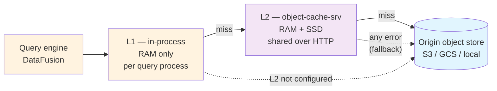

# Caching Architecture

Caching is central to Micromegas read performance. Queries read the same Parquet
partitions and Parquet footers over and over, and the origin object store (S3/GCS)
is the slowest and most expensive hop in that path. Micromegas answers this with a
small family of caches that share one design principle — **the lake is write-once,
so cached bytes never go stale** — and therefore need no invalidation logic at all.

This page describes the caching subsystem as a whole: *what* the tiers are and *why*
they exist. For operator concerns — environment variables, CLI flags, deployment,
and the full metrics taxonomy for `object-cache-srv` — see the companion
[Object Cache Deployment](../admin/object-cache.md) guide. This page cross-links to
it rather than duplicating it.

## The tiered object read path

Reads of lake objects (Parquet partitions, static tables) stack through three tiers,
with transparent fallback at every hop:

1. The query engine reads a Parquet partition, requesting byte ranges from its object store.
2. That store is **L1-wrapped** — an L1 hit never leaves the process.
3. On an L1 miss it falls through to **L2** (the shared `object-cache-srv`) when the cache is
   configured, otherwise straight to origin. The L2 client **falls back to a direct origin read
   on any error** — cache unreachable, non-2xx, or a malformed response.
4. `object-cache-srv` serves from its RAM→SSD backend, fetching missing blocks from origin.

Because every hop degrades to the next one down, a missing or misbehaving cache tier lowers hit
rate but never fails a read.

### L1 and L2 are the same subsystem

The key architectural point: **L1 and L2 are not two different caches — they are two deployments
of one.** Both are built on the same range-cache engine (block-granular range caching, coalescing,
single-flight de-duplication, priority-aware fetching). They differ only in their storage backend:

| Tier | Where | Storage | Eviction |
|---|---|---|---|
| **L1** | in each query process (FlightSQL, monolith) | RAM only | **LFU** |
| **L2** | shared `object-cache-srv`, over HTTP | RAM + SSD | **LRU** (RAM tier) |

The eviction-policy difference is intentional. L1 has a small in-process RAM budget, so
**frequency** (LFU) is the better signal for keeping the genuinely hot partitions resident.
L2's RAM tier fronts a large SSD tier, so its job is to catch **recency** (LRU), with the SSD tier
providing capacity behind it.

### Why it works: the write-once lake invariant

Blocks and partitions are written to deterministic paths exactly once and never mutated. A cached
range therefore can never go stale, so **there is no invalidation logic anywhere in the
subsystem.** Only reads are cached; writes, deletes, and listings always go straight to origin.
This is what lets the cache be a pure pass-through with transparent fallback rather than a
coherence-managed store.

## Read-path mechanics

Because both tiers share the same range-cache engine, these behaviors apply to both. They are
documented at operator granularity in the
[deployment guide](../admin/object-cache.md#fetch-scheduling-memory-bounds); at architecture level
the shape is:

- **Block-granular range caching + coalescing.** Reads are cached per fixed-size block; contiguous
  missing blocks are merged into a single origin GET rather than one GET per block.
- **Priority-aware shared fetch budget.** Every origin fetch is either *demand* (a real read) or
  *prefetch* (background warming). A reserved slice of the budget is always available to demand
  reads, so a demand read is never stuck behind a large prefetch batch — and a prefetch already
  in flight is **promoted** to demand priority if a real read arrives for it.
- **Single-flight de-duplication.** Concurrent reads of the same block coalesce into one origin
  GET; later readers wait on the in-flight fetch instead of issuing their own.
- **Streaming with a memory bound.** `object-cache-srv` streams responses rather than buffering
  them whole, and bounds the total in-flight streaming memory across all concurrent requests — so
  response size is uncapped while server memory stays bounded.

### Cache warming

The cache can be filled ahead of demand through `object-cache-srv`'s `POST /prefetch` endpoint: a
batch of keys is filled at background *prefetch* priority. Warming blocks are admitted to the
**SSD tier only**, so warming never evicts hot demand data from RAM. It is a general "warm these
keys" primitive that anything can drive.

Its one caller today is **write-time warming**. After a writer commits a new partition — durably
to origin *and* to Postgres — it notifies the cache of the new key so the cache pulls it before
the follow-up query asks for it. This is fire-and-forget off the write path: a slow or unreachable
cache never delays or fails the write, and new warming producers can be added without new cache
machinery.

### What is intentionally not cached in L1

L1 wraps only the query read paths — materialized Parquet views and static tables. **Raw
telemetry blocks (`blobs/...`) deliberately bypass L1:** they are read exactly once during ETL, so
caching them in-process would add memory pressure with no reuse benefit. They still flow through
the L2/origin stack like any other read.

## Other caches in the system

Two more caches affect query performance and belong in the end-to-end picture.

### Parsed partition-metadata cache

A separate in-process cache maps a Parquet file path to its **parsed** footer metadata, sized by
`MICROMEGAS_METADATA_CACHE_MB` (default 50 MB). It is what makes the **Postgres partition-metadata
bypass** work: the `partition_metadata` table was removed, and partition metadata is now read from
the Parquet **footer** through the object cache. The footer bytes flow
through the *same* L1/L2 byte cache as the data, and this cache holds the parsed result on top — so
a hot footer is neither re-fetched nor re-parsed. It was a deliberate caching decision to move a
hot metadata read off Postgres and onto the cached object path.

### `PartitionCache` is not a shared cache

Despite the name, `PartitionCache` is **not** part of the caching subsystem. It is a per-query,
in-memory snapshot of the partition rows a query planned against, with no cross-query lifetime and
no eviction. It is called out here only so it is not confused with the object or metadata caches.

### Out of scope

Caches that affect neither query performance nor object-storage cost are intentionally not covered
here — e.g. the OIDC/JWKS auth-key cache and the data-source config cache.

## Explicit non-caches

Two "caches you might expect but won't find" are design decisions worth recording:

- **No DataFusion file/metadata cache.** DataFusion's own `CacheManager` is not configured; Parquet
  caching is deliberately delegated to the footer metadata cache and the L1 byte cache, both of
  which rely on the write-once invariant and need no invalidation.
- **No query-result cache.** Results are recomputed per query; freshness of continuously
  materialized views is prioritized over result reuse.

## Observability

`object-cache-srv` emits a rich metrics/spans taxonomy — hit rate, fetch scheduling, memory and
fetch-budget saturation, per-tier latency — all tabulated in
[Object Cache Deployment → Monitoring](../admin/object-cache.md#monitoring). Two in-process signals
are not covered there:

- **Metadata cache**: `metadata_cache_entry_count` and `metadata_cache_eviction_delay`.
- **L1 byte cache**: the same `range_cache_*` hit/miss counters as L2, but **aggregate only** — L1
  reports `prefix="other"` for every hit/miss, so its parquet and static-table traffic can't be
  split apart.

## Forward-looking

The in-process cache family is designed to grow. A **planned DataFusion metadata cache** would land
as a second in-process tier alongside the byte-range L1 — another cache over the same write-once
lake, warmed and evicted independently. The `MICROMEGAS_OBJECT_CACHE_*` env-var naming was chosen
in part to leave room for it.

## Configuration summary

| Variable | Tier | Default | Purpose |
|---|---|---|---|
| `MICROMEGAS_OBJECT_CACHE_L1_MB` | L1 in-process | 200 | In-process RAM range cache; `0` disables |
| `MICROMEGAS_METADATA_CACHE_MB` | in-process | 50 | Parsed Parquet-footer metadata cache |
| `MICROMEGAS_OBJECT_CACHE_URL` / `_API_KEY` | L2 client opt-in | — | Route reads through `object-cache-srv` |
| (`object-cache-srv` server knobs) | L2 server | — | See [Object Cache Deployment](../admin/object-cache.md#environment-variables) |

## References

- **Shared cache crate:** `rust/object-cache/` — `range_cache/` (`mod.rs`, `fetch.rs`,
  `scheduler.rs`), `l1_store.rs`, `backend.rs`, `bounded_memory_backend.rs`, `foyer_backend.rs`,
  `client.rs`, `prefetch.rs`
- **Cache server:** `rust/object-cache-srv/`
- **In-process caches:** `rust/analytics/src/lakehouse/` — `metadata_cache.rs`,
  `partition_metadata.rs`, `lakehouse_context.rs`, `partition_cache.rs`, `runtime.rs`
- **Write-time warming:** `rust/ingestion/src/data_lake_connection.rs`,
  `rust/analytics/src/lakehouse/write_partition.rs`
- **Deployment guide:** [Object Cache Deployment](../admin/object-cache.md)
