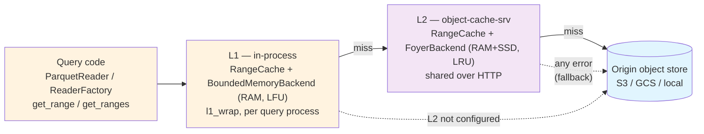

# Caching Architecture

Caching is central to Micromegas read performance. Queries read the same Parquet
partitions and Parquet footers over and over, and the origin object store (S3/GCS)
is the slowest and most expensive hop in that path. Micromegas answers this with a
small family of caches that share one design principle — **the lake is write-once,
so cached bytes never go stale** — and therefore need no invalidation logic at all.

This page describes the caching subsystem as a whole: *what* the tiers are and *why*
they exist. For operator concerns — environment variables, CLI flags, deployment,
and the full metrics taxonomy for `object-cache-srv` — see the companion
[Object Cache Deployment](../admin/object-cache.md) guide. This page cross-links to
it rather than duplicating it.

## The tiered object read path

Reads of lake objects (Parquet partitions, static tables) stack through three tiers,
with transparent fallback at every hop:

1. Query code reads a Parquet partition via `ReaderFactory`/`ParquetReader`, calling
   `object_store.get_range`/`get_ranges`.
2. That store is **L1-wrapped** (`l1_wrap`, `analytics/src/lakehouse/lakehouse_context.rs`) —
   an L1 hit never leaves the process.
3. On an L1 miss it falls through to the inner store: the **L2 `CacheClientStore`**
   when the cache is configured (`MICROMEGAS_OBJECT_CACHE_URL` + `_API_KEY`), otherwise
   the origin directly. `CacheClientStore` (`object-cache/src/client.rs`) routes reads
   to `object-cache-srv` over HTTP and **falls back to a direct origin read on any
   error** — cache unreachable, non-2xx, or a malformed response (`range_cache_client_fallback`).
4. `object-cache-srv` serves from its foyer RAM→SSD backend, fetching missing blocks
   from origin.

Because every hop degrades to the next one down, a missing or misbehaving cache tier
lowers hit rate but never fails a read.

### L1 and L2 are the same subsystem

The key architectural point: **L1 and L2 are not two different caches — they are two
deployments of one.** Both sit on the `object-cache` crate's `RangeCache`
(`object-cache/src/range_cache/`), which implements block-granular range caching,
coalescing, single-flight de-duplication, and the priority-aware fetch budget. They
differ only in **backend** (the `RangeCacheBackend` trait, `object-cache/src/backend.rs`):

| Tier | Where | Backend | Storage | Eviction |
|---|---|---|---|---|
| **L1** | in query process (FlightSQL, monolith) | `BoundedMemoryBackend` | RAM only | **LFU** |
| **L2** | shared `object-cache-srv` over HTTP | `FoyerBackend` | RAM + SSD hybrid | RAM tier: **LRU** |

The eviction-policy difference is intentional. L1's `BoundedMemoryBackend` uses
`LfuConfig` (`bounded_memory_backend.rs`): with a small in-process RAM budget, frequency
is the better signal for keeping the genuinely hot partitions resident. L2's foyer RAM
tier uses `LruConfig` (`foyer_backend.rs`): it fronts a large SSD tier, so its RAM job
is to catch recency, with the SSD tier providing capacity behind it.

### Why it works: the write-once lake invariant

Blocks and partitions are written to deterministic paths exactly once and never mutated.
A cached range therefore can never go stale, so **there is no invalidation logic anywhere
in the subsystem.** Only reads are cached; writes, deletes, and listings always go
straight to origin. This is what lets the cache be a pure pass-through with transparent
fallback rather than a coherence-managed store.

## Read-path mechanics

These behaviors live in the shared `RangeCache` and so apply to both tiers (L1 exercises
them in-process; L2 over HTTP). They are documented at operator granularity in the
[deployment guide](../admin/object-cache.md#fetch-scheduling-memory-bounds); at
architecture level the shape is:

- **Block-granular range caching + coalescing.** Reads are cached per fixed-size block;
  contiguous missing blocks are merged into a single origin GET rather than one GET per block.
- **Priority-aware shared fetch budget.** Every origin fetch is either *demand* (a real
  read) or *prefetch* (background warming). A reserved slice of the fetch budget is always
  available to demand reads, so a demand read is never stuck behind a large prefetch batch.
  A prefetched-but-not-yet-fetched block is **promoted** to demand priority if a demand
  read arrives for it.
- **Single-flight de-duplication.** Concurrent reads of the same block coalesce into one
  origin GET via the `FetchScheduler`'s in-flight map (`range_cache/scheduler.rs`); joiners
  wait on the owner's fetch instead of issuing their own.
- **Streaming responses with a cross-request memory budget.** `object-cache-srv` streams
  bytes to the socket in bounded windows rather than buffering whole responses, and bounds
  the *sum* of in-flight window bytes across all concurrent requests — so response size is
  uncapped while per-server memory stays bounded.

### Cache warming

The cache can be filled ahead of demand through the `POST /prefetch` endpoint on
`object-cache-srv`: a batch of keys (NDJSON, best-effort, load-shed when the queue is full) is
filled at background *prefetch* priority. Prefetched blocks are admitted to the **SSD tier
only** — `FoyerBackend::put` uses `.force().insert()` under the prefetch fill hint
(`foyer_backend.rs`) — so warming never evicts hot demand data from RAM. `POST /prefetch` is a
general "warm these keys" primitive that anything can drive.

Its one caller today is **write-time warming (notify-by-key)**. After a writer commits a new
partition durably to origin *and* to the `lakehouse_partitions` table, it POSTs the partition's
key to `/prefetch` so the cache pulls it before the follow-up query asks for it. This is
fire-and-forget off the write path: `DataLakeConnection::warm_object`
(`ingestion/src/data_lake_connection.rs`) spawns a detached task, so a slow or unreachable cache
never delays or fails the write; its one production caller is the partition-write path
(`write_partition.rs`). `warm_object` is itself a general "warm any object by key" primitive, so
new producers can be added without new cache machinery.

### What is intentionally not cached in L1

`l1_wrap` is applied only to the lakehouse view store (namespace `"lakehouse"`) and the
static-tables store (namespace `"static"`). **Raw blob reads (`blobs/...`) deliberately
bypass L1.** Blobs are read exactly once during ETL materialization (and by the
`get_payload`/`parse_block` SQL functions), so caching them in-process would add memory
pressure for no reuse benefit. They still go through the L2/origin stack like any other read.

## Other caches in the system

Two more caches affect query performance and belong in the end-to-end picture.

### Parsed partition-metadata cache (`MetadataCache`)

`analytics/src/lakehouse/metadata_cache.rs` is a `moka` cache mapping a Parquet file path →
its parsed `Arc<ParquetMetaData>`. It is byte-weighted and size-evicted, sized by
**`MICROMEGAS_METADATA_CACHE_MB`** (default 50 MB, read in `lakehouse_context.rs`).

This cache is what makes the **postgres partition-metadata bypass** work. The postgres
`partition_metadata` table was removed (#1121/#1236); partition metadata is now read from the
Parquet **footer** through the object cache (#1235). `ObjectStoreFetch`
(`analytics/src/lakehouse/partition_metadata.rs`) reads the footer bytes directly from the
object store — which is itself L1/L2-backed — so those footer bytes flow through the *same*
byte cache as the data. `MetadataCache` then caches the *parsed* result on top, so a hot
footer is neither re-fetched (byte cache) nor re-parsed (metadata cache). This was a
deliberate caching-architecture decision: it moved a hot metadata read off postgres and onto
the cached object path.

### `PartitionCache` is not a shared cache

Despite the name, `analytics/src/lakehouse/partition_cache.rs` is **not** part of the caching
subsystem. It is a per-query, in-memory `Vec<Partition>` snapshot of `lakehouse_partitions`
rows, populated by a `SELECT` at query planning time. It has no cross-query lifetime and no
eviction. It is documented here only so it is not confused with the object cache or the
metadata cache.

### Out of scope

Caches that affect neither query performance nor object-storage cost are intentionally not
covered here — e.g. the OIDC/JWKS auth-key cache (`auth/src/oidc.rs`) and the data-source
config cache (`analytics-web-srv/src/data_source_cache.rs`).

## Explicit non-caches

Two "caches you might expect but won't find" are design decisions worth recording:

- **No DataFusion `CacheManager`.** `make_runtime_env` (`analytics/src/lakehouse/runtime.rs`)
  builds the `RuntimeEnv` with only a memory pool — no `CacheManager`, `ListFilesCache`, or
  `FileStatisticsCache`. Parquet caching is deliberately delegated to `MetadataCache` (footers)
  plus `l1_wrap` (byte ranges), which are aware of the write-once invariant and need no
  invalidation.
- **No query-result cache.** Results are recomputed per query. Freshness of continuously
  materialized views is prioritized over result reuse.

## Observability

`object-cache-srv` emits a rich metrics/spans taxonomy — hit rate, fetch scheduling, memory
and fetch-budget saturation gauges, and per-tier latency — all tabulated in
[Object Cache Deployment → Monitoring](../admin/object-cache.md#monitoring). Two in-process
signals are not covered there:

- **`MetadataCache`**: `metadata_cache_entry_count` (on insert) and `metadata_cache_eviction_delay`
  (on size eviction).
- **L1 `RangeCache`**: the same `range_cache_*` hit/miss counters as L2, but **aggregate only** —
  L1 reports `prefix="other"` for every hit/miss, so parquet and static-table traffic can't be
  split apart in L1 metrics.

## Forward-looking

The in-process cache family is designed to grow. The env-var rename to the
`MICROMEGAS_OBJECT_CACHE_*` family (`tasks/completed/rename_l1_cache_env_var_plan.md`) was done
in part to leave room for a **planned DataFusion metadata cache** to land as a second in-process
(L1-tier) cache alongside the byte-range L1. When it does, it has a home in this architecture:
another in-process tier over the same write-once lake, warmed and evicted independently of the
byte cache.

## Configuration summary

| Variable | Tier | Default | Purpose |
|---|---|---|---|
| `MICROMEGAS_OBJECT_CACHE_L1_MB` | L1 in-process | 200 | In-process RAM range cache; `0` disables |
| `MICROMEGAS_METADATA_CACHE_MB` | in-process | 50 | Parsed Parquet-footer metadata cache |
| `MICROMEGAS_OBJECT_CACHE_URL` / `_API_KEY` | L2 client opt-in | — | Route reads through `object-cache-srv` |
| (`object-cache-srv` server knobs) | L2 server | — | See [Object Cache Deployment](../admin/object-cache.md#environment-variables) |

## References

- **Shared cache crate:** `rust/object-cache/` — `range_cache/` (`mod.rs`, `fetch.rs`,
  `scheduler.rs`), `l1_store.rs`, `backend.rs`, `bounded_memory_backend.rs`, `foyer_backend.rs`,
  `client.rs`, `prefetch.rs`
- **Cache server:** `rust/object-cache-srv/`
- **In-process caches:** `rust/analytics/src/lakehouse/` — `metadata_cache.rs`,
  `partition_metadata.rs`, `lakehouse_context.rs`, `partition_cache.rs`, `runtime.rs`
- **Write-time warming:** `rust/ingestion/src/data_lake_connection.rs`
- **Deployment guide:** [Object Cache Deployment](../admin/object-cache.md)
- **Related PRs:** #1188, #1216, #1220, #1225, #1227, #1235, #1236, #1237, #1239
