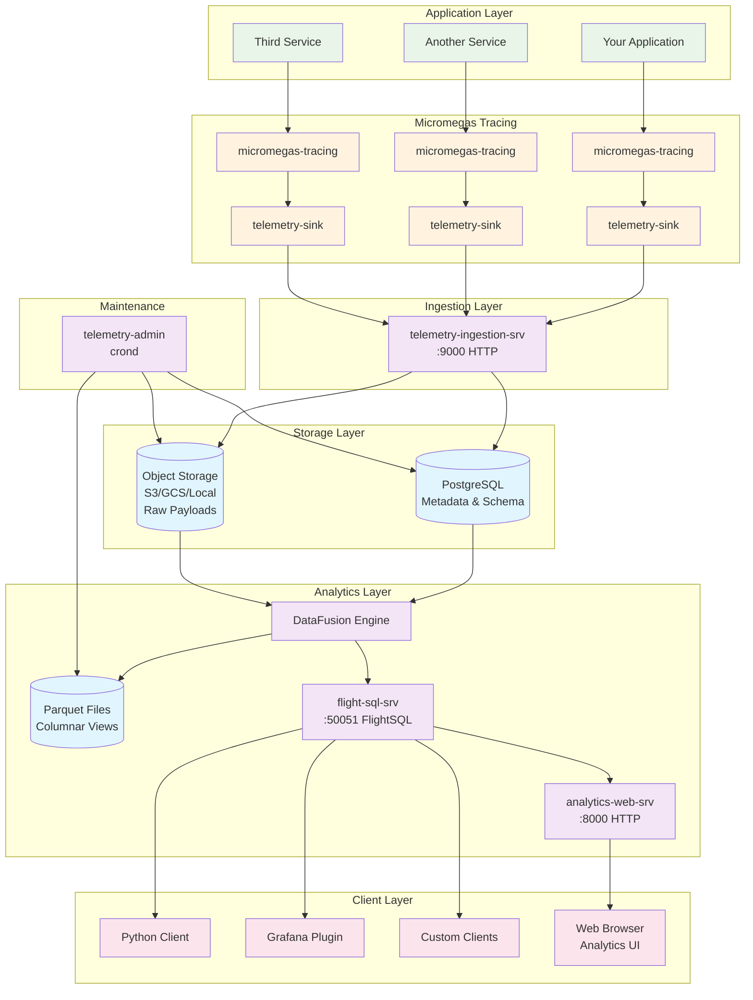
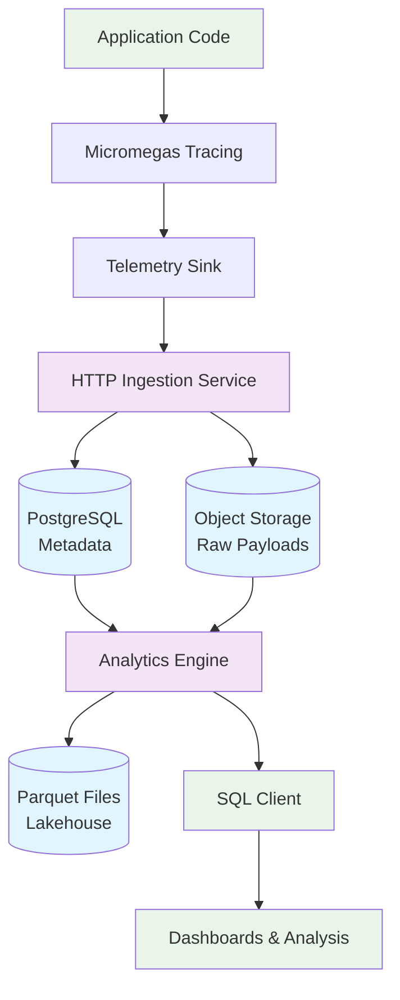
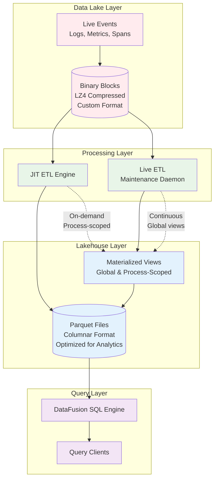

# Architecture Overview

Micromegas is built on a modern lakehouse architecture designed for high-performance observability data collection and analytics.

## Core Components

### Component Responsibilities

#### Data Collection
- **Tracing Library**: Ultra-low overhead (20ns per event) instrumentation embedded in applications
- **Telemetry Sink**: Batches events and handles transmission to ingestion service
- **Ingestion Service**: HTTP endpoint for receiving telemetry data from sinks

#### Data Storage
- **PostgreSQL**: Stores metadata, process information, and stream definitions
- **Object Storage**: Stores raw telemetry payloads in efficient binary format (S3, GCS, or local files)
- **Lakehouse**: Materialized Parquet views created on-demand for fast analytics

#### Analytics Engine
- **DataFusion**: SQL query engine with vectorized execution optimized for Parquet (columnar format)
- **FlightSQL**: High-performance query protocol using Apache Arrow for data transfer
- **HTTP Gateway**: REST API gateway for accessing FlightSQL analytics service
- **Analytics Web App**: Web interface for exploring data, generating Perfetto traces, and monitoring processes
- **Maintenance Daemon**: Background processing for view materialization and data lifecycle

## Data Flow

### Data Flow Steps

1. **Instrumentation**: Applications emit telemetry events using the Micromegas tracing library
2. **Collection**: Events are batched and sent to the ingestion service via HTTP
3. **Storage**: Metadata stored in PostgreSQL, raw payloads stored in object storage
4. **Materialization**: Views created on-demand from raw data using DataFusion
5. **Query**: SQL interface provides analytics capabilities through FlightSQL

## Lakehouse Architecture

### Data Transformation Flow

#### 1. Data Lake Ingestion
- Events collected from applications in real-time
- Stored as compressed binary blocks in object storage
- Custom binary format optimized for high-throughput writes

#### 2. Dual Processing Strategies

**Live ETL (Maintenance Daemon)**:
- Processes recent data continuously (every second/minute/hour)
- Creates global materialized views for cross-process analytics
- Optimized for dashboards and real-time monitoring

**JIT ETL (On-Demand)**:
- Triggered when querying process-specific data
- Fetches relevant blocks, decompresses, and converts to Parquet
- Optimized for deep-dive analysis and debugging

#### 3. Lakehouse Analytics Optimization
- Parquet columnar format enables efficient scanning and filtering
- Dictionary compression reduces storage and improves query performance  
- Predicate pushdown leverages Parquet metadata for fast data pruning

## Analytics Web Application

The analytics web app provides a modern web interface for exploring telemetry data. It consists of:

- **Backend**: Rust-based web server (`analytics-web-srv`) using Axum framework
- **Frontend**: Next.js React application with TypeScript  
- **Integration**: Direct FlightSQL connection to analytics service

### Key Features

- **Process Explorer**: View active processes with real-time metadata
- **Log Viewer**: Stream log entries with level filtering and color coding
- **Trace Generation**: Generate and download Perfetto traces from process data
- **Process Statistics**: Detailed process metrics and monitoring

!!! warning "Development Stage"
    The Analytics Web Application is in early development and only suitable for local testing. Not recommended for production use.

## Design Principles

- **High-frequency collection**: Support for 100k+ events/second per process
- **Cost-efficient storage**: Cheap object storage for raw data with on-demand processing
- **Dual ETL strategy**: Live processing for recent data, JIT for historical analysis
- **Unified observability**: Logs, metrics, and traces in single queryable format
- **Tail sampling friendly**: Store everything cheaply, process selectively
