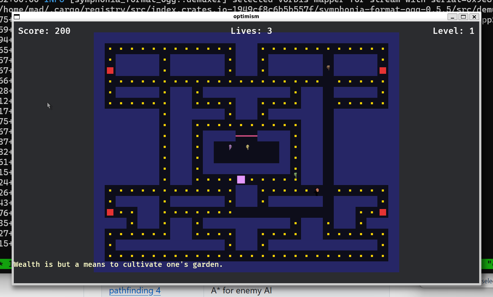

# Instrumenting a Bevy Game with Micromegas

Weekend project: I wanted to document how to instrument a Bevy game with telemetry, so I ended up writing one.

<!-- more -->

The plan was simple — write a tutorial showing how to integrate Micromegas into a Bevy game. Spans, metrics, logs, the full picture. Problem: I needed a game to instrument.

So I built one over the weekend. A Pac-Man clone loosely based on Voltaire's Candide, because why not. It has a full art pipeline (Quaternius 3D models → Blender → 2D sprite sheets), procedural harpsichord music via FluidSynth, A* enemy AI, and a narrator who loses his mind as the violence escalates.

But the point is the instrumentation. The README walks through the complete Micromegas + Bevy integration step by step:

- Bootstrap order (telemetry guard → tracing subscriber → ComputeTaskPool → Bevy app)
- Bridging Bevy's schedule spans into Micromegas via a tracing_subscriber Layer
- `#[span_fn]` on every system function
- `fmetric!` / `imetric!` for gameplay and performance metrics
- Frame-level and subsystem-level span hierarchy

Everything is wired in from the start, not bolted on after the fact. If you're building something in Bevy and want observability, this is the reference I wish existed.

I'll be honest — there's no way I build a full game in a weekend without AI. Claude wrote most of the code while I focused on architecture and design decisions.

[Repo is public](https://github.com/madesroches/optimism) if you want to use the integration as a starting point.
