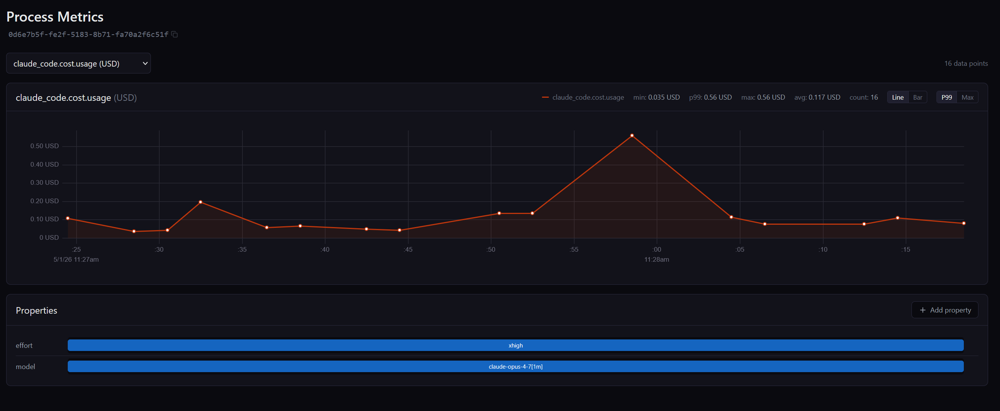

# Micromegas Speaks Open Telemetry Now

[Micromegas](https://github.com/madesroches/micromegas)'s native instrumentation — a Rust crate and an Unreal Engine plugin — gives you about 20ns per event and 100k events per second per process. It's the cheapest way to get telemetry out of code you control. The hard part is "code you control" — production systems are full of code you can't recompile.

<!-- more -->


## The reach problem

The native SDKs ship as a Rust crate and an Unreal Engine plugin. Either way, using them means you need the source, the build, and the willingness to recompile. That's the right trade for first-party services and engine code where every nanosecond of overhead matters. It's also the wrong trade for everything else — vendor binaries, AI agents, the polyglot half of your stack, the one Go service nobody wants to rewrite.

A unified observability platform that can't see those isn't actually unified.

## Open Telemetry already solved instrumentation reach

Every major language has an Open Telemetry SDK. Every major framework has auto-instrumentation. Most modern dev tools emit OTLP if you flip a flag. The hard part of "instrument everything" was already done by the OTel community. The remaining question for any backend is: do you accept what they emit?

Most observability vendors do — at the price of locking it in their wire format on the way through. We don't translate at ingest. The OTLP protobuf lands as-is in object storage; decoding into parquet rows happens lazily at the analytics layer. Same architecture as the native side, different bytes on disk.

## What shipped

Three native OTLP/HTTP routes on the ingestion service:

- `POST /ingestion/otlp/v1/logs` → `log_entries`
- `POST /ingestion/otlp/v1/metrics` → `measures`
- `POST /ingestion/otlp/v1/traces` → `otel_spans`

Same listener, same auth chain, same lakehouse. Bearer-token and OIDC auth ride on `OTEL_EXPORTER_OTLP_HEADERS`. Block IDs are content-addressed, so retried POSTs collapse on insert and never double-count. Full reference is in the [OTLP docs](../../otlp/index.md).

## The honest trade-off

The native crate emits about 20ns per event with thread-local buffering and a custom binary format. OTLP is protobuf over HTTP with batching and retries — heavier per event by orders of magnitude, designed for portability rather than for hundred-thousand-events-per-second hot paths.

The decision rule is simple: if you own the source and care about per-event cost, use the native SDKs (Rust or Unreal). If you don't own the source, or you already have OTel wired up, OTLP gets you to the same lakehouse without rewriting anything.

Same destination, two on-ramps.

One last note on signal coverage: Sum and Gauge metrics land in `measures` today; Histogram, ExponentialHistogram, and Summary are skipped for now. If you need histogram support, [open an issue](https://github.com/madesroches/micromegas/issues) — that's how this gets prioritized.

## What it unlocks

The motivating use case was Claude Code. Claude emits a rich Open Telemetry surface — token costs by cache type, tool-call spans, hook timings, prompt durations — and there was nowhere to put it that didn't involve a separate backend.

Now there is. Six environment variables and the binary:

```bash
export CLAUDE_CODE_ENABLE_TELEMETRY=1
export OTEL_EXPORTER_OTLP_ENDPOINT="https://micromegas.example.com/ingestion/otlp"
export OTEL_EXPORTER_OTLP_PROTOCOL="http/protobuf"
export OTEL_METRICS_EXPORTER=otlp
export OTEL_LOGS_EXPORTER=otlp
export OTEL_EXPORTER_OTLP_HEADERS="Authorization=Bearer mm_abc..."
claude
```

That's the whole integration. Cost per prompt lands as a metric, with the model and effort level preserved as resource attributes:



Tool calls land as spans:


Widen the lens and the same on-ramp covers AI agent fleets, third-party services that already speak OTLP, and polyglot stacks where Micromegas-native is only available in some processes. They all show up next to your `processes`, `log_entries`, and `measures` tables, queryable using the same SQL.

This is what [the previous post](./2026-03-29-from-o11y-to-candor.md) was pointing at — unified telemetry is the moat for AI-driven ops, and "unified" only means something when everything actually lands in the same place.

## Closing

Open Telemetry isn't replacing the native SDKs. They still win on cost-per-event by orders of magnitude, and high-frequency game and server workloads will stay there.

Think of Open Telemetry as the common denominator — the format almost everything already speaks, and now the on-ramp into the same lakehouse as your native streams. The point of a unified observability platform is that "unified" has to actually mean everything.

[Get started with the OTLP docs](../../otlp/index.md) or grab the [repo](https://github.com/madesroches/micromegas).
