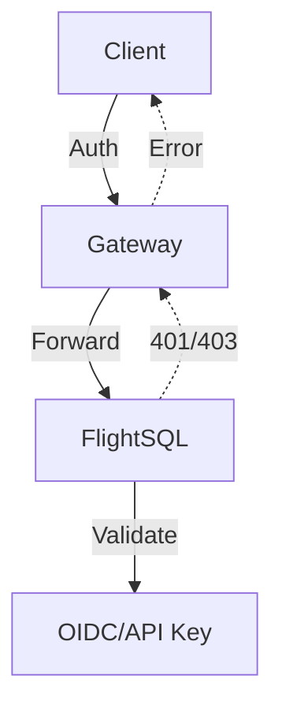

# HTTP Gateway

The HTTP Gateway provides an HTTP/JSON interface to the Micromegas analytics engine, translating HTTP requests into FlightSQL gRPC calls. This enables easier integration from web applications, HTTP-only environments, and clients that don't support gRPC.

## Overview

The HTTP Gateway acts as a transparent proxy between HTTP clients and the FlightSQL backend:

- **HTTP to gRPC Translation**: Converts simple HTTP POST requests to FlightSQL gRPC calls
- **Authentication Forwarding**: Transparently forwards authentication tokens to the backend
- **Configurable Header Forwarding**: Supports custom header forwarding for proprietary auth schemes
- **Origin Tracking**: Tracks query origin with client type augmentation and request correlation
- **Error Handling**: Maps gRPC errors to appropriate HTTP status codes

## Quick Start

### Starting the Gateway

```bash
# Set FlightSQL backend URL
export MICROMEGAS_FLIGHTSQL_URL=grpc://127.0.0.1:50051

# Start gateway on port 3000
cargo run --bin http-gateway-srv -- --listen-endpoint-http 0.0.0.0:3000
```

### Making Your First Query

**Simple query:**
```bash
curl -X POST http://localhost:3000/gateway/query \
  -H "Content-Type: application/json" \
  -d '{"sql": "SELECT * FROM processes LIMIT 5"}'
```

**Query with time range (recommended for performance):**
```bash
curl -X POST http://localhost:3000/gateway/query \
  -H "Content-Type: application/json" \
  -d '{
    "sql": "SELECT * FROM processes ORDER BY start_time DESC LIMIT 5",
    "time_range_begin": "2024-01-01T00:00:00Z",
    "time_range_end": "2024-01-02T00:00:00Z"
  }'
```

Response:
```json
[
  {
    "process_id": "proc-123",
    "exe": "my-app",
    "username": "alice",
    "start_time": "2025-01-15T10:30:00Z"
  },
  ...
]
```

## Features

### Time Range Filtering

The gateway supports out-of-band time range parameters for efficient partition elimination:

```bash
curl -X POST http://localhost:3000/gateway/query \
  -H "Content-Type: application/json" \
  -d '{
    "sql": "SELECT * FROM log_entries ORDER BY time DESC LIMIT 100",
    "time_range_begin": "2024-01-01T00:00:00Z",
    "time_range_end": "2024-01-01T23:59:59Z"
  }'
```

**Benefits:**
- **Partition elimination**: Time range filters are applied before query execution, eliminating entire partitions
- **Better performance**: Significantly faster than SQL time filters for large datasets
- **Consistent API**: Matches FlightSQL service and Python client behavior
- **RFC3339 format**: Standard timestamp format with timezone support

**Requirements:**
- Both `time_range_begin` and `time_range_end` must be provided together
- Timestamps must be in RFC3339 format (e.g., `"2024-01-01T00:00:00Z"`)
- Begin timestamp must be before end timestamp

See [Examples](examples.md) for integration patterns in different languages.

### Transparent Authentication

The gateway forwards authentication headers to the FlightSQL backend without validation:

```bash
curl -X POST http://localhost:3000/gateway/query \
  -H "Authorization: Bearer eyJhbGc..." \
  -H "Content-Type: application/json" \
  -d '{"sql": "SELECT * FROM streams"}'
```

The FlightSQL service validates the token and returns appropriate errors (401/403) which the gateway passes through to the client.

### Origin Tracking

The gateway automatically tracks query origin by augmenting headers:

| Header | Description | Example |
|--------|-------------|---------|
| `x-client-type` | Augmented with `+gateway` suffix | `web+gateway` |
| `x-request-id` | Generated UUID if not provided | `550e8400-e29b-41d4-a716-446655440000` |
| `x-client-ip` | Real client IP (prevents spoofing) | `192.168.1.100` |

**Example with client type:**

```bash
curl -X POST http://localhost:3000/gateway/query \
  -H "X-Client-Type: web" \
  -H "Content-Type: application/json" \
  -d '{"sql": "SELECT * FROM traces"}'
```

The gateway forwards `X-Client-Type: web+gateway` to preserve the full client chain.

### Configurable Header Forwarding

By default, the gateway forwards standard headers like `Authorization`, `X-Request-ID`, and `User-Agent`. You can customize this behavior:

```bash
export MICROMEGAS_GATEWAY_HEADERS='{
  "allowed_headers": ["Authorization", "X-Request-ID", "X-Tenant-ID"],
  "allowed_prefixes": ["X-Custom-"],
  "blocked_headers": ["Cookie", "Set-Cookie"]
}'
```

See [Configuration](configuration.md) for details.

### Error Handling

The gateway maps gRPC errors to HTTP status codes:

| HTTP Status | Meaning | When |
|-------------|---------|------|
| 200 OK | Success | Query executed successfully |
| 400 Bad Request | Invalid request | Empty SQL, query too large (>1MB) |
| 401 Unauthorized | Auth failed | Invalid/missing token (from FlightSQL) |
| 403 Forbidden | Permission denied | User not authorized (from FlightSQL) |
| 500 Internal Error | Server error | SQL syntax error, execution failure |
| 503 Service Unavailable | Backend down | Cannot connect to FlightSQL |

**Error response format:**

```json
{
  "error": "Failed to execute query: table 'invalid' not found"
}
```

## Use Cases

### Web Applications

The gateway enables web apps to query analytics without gRPC:

```javascript
async function queryProcesses() {
  const response = await fetch('http://localhost:3000/gateway/query', {
    method: 'POST',
    headers: {
      'Content-Type': 'application/json',
      'Authorization': `Bearer ${accessToken}`,
      'X-Client-Type': 'web'
    },
    body: JSON.stringify({
      sql: 'SELECT * FROM processes WHERE start_time > NOW() - INTERVAL \'1 hour\''
    })
  });

  if (!response.ok) {
    throw new Error(`Query failed: ${response.statusText}`);
  }

  return await response.json();
}
```

### Proprietary Authentication

The gateway supports custom authentication schemes through header forwarding:

```bash
# Configure custom header forwarding
export MICROMEGAS_GATEWAY_HEADERS='{
  "allowed_headers": ["X-Proprietary-Token", "X-Tenant-ID"],
  "blocked_headers": ["Cookie"]
}'

# Client sends custom headers
curl -X POST http://localhost:3000/gateway/query \
  -H "X-Proprietary-Token: custom-auth-token" \
  -H "X-Tenant-ID: tenant-123" \
  -d '{"sql": "SELECT * FROM logs"}'
```

The backend service validates the custom headers.

### Service Account Delegation

Service accounts can query on behalf of users by providing user attribution headers:

```bash
curl -X POST http://localhost:3000/gateway/query \
  -H "Authorization: Bearer <service-account-token>" \
  -H "X-User-ID: alice@example.com" \
  -H "X-User-Email: alice@example.com" \
  -d '{"sql": "SELECT * FROM user_activity"}'
```

The FlightSQL service validates that the service account is allowed to delegate and logs both the service account and the user being acted upon.

## Architecture

### Request Flow

1. **Client** sends HTTP POST to `/gateway/query` with SQL in JSON body
2. **Gateway** validates request (non-empty SQL, size limits)
3. **Gateway** builds origin metadata (client type, request ID, client IP)
4. **Gateway** forwards allowed headers from client
5. **Gateway** executes gRPC FlightSQL query with all metadata
6. **FlightSQL** validates authentication and executes query
7. **FlightSQL** returns Apache Arrow results
8. **Gateway** converts Arrow to JSON and returns to client

### Logging

The gateway logs all requests with:

- Request ID for correlation
- Client type showing full chain (e.g., `web+gateway`)
- SQL query
- Execution time

**Example gateway logs:**

```
INFO Gateway request: request_id=req-12345, client_type=web+gateway, sql=SELECT * FROM processes
INFO Gateway request completed: request_id=req-12345, duration=37.21ms
```

**Corresponding FlightSQL logs:**

```
INFO execute_query sql="SELECT * FROM processes" user=alice@example.com email=alice@example.com client=web+gateway
```

The request ID appears in both logs for end-to-end tracing.

## Security

### Security Model

The HTTP Gateway follows a **transparent proxy** security model:



**Key Principles:**

1. **Gateway does not validate authentication** - All auth validation happens in FlightSQL
2. **Transparent forwarding** - Gateway forwards auth headers without modification
3. **Error pass-through** - 401/403 errors from FlightSQL passed to client
4. **Origin tracking** - Gateway adds audit metadata (client IP, type, request ID)
5. **Header security** - Explicit allowlist prevents sensitive header leakage

### Authentication Delegation

**Gateway Role:**
- Forwards `Authorization` header to FlightSQL backend
- Does not parse, validate, or cache tokens
- No authentication dependencies or configuration

**FlightSQL Role:**
- Validates OIDC tokens via JWKS
- Validates API keys via HashMap lookup
- Returns 401 Unauthorized for invalid tokens
- Returns 403 Forbidden for permission denials

**Benefits:**
- Simpler gateway implementation
- Centralized auth logic in FlightSQL
- Consistent auth behavior across all clients
- No token caching vulnerabilities in gateway

### User Impersonation Prevention

FlightSQL enforces strict user attribution validation to prevent impersonation attacks.

**OIDC User Tokens (End Users)** - OIDC users **cannot** impersonate other users:
- FlightSQL extracts subject and email from OIDC token
- If `x-user-id` or `x-user-email` headers present, must match token claims
- Mismatch returns 403 Forbidden
- If headers not provided, token claims used for logging

**API Keys and Service Accounts (Delegation)** - Service accounts **can** delegate (act on behalf of users):
- Backend services can query on behalf of users
- Batch processing with user attribution
- Logs show both user and service account

| Authentication Type | Can Impersonate | Validation |
|--------------------|-----------------|------------|
| OIDC User Token | ❌ No | Headers must match token claims |
| API Key | ✅ Yes (delegation) | Service account can act on behalf of users |

### Client IP Security

The gateway always extracts client IP from the actual connection:

- ✅ Blocks `x-client-ip` header from clients
- ✅ Uses real socket address or `X-Forwarded-For` (from trusted proxies)
- ✅ Prevents IP spoofing in audit logs

### Header Forwarding Security

Default configuration blocks sensitive headers:

- ❌ `Cookie` and `Set-Cookie` blocked by default
- ❌ `X-Client-IP` always blocked (gateway sets from connection)
- ✅ Explicit allowlist approach (deny by default)
- ✅ Case-insensitive matching prevents bypass attempts

## Next Steps

- [Configuration](configuration.md) - Header forwarding, environment variables
- [Examples](examples.md) - Common use cases and integration patterns

## Reference

- Binary: `rust/http-gateway/src/http_gateway_srv.rs`
- Implementation: `rust/public/src/servers/http_gateway.rs`
- Configuration: `rust/http-gateway/src/config.rs`
