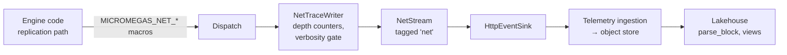

# Network Tracing

!!! note "Audience"
    This document is written to be readable by both human integrators and coding-agent LLMs (e.g. Claude Code). The recipe sections follow a fixed shape — **file**, **function**, **insertion point**, **literal macro line**, **why** — so an agent can apply each site without ambiguity. Human readers can safely skim subsections that don't apply to their engine configuration.

!!! info "Engine version"
    This recipe was authored from a **UE 5.7** codebase but is expected to apply across UE 5.x releases. Function names referenced below have been stable across recent 5.x versions, but **line numbers and surrounding code will differ in your fork** — anchor on the function name and landmark statement, not on line numbers. The rest of the page refers to the target as "UE 5".

For macro signatures, parameters, and semantics, see [Instrumentation API → Network Tracing](instrumentation-api.md#network-tracing).

## 1. Overview

Micromegas net tracing captures per-connection replication traffic at the UE engine layer and lands it in the lakehouse as a structured event stream. Unlike generic spans or logs, net events carry a **bit-size attribution model**: each root object or RPC records how many bits of content it contributed to a connection, letting you answer "which actors/properties dominate per-connection bandwidth?" directly in SQL.

Net tracing is separate from spans/logs/metrics because:

- It needs tight coupling to replication internals (bit stream positions, bunch writers, content blocks) that generic spans can't observe.
- It has its own verbosity ladder (packets / root objects / objects / properties) independent of span sampling.
- It produces a nested event hierarchy — `Connection → Object → Subobject → Property` or `Connection → RPC → Property` — that mirrors the wire format rather than call stacks.

**Event hierarchy.** Net events stream into a dedicated `net` tagged stream. The wire shape depends on whether the project uses classic replication or Iris.

**Classic incoming example (`ProcessBunch` path):**

```
NetConnectionBeginEvent       connection="127.0.0.1:7777"  is_outgoing=false
  NetObjectBeginEvent         name="PlayerPawn_C_0"
  NetPropertyEvent            name="Health"            bit_size=16
  NetPropertyEvent            name="ReplicatedMovement" bit_size=112
  NetObjectEndEvent           bit_size=512
  NetObjectBeginEvent         name="InventoryComponent"   # peer, not nested
  NetPropertyEvent            name="GoldCount"         bit_size=24
  NetObjectEndEvent           bit_size=88
  NetRPCBeginEvent            name="ClientNotifyHit"
  NetPropertyEvent            name="HitLocation"       bit_size=96
  NetRPCEndEvent              bit_size=160
NetConnectionEndEvent         bit_size=760             # sum of root Object/RPC bits
```

**Iris outgoing example (`WriteObjectAndSubObjects` path):**

```
NetConnectionBeginEvent       connection="127.0.0.1:7777"  is_outgoing=true
  NetObjectBeginEvent         name="PlayerPawn_C_0"
    NetPropertyEvent          name="Health"            bit_size=16
    NetObjectBeginEvent       name="WeaponComponent"   # nested inside parent
      NetPropertyEvent        name="AmmoCount"         bit_size=24
    NetObjectEndEvent         bit_size=88
  NetObjectEndEvent           bit_size=520
NetConnectionEndEvent         bit_size=520
```

The classic shape emits subobjects as **peers** at depth 0; Iris emits them **nested** at depth 1+. Both are correct — they mirror the actual replication traversal order in each system. See [Architecture → Classic vs Iris hierarchy](#classic-vs-iris-hierarchy).

## 2. Architecture

This section is load-bearing: the recipe in §3 makes judgment calls (which macro form, which bit source, when to suspend) that only make sense once the architecture is understood. When the implementer faces a novel call site or a renamed function, this section is the fallback.

### Data flow



### Verbosity model

Runtime verbosity is a 0–4 enum:

| Level | Name | Emits |
|-------|------|-------|
| 0 | `Off` | Nothing |
| 1 | `Packets` | Connection scopes only |
| 2 | `RootObjects` | + root object scopes (depth 0) |
| 3 | `Objects` | + nested object scopes (depth 1+) |
| 4 | `Properties` | + per-property leaf events, + RPC scopes (root and nested) |

**Depth-based gating rule.** Inside `NetTraceWriter`:

- Object scopes: depth 0 = at least level `RootObjects`; depth 1+ = at least level `Objects`
- Property leaves = level `Properties`
- RPC scopes (Begin/End events) = level `Properties`

**Default:** level 2 (`RootObjects`) — production setting, cheap enough to run continuously.

Note that root RPC bit_size (`ObjectDepth == 0` at `EndRPC`) still accumulates into `NetConnectionEndEvent.bit_size` at every verbosity ≥ `Packets`, regardless of whether the `NetRPC*` events themselves are emitted. Only the per-RPC event records require level 4.

**Snapshot invariant (Decision 6).** The writer captures `EffectiveVerbosity` at the **outermost** `BeginConnection` and uses that snapshot for every gating decision in the scope. CVar-driven changes take effect at the **next** outer connection scope, never mid-scope. This eliminates orphaned Begin/End pairs and partially-gated subtrees.

### Content-attribution vs wire-bit semantics

Net tracing emits two distinct families of data. Pick the right one for your question:

| Question | Use |
|----------|-----|
| Which actors/properties dominate per-connection bandwidth? | `NetObjectEndEvent.bit_size` / `NetPropertyEvent.bit_size` |
| What's the connection's true bandwidth on the wire? | `sum(net.packet_sent_bits)` filtered by `connection_name` |
| What fraction is framing/overhead? | `1 − sum(NetConnectionEndEvent.bit_size) / sum(net.packet_*_bits)` |

`bit_size` on the `NetConnectionEndEvent` is the **content sum**: root-level `NetObjectEndEvent.bit_size` + root-level `NetRPCEndEvent.bit_size`. It deliberately excludes packet headers, bunch headers, control bunches, NetGUID exports, voice, and anything outside an `OBJECT_SCOPE` or `RPC_SCOPE`.

The `ObjectDepth == 0` gate in `EndObject` / `EndRPC` prevents nested-scope double-counting: a receive RPC inside a subobject scope measures the same `Reader` delta as the outer object, so only the outer contribution is accumulated. Don't try to defeat this — see [Pitfalls → RPC bits double-count](#rpc-bits-double-count-into-netconnectionendeventbit_size).

### Classic vs Iris hierarchy

**Classic** — `UActorChannel::ReplicateActor` opens a root-actor scope, replicates the actor, **closes** the scope, then calls `DoSubObjectReplication`, which opens a **peer** scope at depth 0 for each subobject. The two scopes are siblings in the event stream.

Why: classic's actor/subobject split is serialized into separate scopes because they run sequentially in different bunches.

**Iris** — `FReplicationWriter::WriteObjectAndSubObjects` is recursive: the parent scope stays open while child scopes run inside it, producing a nested tree in the event stream.

Why: Iris serializes an object and all its subobjects into a single batch, so the scope structure follows the recursion.

**Consequence for queries.** Queries that walk hierarchy must handle both shapes — or filter on a per-process flag that identifies Iris vs classic processes.

### Non-nesting invariant (Decision 6)

**Connection scopes do not nest.** Only the outermost `BeginConnection` emits and resets writer state; nested ones are absorbed as no-ops and logged once via `LogMicromegasNet` with the inner/outer `(name, direction)` pair.

Consequence:

- If a nested scope closes while `ObjectDepth == 0`, its `AccumulatedBits` roll into the outer's total.
- If it closes while inside an outer object scope, the bits are dropped.

Don't try to defeat this by changing the writer. Instead:

- Instrument so scopes don't overlap naturally (one per replication entry point).
- For paths that process packets/bunches but **shouldn't** contribute to attribution (demo, replay), use `MICROMEGAS_NET_SUSPEND_SCOPE()` instead.

### Suspend mechanism

`MICROMEGAS_NET_SUSPEND_SCOPE()` zeroes out every `MICROMEGAS_NET_*` call inside its lifetime without touching depth counters. Safe to nest under an active live scope — the live scope resumes unchanged when the suspend scope exits.

Use it for:

- Demo recording / replay scrubbing
- Server-side simulation that re-runs replication
- Any synchronous engine callback that can fire from inside a live packet/replication scope and shouldn't be attributed

### RAII everywhere

Every `MICROMEGAS_NET_*` macro is RAII. There are no public `BEGIN_*` / `END_*` macros. Do not call `Dispatch::NetEndConnection` / `NetEndObject` / `NetEndRPC` directly — only the scope guard destructors are authorized callers.

Early returns are safe: the destructors close scopes automatically when the enclosing block exits.

## 3. Engine instrumentation recipe

Every site below follows the same shape:

- **File** — UE 5 path (`Engine/Source/...` or `Engine/Plugins/...`).
- **Function** — qualified signature.
- **Insertion point** — a named landmark statement in the existing code.
- **Insert** — the literal macro line (copy-pasteable C++).
- **Why** — one sentence on what breaks or is misattributed if skipped.

Line numbers will differ in your fork. Anchor on the function name and landmark statement.

**Connection-name resolution snippet.** Every connection-scope site uses the same two-liner to pick a stable `FName` for the connection. Defined once here, referenced by `<conn-name>` below:

```cpp
FName MmConnectionName = Connection->GetPlayerOnlinePlatformName();
if (MmConnectionName == NAME_None) { MmConnectionName = Connection->GetFName(); }
```

Adjust `Connection->` if the local handle is named differently (e.g. `Params.Connection`, `NetConnection`).

### 3.1 Incoming packet scope

- **File:** `Engine/Source/Runtime/Engine/Private/NetConnection.cpp`
- **Function:** `UNetConnection::ReceivedPacket`
- **Insertion point:** after the `if (PacketNotify.ReadHeader(Reader))` success branch, before `InTraceCollector` setup.
- **Insert:**

    ```cpp
    // micromegas net trace
    FName MmConnectionName = GetPlayerOnlinePlatformName();
    if (MmConnectionName == NAME_None) { MmConnectionName = GetFName(); }
    MICROMEGAS_NET_CONNECTION_SCOPE(MmConnectionName, /*bIsOutgoing=*/ false);
    ```

- **Why:** natural function-scoped boundary for one received UDP packet; RAII closes the scope on every early-return path.

Then, near the existing `UE_NET_TRACE_PACKET_RECV(...)` line at the end of the function, add the wire-bit metric:

- **Insert:**

    ```cpp
    // micromegas net trace — physical wire bits
    MICROMEGAS_IMETRIC("net", MicromegasTracing::Verbosity::Med,
                       TEXT("net.packet_received_bits"), TEXT("bits"),
                       Reader.GetNumBits());
    ```

### 3.2 Outgoing packet metric

- **File:** `Engine/Source/Runtime/Engine/Private/NetConnection.cpp`
- **Function:** `UNetConnection::FlushNet`
- **Insertion point:** immediately after the `UE_NET_TRACE_PACKET_SEND(...)` line, before the `LowLevelSend` call.
- **Insert:**

    ```cpp
    // micromegas net trace — physical wire bits
    MICROMEGAS_IMETRIC("net", MicromegasTracing::Verbosity::Med,
                       TEXT("net.packet_sent_bits"), TEXT("bits"),
                       SendBuffer.GetNumBits());
    ```

- **Why:** physical wire-bit counter. **Do not** open a `MICROMEGAS_NET_CONNECTION_SCOPE` here — outgoing scopes live at higher-level replication entry points (§3.3, §3.4, §3.5).

### 3.3 Classic server replication scope

- **File:** `Engine/Source/Runtime/Engine/Private/NetDriver.cpp`
- **Function:** `UNetDriver::ServerReplicateActors_ForConnection`
- **Insertion point:** first executable line of the function body, inside the `#if WITH_SERVER_CODE` guard.
- **Insert:**

    ```cpp
    // micromegas net trace
    FName MmConnectionName = Params.Connection->GetPlayerOnlinePlatformName();
    if (MmConnectionName == NAME_None) { MmConnectionName = Params.Connection->GetFName(); }
    MICROMEGAS_NET_CONNECTION_SCOPE(MmConnectionName, /*bIsOutgoing=*/ true);
    ```

- **Why:** wraps the per-connection actor-replication walk on a vanilla server (no RepGraph). **Skipped entirely** when `UReplicationDriver` is set — that path needs §3.4 instead.

### 3.4 RepGraph server replication scope

- **File:** `Engine/Plugins/Runtime/ReplicationGraph/Source/Private/ReplicationGraph.cpp`
- **Function:** `UReplicationGraph::ServerReplicateActors`
- **Insertion point:** inside the `for (UNetReplicationGraphConnection* ConnectionManager : Connections)` loop, after the early-`continue` checks (saturation, invalid connection) and before the gather phase.
- **Insert:**

    ```cpp
    // micromegas net trace
    FName MmConnectionName = NetConnection->GetPlayerOnlinePlatformName();
    if (MmConnectionName == NAME_None) { MmConnectionName = NetConnection->GetFName(); }
    MICROMEGAS_NET_CONNECTION_SCOPE(MmConnectionName, /*bIsOutgoing=*/ true);
    ```

- **Why:** RepGraph short-circuits `UNetDriver::ServerReplicateActors`, so the §3.3 scope never opens for RepGraph traffic. Symptom of missing this site: object/property events appear outside any `BeginConnection` event — especially ~120 actors per tick with `bit_size:0` from the relevancy walk.

### 3.5 Iris outgoing scope

- **File:** `Engine/Source/Runtime/Engine/Private/Net/Experimental/Iris/DataStreamChannel.cpp`
- **Function:** `UDataStreamChannel::WriteData`
- **Insertion point:** after the `if (Result == EWriteResult::NoData) return;` early return, before the main write loop.
- **Insert:**

    ```cpp
    // micromegas net trace
    FName MmConnectionName = Connection->GetPlayerOnlinePlatformName();
    if (MmConnectionName == NAME_None) { MmConnectionName = Connection->GetFName(); }
    MICROMEGAS_NET_CONNECTION_SCOPE(MmConnectionName, /*bIsOutgoing=*/ true);
    ```

- **Why:** opens only when there's actual work — empty ticks don't produce empty scopes. Iris bypasses both classic scopes (§3.3, §3.4).

### 3.6 Queued-bunch deferred-flush scope

- **File:** `Engine/Source/Runtime/Engine/Private/DataChannel.cpp`
- **Function:** `UActorChannel::ProcessQueuedBunches`
- **Insertion point:** inside the `bHasTimeToProcess && PendingGuidResolves.Num() == 0` branch, immediately before the `while ((BunchIndex < QueuedBunches.Num()) && ...)` drain loop.
- **Insert:**

    ```cpp
    // micromegas net trace
    FName MmConnectionName = Connection->GetPlayerOnlinePlatformName();
    if (MmConnectionName == NAME_None) { MmConnectionName = Connection->GetFName(); }
    MICROMEGAS_NET_CONNECTION_SCOPE(MmConnectionName, /*bIsOutgoing=*/ false);
    ```

- **Why:** queued bunches (parked waiting for NetGUID resolution) are flushed from `UActorChannel::Tick()`, **outside** the §3.1 `ReceivedPacket` scope. Without this, multi-kilobit `InventoryManagerComponent` and similar large initial-state objects orphan ~1 s after the packet arrives.

### 3.7 Classic object scopes

Four sites.

#### 3.7.1 `UActorChannel::ReplicateActor` (root actor, send)

- **File:** `Engine/Source/Runtime/Engine/Private/DataChannel.cpp`
- **Insertion point:** inside the `// The Actor` block, immediately after the existing `UE_NET_TRACE_OBJECT_SCOPE(ActorReplicator->ObjectNetGUID, Bunch, ...)` line.
- **Insert:**

    ```cpp
    // micromegas net trace
    MICROMEGAS_NET_OBJECT_SCOPE(Actor->GetFName(), Bunch.GetNumBits());
    ```

- **Why:** root actor body. Bit source is the bunch writer because that's the wire stream the actor's bits land in.

#### 3.7.2 `UActorChannel::WriteSubObjectInBunch` (subobject, send)

- **File:** `Engine/Source/Runtime/Engine/Private/DataChannel.cpp`
- **Insertion point:** immediately after the existing `UE_NET_TRACE_OBJECT_SCOPE(ObjectReplicator->ObjectNetGUID, Bunch, ...)` line, before the `bWroteSomething = ObjectReplicator.Get().ReplicateProperties(Bunch, ObjRepFlags);` call.
- **Insert:**

    ```cpp
    // micromegas net trace
    MICROMEGAS_NET_OBJECT_SCOPE(Obj->GetFName(), Bunch.GetNumBits());
    ```

- **Why:** subobject body. In classic, this opens at depth 0 (peer to the root actor's scope, **not nested**) — the §3.7.1 scope already closed by the time `WriteSubObjectInBunch` is called from `DoSubObjectReplication`.

#### 3.7.3 `UActorChannel::ProcessBunch` content-block receive loop

- **File:** `Engine/Source/Runtime/Engine/Private/DataChannel.cpp`
- **Insertion point:** immediately after `TSharedRef<FObjectReplicator>& Replicator = FindOrCreateReplicator(RepObj);`, before `bool bHasUnmapped = false;`.
- **Insert:**

    ```cpp
    // micromegas net trace
    MICROMEGAS_NET_OBJECT_SCOPE(RepObj->GetFName(), Reader.GetPosBits());
    ```

- **Why:** covers both root actors and subobjects on receive — `ProcessBunch`'s loop body handles both. Bit source is `Reader` (the local `FNetBitReader` containing the content-block payload), **not** `Bunch` (the outer packet reader — using `Bunch` here would measure the wrong delta).

#### 3.7.4 `FObjectReplicator::ReplicateCustomDeltaProperties` (fast arrays / custom delta)

- **File:** `Engine/Source/Runtime/Engine/Private/DataReplication.cpp`
- **Insertion point:** inside the per-property loop, after the trace-collection reset block, before the `TSharedPtr<INetDeltaBaseState>& OldState = ...` assignment.
- **Insert:**

    ```cpp
    // micromegas net trace
    MICROMEGAS_NET_OBJECT_SCOPE(Property->GetFName(), TempBitWriter.GetNumBits());
    ```

- **Why:** outer container for fast-array / custom-delta properties. Opens at depth 1 (nested inside the root-actor scope, since `ReplicateCustomDeltaProperties` is called from `ReplicateProperties_r` inside `ReplicateActor`'s scope) — the **one classic exception** to the peer-not-nested rule.

### 3.8 Classic property scopes

Five sites in `Engine/Source/Runtime/Engine/Private/RepLayout.cpp`. The macro form (flat vs scope) is dictated by what's already available; pick wrong and you create unnecessary divergence.

#### 3.8.1 `SendProperties_r`, shared-property branch

- **Insertion point:** immediately after `NETWORK_PROFILER(GNetworkProfiler.TrackReplicateProperty(ParentCmd.Property, SharedPropInfo->PropBitLength, nullptr));`.
- **Insert:**

    ```cpp
    // micromegas net trace
    MICROMEGAS_NET_PROPERTY(Cmd.Property->GetFName(), SharedPropInfo->PropBitLength);
    ```

- **Why flat:** `SharedPropInfo->PropBitLength` is pre-computed, no delta needed.

#### 3.8.2 `SendProperties_r`, regular-property branch

- **Insertion point:** immediately after `NETWORK_PROFILER(GNetworkProfiler.TrackReplicateProperty(ParentCmd.Property, NumEndBits - NumStartBits, nullptr));`.
- **Insert:**

    ```cpp
    // micromegas net trace
    MICROMEGAS_NET_PROPERTY(Cmd.Property->GetFName(), NumEndBits - NumStartBits);
    ```

- **Why flat:** `NumStartBits` / `NumEndBits` are pre-existing engine locals captured for `NETWORK_PROFILER` — reuse them in a single line. Switching to the scope form would require wrapping `NetSerializeItem` in a new brace-bounded block to avoid measuring the trailing `ENABLE_PROPERTY_CHECKSUMS` code, **increasing** divergence.

#### 3.8.3 `SendProperties_BackwardsCompatible_r`

- **Insertion point:** immediately after `NETWORK_PROFILER(GNetworkProfiler.TrackReplicateProperty(Cmd.Property, NumEndBits - NumStartBits, nullptr));`.
- **Insert:**

    ```cpp
    // micromegas net trace
    MICROMEGAS_NET_PROPERTY(Cmd.Property->GetFName(), NumEndBits - NumStartBits);
    ```

- **Why flat:** same reasoning as §3.8.2.

#### 3.8.4 `ReceiveProperties_r`

- **Insertion point:** inside the per-property block, immediately after the existing `UE_NET_TRACE_DYNAMIC_NAME_SCOPE(Cmd.Property->GetFName(), Params.Bunch, ...)` line, before the `if (ReceivePropertyHelper(...))` call.
- **Insert:**

    ```cpp
    // micromegas net trace
    MICROMEGAS_NET_PROPERTY_SCOPE(Cmd.Property->GetFName(), Params.Bunch.GetPosBits());
    ```

- **Why scope:** there's no pre-existing bit capture here, and the scope form absorbs what would otherwise be a dedicated `MmStartBits` capture — one line instead of three.

#### 3.8.5 `ReceiveProperties_BackwardsCompatible_r`

- **Insertion point:** after the `TempReader.ResetData(Reader, NumBits)` and error-check block, before `if (NetFieldExportGroup->NetFieldExports[NetFieldExportHandle].bIncompatible) continue;`.
- **Insert:**

    ```cpp
    // micromegas net trace
    MICROMEGAS_NET_PROPERTY(NetFieldExportGroup->NetFieldExports[NetFieldExportHandle].ExportName, NumBits);
    ```

- **Why flat:** `NumBits` is read directly from the stream as a packed int — no delta needed.

### 3.9 Classic RPCs

Three sites.

#### 3.9.1 `ProcessRemoteFunctionForChannelPrivate`, send-side

- **File:** `Engine/Source/Runtime/Engine/Private/NetDriver.cpp`
- **Function:** `UNetDriver::ProcessRemoteFunctionForChannelPrivate`
- **Insertion point:** after `TSharedPtr<FRepLayout> RepLayout = GetFunctionRepLayout(Function);`, immediately before `RepLayout->SendPropertiesForRPC(Function, Ch, TempWriter, Parms);`.
- **Insert:**

    ```cpp
    // micromegas net trace
    MICROMEGAS_NET_RPC_SCOPE(Function->GetFName(), TempWriter.GetNumBits());
    ```

- **Why:** `TempWriter` is fresh per-RPC, so `GetNumBits()` gives the full payload size via the destructor delta after `SendPropertiesForRPC` returns.

#### 3.9.2 `ProcessRemoteFunctionForChannelPrivate`, RPC-forced ReplicateActor block

- **File:** `Engine/Source/Runtime/Engine/Private/NetDriver.cpp`
- **Function:** `UNetDriver::ProcessRemoteFunctionForChannelPrivate`
- **Insertion point:** earlier in the same function — the `Ch->SetForcedSerializeFromRPC(true); Ch->ReplicateActor(); Ch->SetForcedSerializeFromRPC(false);` triple. Wrap it in a brace-bounded block with a connection scope:
- **Insert (replaces the triple):**

    ```cpp
    // micromegas net trace
    {
        FName MmConnectionName = Connection->GetPlayerOnlinePlatformName();
        if (MmConnectionName == NAME_None) { MmConnectionName = Connection->GetFName(); }
        MICROMEGAS_NET_CONNECTION_SCOPE(MmConnectionName, /*bIsOutgoing=*/ true);

        Ch->SetForcedSerializeFromRPC(true);
        Ch->ReplicateActor();
        Ch->SetForcedSerializeFromRPC(false);
    }
    ```

- **Why:** when an RPC fires for an actor whose channel isn't up to date, `ReplicateActor` is forced — emitting a full actor + subobject + fast-array walk that needs connection attribution. The brace bounds the RAII lifetime so `EndConnection` fires immediately after `SetForcedSerializeFromRPC(false)`. If reached while another scope is open (e.g. inside §3.3), Decision-6 absorbs the nested Begin/End as no-ops.

#### 3.9.3 `FObjectReplicator::ReceivedRPC`

- **File:** `Engine/Source/Runtime/Engine/Private/DataReplication.cpp`
- **Insertion point:** immediately before `FuncRepLayout->ReceivePropertiesForRPC(Object, LayoutFunction, OwningChannel, Reader, Parms, UnmappedGuids);`.
- **Insert:**

    ```cpp
    // micromegas net trace — FunctionName is already in scope from earlier FieldCache->Field.GetFName()
    MICROMEGAS_NET_RPC_SCOPE(FunctionName, Reader.GetPosBits());
    ```

- **Why:** receive-side RPC body. `Reader` is the bit reader the RPC parameters are deserialized from.

### 3.10 Iris properties

Eight sites in `Engine/Source/Runtime/Net/Iris/Private/Iris/ReplicationSystem/ReplicationOperations.cpp` — one per `Serialize` / `Deserialize` variant.

**Pattern (identical at every site):** inside the `for (uint32 MemberIt = 0; MemberIt < MemberCount; ++MemberIt)` loop, immediately before the `MemberSerializerDescriptor.Serializer->{Serialize,Deserialize,SerializeDelta,DeserializeDelta}(Context, Args);` call. The macro line is:

```cpp
// micromegas net trace — Serialize variants
MICROMEGAS_NET_PROPERTY_SCOPE(MemberDebugDescriptors[MemberIt].DebugName->Name,
                              Context.GetBitStreamWriter()->GetPosBits());
```

with `GetBitStreamWriter()` for `Serialize*` variants, `GetBitStreamReader()` for `Deserialize*` variants.

The eight functions:

| Function | Bit stream | Serializer call |
|----------|-----------|-----------------|
| `Serialize` | `GetBitStreamWriter()` | `Serializer->Serialize` |
| `Deserialize` | `GetBitStreamReader()` | `Serializer->Deserialize` |
| `SerializeDelta` | `GetBitStreamWriter()` | `Serializer->SerializeDelta` |
| `DeserializeDelta` | `GetBitStreamReader()` | `Serializer->DeserializeDelta` |
| `SerializeWithMask` | `GetBitStreamWriter()` | `Serializer->Serialize` |
| `DeserializeWithMask` | `GetBitStreamReader()` | `Serializer->Deserialize` |
| `SerializeDeltaWithMask` | `GetBitStreamWriter()` | `Serializer->SerializeDelta` |
| `DeserializeDeltaWithMask` | `GetBitStreamReader()` | `Serializer->DeserializeDelta` |

**For the four `WithMask` variants**, the macro lives **inside** the `if (ChangeMask.IsAnyBitSet(...))` (or equivalent changemask-check) block so only dirty properties trace.

**Why:** Iris has no `NETWORK_PROFILER` capture to reuse, and the bit position is a `GetPosBits` delta across the serializer call — the scope form is the right tool. `DebugName->Name` is `const TCHAR*` (process-lifetime stable, allocated by `CreatePersistentNetDebugName`) — pass directly; the macro wraps it in `StaticStringRef` internally.

### 3.11 Iris objects

Two sites.

#### 3.11.1 `FReplicationWriter::SerializeObjectStateDelta`

- **File:** `Engine/Source/Runtime/Net/Iris/Private/Iris/ReplicationSystem/ReplicationWriter.cpp`
- **Insertion point:** first executable line of the function body.
- **Insert:**

    ```cpp
    // micromegas net trace
    MICROMEGAS_NET_OBJECT_SCOPE(
        (ObjectData.Protocol && ObjectData.Protocol->DebugName) ? ObjectData.Protocol->DebugName->Name : TEXT("Unknown"),
        Context.GetBitStreamWriter()->GetPosBits());
    ```

- **Why:** per-object Iris send entry point, called for both root objects and subobjects within a batch. Null-guard on `Protocol` / `DebugName` falls back to the literal `TEXT("Unknown")` (also process-lifetime stable). Depth-based gating in `NetTraceWriter` decides which level emits.

#### 3.11.2 `FReplicationReader::DeserializeObjectStateDelta`

- **File:** `Engine/Source/Runtime/Net/Iris/Private/Iris/ReplicationSystem/ReplicationReader.cpp`
- **Insertion point:** first executable line of the function body.
- **Insert:**

    ```cpp
    // micromegas net trace
    MICROMEGAS_NET_OBJECT_SCOPE(
        (ObjectData.Protocol && ObjectData.Protocol->DebugName) ? ObjectData.Protocol->DebugName->Name : TEXT("Unknown"),
        Context.GetBitStreamReader()->GetPosBits());
    ```

- **Why:** symmetric receive path with the same null-guard pattern.

### 3.12 Iris RPCs

Four sites in `Engine/Source/Runtime/Net/Iris/Private/Iris/ReplicationSystem/NetBlob/NetRPC.cpp`.

#### 3.12.1 `FNetRPC::SerializeWithObject`

- **Insertion point:** after `FNetBitStreamWriter& Writer = *Context.GetBitStreamWriter();`, before `const uint32 HeaderPos = Writer.GetPosBits();`.
- **Insert:**

    ```cpp
    // micromegas net trace
    MICROMEGAS_NET_RPC_SCOPE(BlobDescriptor->DebugName->Name, Writer.GetPosBits());
    ```

- **Why:** `BlobDescriptor` is a member field, valid at function entry — open the scope as early as possible to capture the full RPC including header.

#### 3.12.2 `FNetRPC::Serialize`

- **Insertion point:** same shape — after the `FNetBitStreamWriter& Writer = ...` line, before the `HeaderPos` capture.
- **Insert:**

    ```cpp
    // micromegas net trace
    MICROMEGAS_NET_RPC_SCOPE(BlobDescriptor->DebugName->Name, Writer.GetPosBits());
    ```

#### 3.12.3 `FNetRPC::DeserializeWithObject`

- **Insertion point:** **after** `ResolveFunctionAndObject(...)` succeeds and `UE_NET_TRACE_SET_SCOPE_NAME(TraceScope, BlobDescriptor->DebugName);` runs, immediately before `InternalDeserializeBlob(Context);`.
- **Insert:**

    ```cpp
    // micromegas net trace
    MICROMEGAS_NET_RPC_SCOPE(BlobDescriptor->DebugName->Name, Context.GetBitStreamReader()->GetPosBits());
    ```

- **Why:** the RPC name isn't valid until after `ResolveFunctionAndObject` — opening the scope earlier would dereference an invalid `BlobDescriptor`.

#### 3.12.4 `FNetRPC::Deserialize`

- **Insertion point:** same post-resolve placement as §3.12.3.
- **Insert:**

    ```cpp
    // micromegas net trace
    MICROMEGAS_NET_RPC_SCOPE(BlobDescriptor->DebugName->Name, Context.GetBitStreamReader()->GetPosBits());
    ```

### 3.13 Demo recording suspend

Three sites in `Engine/Source/Runtime/Engine/Private/DemoNetDriver.cpp`, all using `MICROMEGAS_NET_SUSPEND_SCOPE();` (no arguments) immediately before the demo operation.

#### 3.13.1 `UDemoNetDriver::ProcessRemoteFunction`

- **Insertion point:** immediately before `InternalProcessRemoteFunction(Actor, SubObject, ClientConnections[0], Function, Parameters, OutParms, Stack, IsServer());`.
- **Insert:**

    ```cpp
    // micromegas net trace
    MICROMEGAS_NET_SUSPEND_SCOPE();
    ```

- **Why:** a multicast RPC processed by `DemoNetDriver` during live-game `ReceivedPacket` would otherwise call `BeginConnection` / `EndConnection` and clobber the live packet's depth counters and `AccumulatedBits`.

#### 3.13.2 `UDemoNetDriver::TickDemoRecordFrame`

- **Insertion point:** immediately before the demo actor-replication block (around the `STAT_ReplayReplicateActors` cycle counter / `Replay actor replication time` scope).
- **Insert:**

    ```cpp
    // micromegas net trace
    MICROMEGAS_NET_SUSPEND_SCOPE();
    ```

- **Why:** demo recording isn't real network bandwidth — including its 1-bit "no changes" fast-array markers and 0-dirty-bits objects would be misleading.

#### 3.13.3 `UDemoNetDriver::NotifyActorTornOff`

- **Insertion point:** immediately before `ReplayHelper.ReplicateActor(Actor, ClientConnections[0], true);`.
- **Insert:**

    ```cpp
    // micromegas net trace
    MICROMEGAS_NET_SUSPEND_SCOPE();
    ```

- **Why:** event-driven, same re-entrancy risk as `ProcessRemoteFunction`.

## 4. Pitfalls

Each entry below gives a **symptom** you'd see in the lakehouse or the log, the underlying **cause**, and the structural **fix**. Together these encode the rules an implementer needs to extrapolate to call sites the recipe doesn't explicitly cover.

### Object events orphan outside any connection scope (server traces)

- **Symptom:** root `NetObjectBeginEvent` events appear in the stream with no preceding `NetConnectionBeginEvent`, often ~120 actors per tick with `bit_size:0`.
- **Cause:** the project sets a `UReplicationDriver` (typically `UReplicationGraph`), which makes `UNetDriver::ServerReplicateActors` short-circuit into the driver — the §3.3 scope never opens.
- **Fix:** add the §3.4 RepGraph scope.
- **Generalization:** any custom replication driver needs its own per-connection scope at its top-level per-connection loop.

### Multi-kilobit objects appear ~1 s after their packet (client traces, initial state)

- **Symptom:** large initial-state subobjects (e.g. `InventoryManagerComponent`) orphan outside a `ReceivedPacket` scope, ~1 s late.
- **Cause:** bunches blocked on unresolved NetGUIDs are parked in `UActorChannel::QueuedBunches` and flushed later from `Tick()`, outside `ReceivedPacket`.
- **Fix:** add the §3.6 `ProcessQueuedBunches` scope.
- **Generalization:** any code path that calls `ProcessBunch` from outside `ReceivedPacket` needs its own incoming connection scope.

### `LogMicromegasNet` fires repeatedly with the same `(inner, outer)` pair

- **Symptom:** a diagnostic log line repeats at runtime with the same inner/outer connection name+direction.
- **Cause:** a real re-entry path — the inner scope opens while the outer is still active.
- **Fix:** identify the call path. If the inner work shouldn't be attributed (demo, replay), add `MICROMEGAS_NET_SUSPEND_SCOPE()` at the inner call site instead of a connection scope. If it **should** be attributed, accept the Decision-6 absorption: inner bits roll into the outer's `AccumulatedBits` if they close at root depth, or are dropped if they close inside an outer object scope.
- **Generalization:** any synchronous engine callback that can fire from inside a packet/replication scope (e.g. `PostLogin`, `OnRep_*` calling into game code) is a re-entry candidate.

### `NetConnectionEndEvent.bit_size` much smaller than `sum(net.packet_*_bits)`

- **Symptom:** content bits look way off from wire bits for the same connection and window.
- **Cause:** expected — `bit_size` is content attribution (sum of root `NetObjectEndEvent.bit_size` and root `NetRPCEndEvent.bit_size` only); the metric is wire bits including bunch headers, packet headers, NetGUID exports, control bunches, and voice.
- **Fix:** use `net.packet_*_bits` for wire totals, `NetConnectionEndEvent.bit_size` for content attribution. **The gap is the framing overhead** — that's a feature, not a bug.

### Demo recording bits show up as live network bandwidth

- **Symptom:** unusual spikes in content attribution during replay recording; depth counters behave oddly in live packets near demo events.
- **Cause:** missing `SUSPEND_SCOPE` on one of the §3.13 `DemoNetDriver` sites — the demo's `BeginConnection` clobbered the live packet's depth counters.
- **Fix:** add the missing suspend.
- **Generalization:** any system that does its own packet/bunch processing while the live game is also doing so (replay, server-side simulation, ghost recording) should suspend.

### `EndConnection` events with no preceding `BeginConnection`

- **Symptom:** unbalanced Begin/End in the event stream.
- **Cause:** a removed-then-reintroduced manual Begin/End pair, or a scope opened in one frame's block and closed after a flush boundary.
- **Fix:** only use `MICROMEGAS_NET_CONNECTION_SCOPE` (RAII) at function-scoped boundaries — there are no public Begin/End macros. If this surfaces in a fresh integration, confirm no helper is calling `Dispatch::NetEndConnection()` directly (`FNetConnectionScope` is the only authorized caller).

### RPC bits double-count into `NetConnectionEndEvent.bit_size`

- **Symptom:** content bits appear inflated when RPCs are involved.
- **Cause:** an RPC scope nested inside an object scope on the receive path (an RPC fires inside `ReceivedBunch` which is inside §3.7.3's `ProcessBunch` `OBJECT_SCOPE`). Both scopes would measure deltas of the same `Reader`.
- **Fix:** already gated automatically by `if (ObjectDepth == 0)` in `EndRPC` — nested RPC bits are silently absorbed into the parent object's measurement, not double-counted. Don't try to "unfix" the gate.

### Subobject hierarchy differs between classic and Iris

- **Symptom:** queries that walk `NetObject*` nesting return different shapes from classic vs Iris processes.
- **Cause:** classic emits subobjects as **peers** at depth 0 (because `WriteSubObjectInBunch` is called from `DoSubObjectReplication` **after** the root actor's scope closed). Iris emits them **nested** at depth 1+ (because `WriteObjectAndSubObjects` recurses inside the parent scope).
- **Fix:** both shapes are correct — they reflect how each system actually replicates. Queries that traverse hierarchy must handle both, or filter on a per-process Iris/classic flag.

## 5. Verifying instrumentation

!!! note "Scope"
    A dedicated `net_events` view has **not yet been added** to `rust/analytics/src/lakehouse/`. For now, per-event inspection goes through the generic [`parse_block(block_id)`](../query-guide/functions-reference.md#parse_blockblock_id) table function, which returns `(object_index, type_name, value as JSONB)` rows. For net blocks the `type_name` values are `NetConnectionBeginEvent`, `NetConnectionEndEvent`, `NetObjectBeginEvent`, `NetObjectEndEvent`, `NetPropertyEvent`, `NetRPCBeginEvent`, `NetRPCEndEvent`. Once a first-class `net_events` view ships, these queries shorten; the verification shape stays the same.

### Stream registration

Confirms the net stream is created and tagged.

```sql
SELECT process_id, tags, properties
FROM streams
WHERE array_has(tags, 'net')
ORDER BY insert_time DESC
LIMIT 5;
```

If this returns zero rows, the writer isn't initializing or the sink isn't uploading — no point checking anything else.

### Wire-bit metrics

Confirms §3.1 and §3.2 are firing. Independent of any net-events view — these go through the standard metric pipeline.

```sql
SELECT time, name, value, properties
FROM measures
WHERE name IN ('net.packet_sent_bits', 'net.packet_received_bits')
ORDER BY time DESC
LIMIT 20;
```

### Find a net block to inspect

The `blocks` view joins stream tags under `"streams.tags"`; filter with `array_has`:

```sql
SELECT block_id, stream_id, "processes.exe", begin_time, end_time,
       nb_objects, payload_size, "streams.tags"
FROM blocks
WHERE array_has("streams.tags", 'net')
ORDER BY end_time DESC
LIMIT 5;
```

### Decode events in a block

Pick a `block_id` from the query above and pass it to `parse_block`:

```sql
SELECT object_index, type_name, jsonb_format_json(value) AS event
FROM parse_block('<block_id>')
LIMIT 1000;
```

Or summarize what event types a block contains:

```sql
SELECT DISTINCT type_name FROM parse_block('<block_id>');
```

A `NetConnectionBeginEvent` without a matching `EndEvent` in the same block signals unbalanced instrumentation.

!!! tip "Notebook-friendly"
    In the Analytics Web App, the three queries above compose naturally into a notebook: a net-blocks table with a row selection → two `parse_block` cells bound to `$blocks.selected.block_id`. Ready-made inspection workflow.

### Connection names and bit sizes

Extract specific fields with `jsonb_get` / `jsonb_as_string`:

```sql
SELECT object_index,
       type_name,
       jsonb_as_string(jsonb_get(value, 'connection_name')) AS connection_name,
       jsonb_as_string(jsonb_get(value, 'is_outgoing'))     AS is_outgoing,
       jsonb_as_string(jsonb_get(value, 'bit_size'))        AS bit_size
FROM parse_block('<block_id>')
WHERE type_name IN ('NetConnectionBeginEvent', 'NetConnectionEndEvent')
ORDER BY object_index;
```

`connection_name` should be a non-empty `FName`-backed string. `bit_size` on the End event should be a plausible content-bit total.

### Content-vs-wire reconciliation

Pick one connection and one time window. Sum `NetConnectionEndEvent.bit_size` from `parse_block` across that connection's net blocks, and sum `net.packet_sent_bits` from `measures` for the same connection over the same window. Content should be 0.7–0.95× wire. Wild divergence indicates a missing `OBJECT_SCOPE` somewhere in the replication path. This query is verbose against `parse_block` — once a first-class `net_events` view lands, it collapses to a single JOIN.

### No orphaned ends

Over a single block, every `NetConnectionEndEvent` should follow a preceding `NetConnectionBeginEvent` (same for `NetObject*` and `NetRPC*`). Walk the `parse_block` output and maintain a depth counter per event family — it must never go negative.

### CVar runtime change

```
telemetry.net.verbosity 4
telemetry.net.verbosity 2
```

Confirm net-block insertion rate scales with verbosity by re-running the `blocks` filter query at each level. The change takes effect at the **next outermost `BeginConnection`** (verbosity is snapshotted per scope), **not mid-scope**.

## 6. Build configuration

`MICROMEGAS_NET_TRACE_ENABLED` defaults to `!UE_BUILD_SHIPPING && !WITH_EDITOR`:

- **Editor** → off
- **Development / Test** → on
- **Shipping** → off

To enable in shipping for a focused investigation, add to your `Target.cs`:

```csharp
GlobalDefinitions.Add("MICROMEGAS_NET_TRACE_ENABLED=1");
```

To force-off in non-shipping for a perf bake-off:

```csharp
GlobalDefinitions.Add("MICROMEGAS_NET_TRACE_ENABLED=0");
```

When the macro is `0`, every `MICROMEGAS_NET_*` call expands to nothing — **zero overhead**, zero divergence cost beyond the insertion lines themselves.
