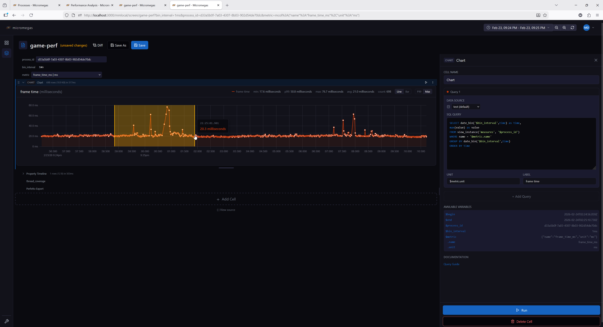
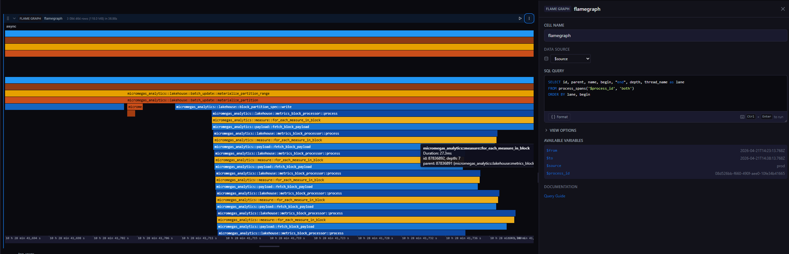
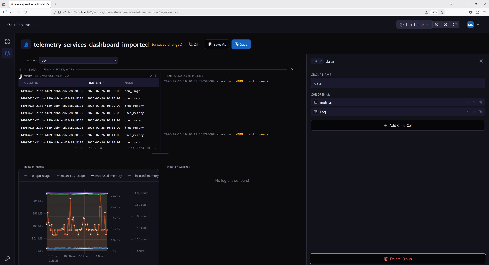
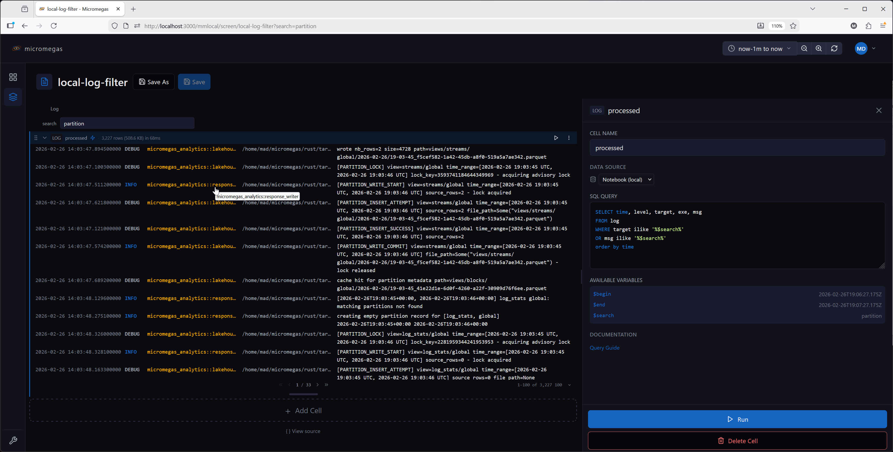
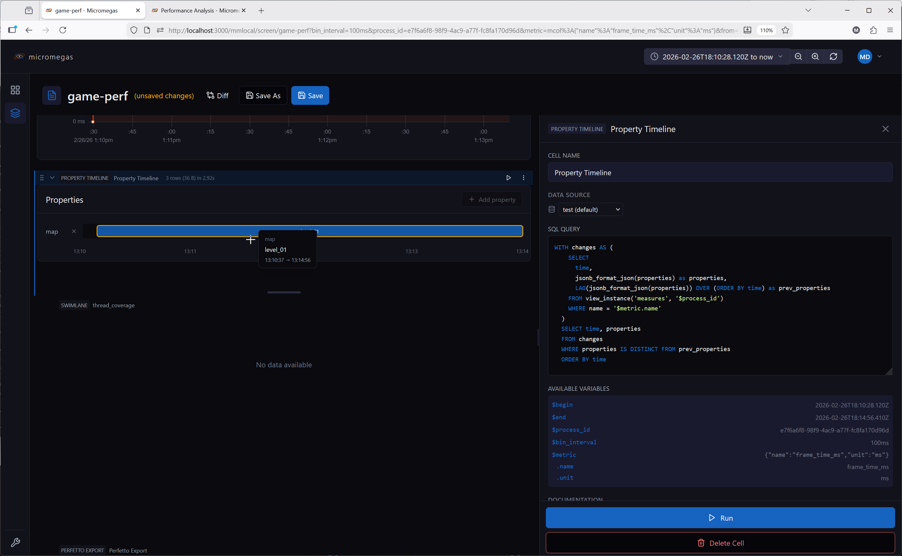
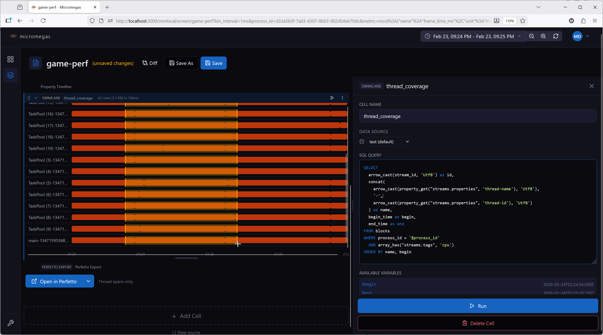
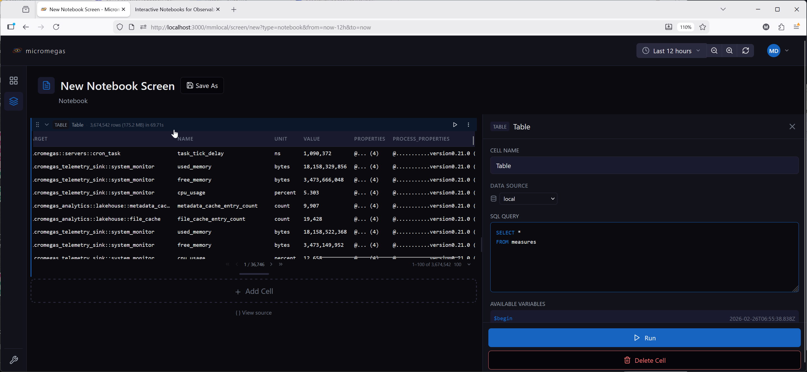
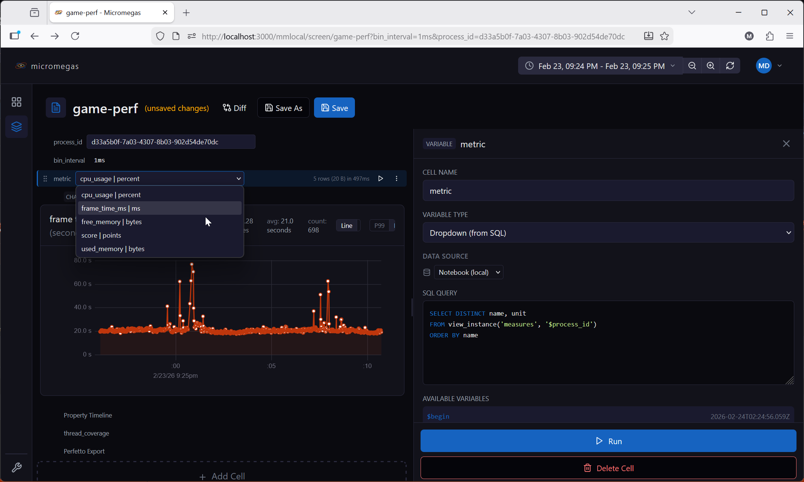

# Cell Types Reference

Notebooks support 13 cell types. Each cell has a `name` (unique within the notebook), a `type`, and a `layout` controlling its display height and collapsed state.

Data cells (table, chart, log, etc.) execute SQL queries and register their results in the [local WASM query engine](execution.md#local-wasm-query-engine), making them available for downstream cells to query.

---

## { .cell-icon } Chart

Multi-query time-series charts supporting line and bar chart types.

**Configuration:**

| Field | Type | Description |
|-------|------|-------------|
| `queries` | array | One or more query definitions |
| `options.scale_mode` | `'p99'` \| `'max'` | Y-axis scaling mode (default `'p99'`) |
| `options.chart_type` | `'line'` \| `'bar'` | Chart type (default `'line'`) |
| `options.reference_lines` | array | Horizontal threshold lines drawn over the chart |

**Query definition:**

| Field | Type | Description |
|-------|------|-------------|
| `sql` | string | SQL query returning X + Y columns (plus optional `color`) |
| `name` | string | Query name (used for WASM table registration) |
| `unit` | string | Y-axis unit label |
| `label` | string | Series label override |
| `color` | string | Series color `#rrggbb` (default: rotating palette) |
| `dataSource` | string | Per-query data source |

**SQL columns:**

| Column | Required | Description |
|--------|----------|-------------|
| X (1st non-color) | Yes | Timestamp, numeric, or string for categorical |
| Y (2nd non-color) | Yes | Numeric value |
| `color` | No | Per-row mark color — packed RGBA u32 (e.g. from `rgba()` or `color_scale()`), `'#rrggbb'`/`'#rrggbbaa'` string, or 4-byte binary |

The `color` column is identified by name (case-insensitive) and may appear in any position. When present, bars use per-row fill colors and lines use an interpolated gradient stroke. The query's `color` field above then acts as the legend token only — set it to a neutral color (e.g. gray) when the marks are SQL-colored.

**Reference line fields:**

| Field | Type | Description |
|-------|------|-------------|
| `value` | number \| string | Threshold value (or `$macro`) |
| `name` | string | Label prefix shown before the formatted value |
| `unit` | string | Unit of the value — selects the scale (default: primary series unit) |
| `color` | string | CSS color (default crimson `#c62828`) |
| `style` | `'dashed'` \| `'solid'` | Line style (default `'dashed'`) |

**Scale modes:**

- **p99** (default) — scales Y-axis to the 99th percentile, handling outliers gracefully
- **max** — scales Y-axis from 0 to the maximum value

**Features:**

- Multiple queries per chart, each with its own data source and unit
- User-chosen series color (editable color picker in the editor; default palette)
- SQL-driven per-row mark colors via `color` column (`rgba()`, `lerp_color()`, `color_scale()`)
- Horizontal reference lines at configurable thresholds
- Drag-to-zoom: drag horizontally on the chart to select a time range and zoom in
- Chart type and scale mode toggleable via controls
- Each query's results are registered in the WASM engine as `cellName.queryName` — or just `cellName` if the query has no `name`

**Example — threshold-colored bars with a budget line:**

```sql
SELECT
  time,
  frame_time_us AS value,
  CASE WHEN frame_time_us > $budget_us
    THEN rgba(0.8, 0.1, 0.1, 1.0)
    ELSE rgba(0.2, 0.7, 0.2, 1.0)
  END AS color
FROM frame_metrics
ORDER BY time
```

With `options.reference_lines`:

```json
[{ "name": "frame budget", "value": "$budget_us", "unit": "us", "color": "#c62828" }]
```

See [color UDFs](../../query-guide/functions-reference.md) for `rgba()`, `lerp_color()`, and `color_scale()`.

{ .screenshot }

---

## { .cell-icon } Flame Graph

Interactive span visualization rendered with WebGL. Spans are grouped into lanes (one per thread or async scope) and stacked by call depth, with drag-to-zoom and WASD navigation.

**Configuration:**

| Field | Type | Description |
|-------|------|-------------|
| `sql` | string | SQL query returning span data |
| `dataSource` | string | Data source override |

**Options:**

| Field | Type | Description |
|-------|------|-------------|
| `initialFrom` | string | Initial zoomed-in start time (accepts `$variable`, relative like `now-1h`, or absolute) |
| `initialTo` | string | Initial zoomed-in end time |

**Required columns:**

| Column | Type | Description |
|--------|------|-------------|
| `id` | bigint | Unique span identifier |
| `parent` | bigint | Parent span id (0 or null for roots) |
| `name` | string | Span name (used for label and color hash) |
| `begin` | timestamp | Span start time |
| `end` | timestamp | Span end time |
| `depth` | int | Call depth within the lane (UInt32 in `process_spans`) |

**Optional columns:**

| Column | Type | Description |
|--------|------|-------------|
| `lane` | string | Lane name — one lane per distinct value (e.g., thread name, `async`). If omitted, all spans render in a single lane named `default`. The lane literally named `async` gets greedy-packed layout (see Features). |

**Features:**

- WebGL-rendered spans with Canvas2D label and time-axis overlay — handles millions of rows
- Color-coded by span name using a brand-derived rust/blue/gold palette
- Mouse wheel scrolls vertically across lanes (no zoom modifier — keeps the surrounding page reachable)
- Hover tooltip shows span name, duration, id, depth, and parent name (plus any of `target`, `filename`, `line`, `kind`, `bit_size`, etc. when those columns are present in the result)
- The lane literally named `async` is laid out by greedy packing to avoid overlap; all other lanes use the raw `depth` column
- Auto-detects the x-axis mode from the `begin`/`end` column types: timestamp columns drive time mode; numeric columns drive "bits" mode (used for memory snapshots). In bits mode, `initialFrom` / `initialTo` are ignored.
- Results registered in the [local WASM query engine](execution.md#local-wasm-query-engine) under the cell name for downstream queries

**Interactions:**

| Input | Action |
|-------|--------|
| Horizontal drag | Zoom into the dragged time range (local zoom) |
| `Alt` + horizontal drag | In time mode, broadcasts the dragged range to downstream cells via the cell's selection |
| Double-click | Reset zoom to the full data extent |
| Mouse wheel | Scroll vertically across lanes |
| `W` / `S` | Zoom in / out, anchored at the cursor |
| `A` / `D` | Pan left / right |

Keyboard input requires the flame graph to have keyboard focus (click it first).

**Example SQL:**

```sql
SELECT id, parent, name, begin, "end", depth, thread_name AS lane
FROM process_spans('$process_id', 'both')
ORDER BY lane, begin
```

The `process_spans(process_id, types)` table function returns thread spans, async spans, or `'both'`.

{ .screenshot }

---

## { .cell-icon } Horizontal Group (HG)

A container cell that arranges its children side by side in a horizontal layout.

**Configuration:**

| Field | Type | Description |
|-------|------|-------------|
| `children` | array | Child cell configurations (any type except HG) |

**Features:**

- Children render side by side with equal width via flex layout
- Reorder via a drag handle (appears on hover over a child)
- Drag a child vertically more than ~30px outside the group bounds to extract it back to the main cell list
- Add new children via the group editor; remove a child via the "Remove from group" context-menu entry
- Each child has independent execution, state, and data source settings
- Aggregate stats (row count, byte size) displayed in the group header

**Constraints:**

- HG cells cannot be nested — no HG inside another HG
- During execution, children are flattened into the main sequence and execute left to right
- Variables defined in child cells are visible to cells below the group

**Example use case:**

Place two related charts side by side — one showing CPU usage and another showing memory usage — for a compact comparison view.

{ .screenshot }

---

## { .cell-icon } Log

SQL query results formatted as log entries with level-based coloring.

**Configuration:**

| Field | Type | Description |
|-------|------|-------------|
| `sql` | string | SQL query returning log data |
| `dataSource` | string | Data source override |

**Options:**

| Field | Type | Description |
|-------|------|-------------|
| `pageSize` | number | Entries per page (default: 100; selectable from 50 / 100 / 250 / 500 / 1000) |

**Expected columns:**

The renderer auto-classifies columns by name:

- `time` — event timestamp
- `level` — log level (`FATAL`, `ERROR`, `WARN`, `INFO`, `DEBUG`, `TRACE`)
- `target` — logger target/module
- `msg` — log message

Additional columns render as fixed-width monospace and truncate at 200px — hover to see the full value in a tooltip.

- Results registered in the [local WASM query engine](execution.md#local-wasm-query-engine) under the cell name for downstream queries

**Level coloring:**

| Level | Color |
|-------|-------|
| FATAL | Bright red |
| ERROR | Red |
| WARN | Yellow |
| INFO | Blue (link color) |
| DEBUG | Secondary text |
| TRACE | Muted |

**Example SQL:**

```sql
SELECT time, level, target, msg
FROM log_entries
ORDER BY time DESC
LIMIT 500
```

{ .screenshot }

---

## { .cell-icon } Map

3D map visualization that plots spatial events on a GLB model. Events are rendered as instanced sphere markers at their native `(x, y, z)` coordinates.

**Configuration:**

| Field | Type | Description |
|-------|------|-------------|
| `sql` | string | SQL query returning spatial data |
| `dataSource` | string | Data source override |

**Required columns:**

| Column | Type | Description |
|--------|------|-------------|
| `x` | number | X coordinate |
| `y` | number | Y coordinate |
| `z` | number | Z coordinate |

Any additional columns the query returns are addressable as `$column` in the detail template (see below).

**Options:**

| Field | Type | Default | Description |
|-------|------|---------|-------------|
| `mapUrl` | string | none | Bare GLB filename from the catalog (e.g. `Arena_North.glb`) — despite the name, not a URL; the renderer composes the blob URL at load time. |
| `shape` | `'sphere'` \| `'box'` | `'sphere'` | Marker primitive |
| `cameraKind` | `'perspective'` \| `'orthographic'` | `'perspective'` | Camera projection. Orthographic removes perspective foreshortening — better for flat heatmap-style data. Controls are identical in both modes. |
| `mapping` | object | per-shape defaults | Per-channel column-or-scalar bindings (see below) |
| `detailTemplate` | string | see below | Markdown template rendered in the event detail panel when a marker is clicked |

**Channel mapping:**

Marker appearance is driven by a `mapping` object whose channels depend on the selected shape:

| Channel | Shapes | Default scalar | Description |
|---------|--------|----------------|-------------|
| `x`, `y`, `z` | both | `'x'`, `'y'`, `'z'` | Position. Each entry is `{ column: name }` to read per-row values, or `{ scalar: name }` to remap to a differently-named column. Must resolve to numeric columns. |
| `size` | sphere | `10` | Uniform radius. |
| `scaleX`, `scaleY`, `scaleZ` | box | `100` each | Per-axis extents. |
| `color` | both | `0xbf360cff` (Rust orange) | Marker color. Scalar is an RGBA u32 (also accepts `#rrggbb` / `#rrggbbaa` strings in the editor). Column bindings accept three column kinds — see below. |

Each non-position channel is `{ scalar: value }` (applies to every row) or `{ column: name }` (reads from that column). String scalars may contain notebook macros (`$mySize`, `$cell.selected.radius`) — they are re-resolved at render time, so editor scrubbing stays cheap without rebuilding the per-instance buffers.

**Color column encodings:**

When `color` is column-bound, the renderer accepts three column types. **UInt32 is the idiomatic form** — the built-in color UDFs all return UInt32 in `0xRRGGBBAA` byte order:

| UDF | Signature | Description |
|-----|-----------|-------------|
| `rgba(r, g, b, a)` | `(f64, f64, f64, f64) → UInt32` | Pack four `[0.0, 1.0]` channels (out-of-range values clamp at the byte boundary). |
| `lerp_color(c1, c2, t)` | `(UInt32, UInt32, f64) → UInt32` | Linear interpolation between two packed colors in straight-alpha sRGB. |
| `color_scale(name, t, alpha)` | `(string, f64, f64) → UInt32` | Perceptually-uniform colormap sample (`'viridis'`, `'magma'`, etc). |

The full set of accepted column types:

| Column type | Encoding |
|-------------|----------|
| UInt32 (or any integer) | Packed RGBA in `0xRRGGBBAA` order — the form emitted by `rgba()`, `lerp_color()`, and `color_scale()`. |
| String | Hex literal — `'#rrggbb'` (alpha = `0xff`) or `'#rrggbbaa'`. |
| Binary (4 bytes) | `R, G, B, A` byte order — DataFusion produces this for raw `0xrrggbbaa` hex literals in SQL. |

Non-finite numeric values (NaN, null) in any column-bound numeric channel fail the build with a row-level error — filter them in SQL.

**Detail template:**

When a marker is selected, the cell renders a Markdown template with macro
substitution. The same template is also shown as a transient tooltip that
follows the cursor while you hover a marker (clicking still opens the docked
panel). The hover tooltip is on by default; uncheck **Show as a tooltip when
hovering a marker** to disable it, and leaving the template empty disables it
too. The selected row's columns are exposed as `$column`, and the standard
notebook macros work too:

- `$column` — column from the selected row (wins name collisions against variables)
- `$from`, `$to` — current time range
- `$variable`, `$variable.column` — notebook variables and their columns
- `$cell[N].column`, `$cell.selected.column` — cross-cell references

Each `$column` carries its Arrow type, so timestamp columns render as RFC3339
and numeric columns can be wrapped with `format_value` for adaptive units —
e.g. `format_value($bytes_sent, 'bytes')` renders `3.4 GB`. The raw,
full-precision value reaches `format_value` (no intermediate stringification),
matching the table cell's override-template capability.

The default template is:

```markdown
### Event Details

---

**Location:** ($x, $y, $z)
```

Authors extend it to surface query-specific columns. For example, to link to
the process page using a `process_id` column:

```markdown
### Event

**Location:** ($x, $y, $z)

[View process logs](/process?process_id=$process_id)
```

Internal links (starting with `/`) route through the app's base-path-aware
router; external links open in a new tab. Raw HTML in the template is
rendered as text (not parsed), matching the Markdown cell's behavior.

**Coordinate frame:**

Events are placed at their raw `x`, `y`, `z` values without any runtime transform. The renderer assumes **Z-up**; handedness and units must match between the GLB and the event data (no specific units are required). See [Admin → Maps](../../admin/web-app.md#maps) for the full GLB authoring contract and catalog configuration.

**Features:**

- Instanced rendering — handles hundreds of thousands of markers efficiently
- Interactive markers — click to select, hover to highlight and preview the detail template as a cursor tooltip
- Event detail panel rendered from a Markdown template with macro substitution
- Results registered in the [local WASM query engine](execution.md#local-wasm-query-engine) under the cell name for downstream queries

**Camera controls:**

The same controls apply in both perspective and orthographic camera modes.

| Input | Action |
|-------|--------|
| Left-drag | Pan (top-down XY translation) |
| Right-drag | Orbit around the look-at point. Pitch is clamped to keep the camera above the horizon. |
| Ctrl/Cmd + wheel | Zoom, anchored to the point under the cursor. Plain wheel scrolls the surrounding page. |
| `W` / `S` | Pan forward / back (top-down — does not change elevation) |
| `A` / `D` | Strafe left / right |
| `Q` / `E` | Zoom in / out |
| `Z` | Reset view to the initial framing |

Keyboard controls (WASD/QE/Z) require the pointer to be over the map — keeps multiple Map cells on the same page from moving together and ignores keystrokes typed into form inputs.

**Example SQL (spatial events from a JSONB-encoded payload):**

```sql
SELECT
  time,
  process_id,
  jsonb_as_f64(jsonb_path_query_first(msg_jsonb, '$.position[0]')) as x,
  jsonb_as_f64(jsonb_path_query_first(msg_jsonb, '$.position[1]')) as y,
  jsonb_as_f64(jsonb_path_query_first(msg_jsonb, '$.position[2]')) as z,
  jsonb_as_string(jsonb_path_query_first(msg_jsonb, '$.actor_id')) as actor_id,
  jsonb_as_string(jsonb_path_query_first(msg_jsonb, '$.event_type')) as event_type
FROM events
WHERE name = 'spatial_event'
LIMIT 10000
```

---

## { .cell-icon } Markdown

Static text and documentation using GitHub Flavored Markdown.

**Configuration:**

| Field | Type | Description |
|-------|------|-------------|
| `content` | string | Markdown text to render |

**Features:**

- Full GitHub Flavored Markdown: headings, tables, lists, code blocks, strikethrough
- Supports [variable substitution](variables.md#sql-macro-substitution): `$variable`, `$variable.column`, `$from`, `$to`
- Validates macro references during editing — warns about undefined variables
- Does not execute queries or block downstream cells
- Rendered output appears only after the cell's turn in sequential execution — the body stays blank until upstream variables and cell results are resolved, so macros never display stale or broken values on first paint

**Example content:**

```markdown
# Dashboard for $process_id

Showing data from **$from** to **$to**.
```

---

## { .cell-icon } Perfetto Export

Exports trace data to [Perfetto UI](https://ui.perfetto.dev) for visualization, or downloads it as a file.

**Configuration:**

| Field | Type | Description |
|-------|------|-------------|
| `processIdVar` | string | Variable name containing the process ID (default: `$process_id`) |
| `spanType` | `'thread'` \| `'async'` \| `'both'` | Which span types to include (default: `both`) |
| `dataSource` | string | Data source override |

**Features:**

- Split button: **Open in Perfetto** (primary) or **Download** (secondary)
- Download saves a Perfetto protobuf trace as `trace-{processId}.pb`
- Shows a warning if the referenced variable is empty or undefined
- Caches the generated trace buffer — cleared when process ID, span type, time range, or data source changes
- Progress indicator during trace generation (shows running MB received as chunks stream in)
- No automatic execution — triggered by user button click

---

## { .cell-icon } Property Timeline

Visualizes how JSON properties change over time as horizontal timeline segments.

**Configuration:**

| Field | Type | Description |
|-------|------|-------------|
| `sql` | string | SQL query returning `time` and `properties` (JSON) columns |
| `dataSource` | string | Data source override |

**Options:**

| Field | Type | Description |
|-------|------|-------------|
| `selectedKeys` | string[] | Property keys to display as timeline tracks |

**Features:**

- Parses JSON properties from each row and detects value changes
- Each selected property key displays as a horizontal timeline track
- Interactive key selection — add or remove property keys from the display
- Time range zoom via drag selection
- Fills time gaps with "no value" state
- Results registered in the [local WASM query engine](execution.md#local-wasm-query-engine) under the cell name for downstream queries

**Expected columns:**

- `time` — timestamp
- `properties` — JSON object string (e.g., `{"cpu": 45, "state": "running"}`)

{ .screenshot }

---

## { .cell-icon } Reference Table

Embeds inline CSV data that is registered as a queryable table in the [local WASM query engine](execution.md#local-wasm-query-engine). Downstream cells can query it by the cell's name.

**Configuration:**

| Field | Type | Description |
|-------|------|-------------|
| `csv` | string | CSV data with headers in the first row |

**Options:**

The editor only exposes the CSV body. The renderer honors `sortColumn`, `sortDirection`, `pageSize`, and `hiddenColumns` in the raw config if present, but there is no UI to set them.

**Features:**

- CSV parsed with [d3-dsv](https://d3js.org/d3-dsv) (RFC 4180 quoting/escaping)
- Type inference is per-column: a column becomes `Float64` if every non-empty cell parses as a finite number; otherwise `Utf8` (string). Empty cells become `NaN` (numeric) or `''` (string)
- Empty or header-only input is rejected with an error
- Registered in the WASM engine under the cell name — queryable by downstream cells
- Displays as a sortable, paginated table (same UI as the Table cell). Row selection is not supported.
- Useful for lookup tables, configuration data, or reference values

**Example:**

A cell named `thresholds` with this CSV:

```csv
metric,warn_threshold,error_threshold
cpu_usage,80,95
memory_usage,70,90
disk_usage,85,95
```

Can be queried by a downstream table cell:

```sql
SELECT m.name, m.value, t.warn_threshold, t.error_threshold
FROM raw_metrics m
JOIN thresholds t ON m.name = t.metric
WHERE m.value > t.warn_threshold
```

---

## { .cell-icon } Swimlane

Horizontal lane visualization for thread or async activity over time. Each lane shows one or more time segments as horizontal bars.

**Configuration:**

| Field | Type | Description |
|-------|------|-------------|
| `sql` | string | SQL query returning lane data |
| `dataSource` | string | Data source override |

**Required columns:**

| Column | Type | Description |
|--------|------|-------------|
| `id` | string | Unique lane identifier |
| `name` | string | Lane display name |
| `begin` | timestamp | Segment start time |
| `end` | timestamp | Segment end time |

Multiple rows with the same `id` create multiple segments in one lane. Lanes are ordered by first occurrence in the query results.

**Features:**

- Fixed label column on the left with lane names
- Horizontal time bars in the center
- Horizontal drag selects a time range; broadcasts the selection to downstream cells (`$cellname.selected.begin`, `$cellname.selected.end`)
- Time axis with formatted tick marks
- Results registered in the [local WASM query engine](execution.md#local-wasm-query-engine) under the cell name for downstream queries

**Example SQL:**

```sql
SELECT
  arrow_cast(stream_id, 'Utf8') as id,
  concat(
    arrow_cast(property_get("streams.properties", 'thread-name'), 'Utf8'),
    '-',
    arrow_cast(property_get("streams.properties", 'thread-id'), 'Utf8')
  ) as name,
  begin_time as begin,
  end_time as end
FROM blocks
WHERE process_id = '$process_id'
  AND array_has("streams.tags", 'cpu')
ORDER BY name, begin
```

{ .screenshot }

---

## { .cell-icon } Table

SQL query results displayed in a sortable, paginated table.

**Configuration:**

| Field | Type | Description |
|-------|------|-------------|
| `sql` | string | SQL query with macro substitution |
| `dataSource` | string | Data source override |

**Options:**

| Field | Type | Description |
|-------|------|-------------|
| `sortColumn` | string | Currently sorted column |
| `sortDirection` | `'asc'` \| `'desc'` | Sort direction |
| `pageSize` | number | Rows per page (default: 100; selectable from 50 / 100 / 250 / 500 / 1000) |
| `hiddenColumns` | string[] | Columns to hide |
| `overrides` | array | Column format overrides — each entry `{ column, format }` |
| `selectionMode` | `'none'` \| `'single'` | Whether clicking a row publishes a selection to downstream cells (default `'none'`) |

**Features:**

- Sticky header with click-to-sort columns
- Column hiding via context menu, with a restoration bar to unhide
- Client-side pagination with configurable page size
- Sort column available as `$order_by` macro in SQL for server-side sorting
- Column format overrides with markdown and row macros (`$row.columnName`)
- With `selectionMode: 'single'`, the selected row is exposed to downstream cells as `$cellname.selected.column`
- Results registered in the [local WASM query engine](execution.md#local-wasm-query-engine) under the cell name for downstream queries

**Column format overrides:**

Override how a column renders by providing a markdown format string with row macros:

```markdown
[$row.exe](/process/$row.process_id?from=$begin&to=$end)
```

This renders the `exe` column as a link to the process page.

**Example SQL:**

```sql
SELECT process_id, exe, start_time, username, computer
FROM processes
ORDER BY $order_by
LIMIT 100
```

{ .screenshot }

---

## { .cell-icon } Transposed Table

SQL results with rows and columns swapped. The original column names become the first column, and each result row becomes a subsequent column. Useful for displaying metadata or key-value properties.

**Configuration:**

Same as Table — `sql`, `dataSource`. The transposed view has no pagination (all rows scroll inside the cell).

**Options:**

| Field | Type | Description |
|-------|------|-------------|
| `hiddenRows` | string[] | Hidden row names (original column names) |
| `overrides` | array | Row rendering overrides — each entry `{ column, format }`, where `column` is the original column name (now a row label) |

**Features:**

- Row hiding via right-click context menu, with a restoration bar to unhide
- Row format overrides with markdown and row macros (same syntax as table column overrides)
- Results registered in the [local WASM query engine](execution.md#local-wasm-query-engine) under the cell name for downstream queries

**Example:**

A query returning `process_id, exe, username, computer` for a single row displays as:

| Field | Value |
|-------|-------|
| process_id | abc-123 |
| exe | my-service |
| username | admin |
| computer | prod-01 |

---

## { .cell-icon } Variable

User-configurable inputs that populate `$variable` references in downstream cells. Variable cells render in the cell title bar rather than taking up vertical space.

There are four variable subtypes, controlled by the `variableType` field.

**Common configuration:**

| Field | Type | Description |
|-------|------|-------------|
| `name` | string | Variable identifier — referenced downstream as `$name` (or `$name.column` for multi-column combobox values) |
| `variableType` | `'text'` \| `'combobox'` \| `'expression'` \| `'datasource'` | Variable subtype |
| `defaultValue` | string or object | Default value used when no URL override is present |
| `dataSource` | string | Data source for SQL queries (combobox only) |

Variable cells block downstream cells until their value is resolved. See [Variables](variables.md) for full documentation of the variable system including scope, expressions, and URL sync.

### Text

Free-form text input. The user types a value directly. No SQL execution.

```
variableType: 'text'
defaultValue: 'cpu_usage'
```

### Combobox

Dropdown populated by a SQL query. Single-column queries produce simple string options. Multi-column queries produce options with named fields accessible via `$variable.column` syntax.

| Field | Type | Description |
|-------|------|-------------|
| `sql` | string | SQL query returning option values |
| `dataSource` | string | Data source for the query |

```sql
-- Single column: options are strings
SELECT DISTINCT name FROM measures

-- Multi-column: options are objects with .name and .unit fields
SELECT DISTINCT name, unit FROM measures
```

After execution, the current value is validated against available options. If invalid, the default value or first option is auto-selected.

{ .screenshot }

### Expression

Computed value from a JavaScript expression. Evaluated automatically — not user-editable at runtime.

| Field | Type | Description |
|-------|------|-------------|
| `expression` | string | JavaScript expression to evaluate |

Available bindings: `$from`, `$to`, `$duration_ms`, `$innerWidth`, `$devicePixelRatio`, and upstream variables as `$variableName`.

Allowed operations: arithmetic (`+`, `-`, `*`, `/`, `%`), `Math.*`, `new Date(...)`, and `snap_interval(ms)`. Browser globals (`window`, `document`, `eval`, `fetch`, …) are blocked.

```javascript
// Compute a time bin interval based on viewport width
snap_interval($duration_ms / $innerWidth)
```

See [Expression Evaluation](variables.md#expression-evaluation) for details.

### Datasource

Dropdown populated with available data sources from the API. Use with `$variableName` in a query cell's data source field to route queries to user-selected backends.

```
variableType: 'datasource'
defaultValue: 'production'
```
