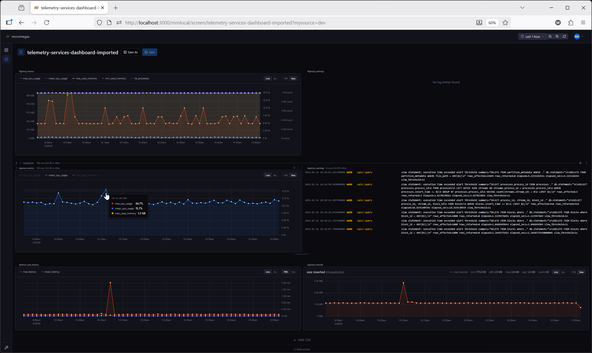
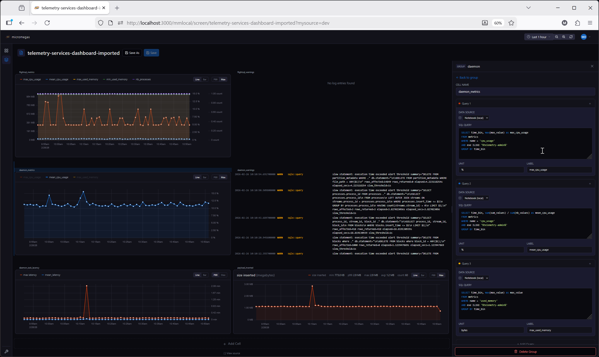

# Notebooks

Notebooks are the primary screen type in the analytics web app. A notebook is an ordered list of **cells** that execute top-to-bottom, combining SQL queries, visualizations, markdown documentation, and user-controlled variables into a single interactive document.

Notebooks can replicate everything the built-in screen types (process list, metrics, log, table) can do, with greater flexibility and composability. Each cell's query results are automatically registered in a local WebAssembly query engine, so downstream cells can query upstream results without additional server round-trips.

{ .screenshot }

## Layout

A notebook has two panels:

- **Cell list** (left) — the ordered sequence of cells. Each cell has a header showing its name, type, status, and execution stats.
- **Editor panel** (right) — configuration for the currently selected cell. Click a cell header to select it and open its editor. A draggable resize handle separates the two panels.

{ .screenshot }

## Creating a Notebook

1. Go to **Screens** in the sidebar.
2. Click **+** and select **Notebook**.
3. The notebook opens with an empty cell list. Use the **Add Cell** button to add your first cell.

## Working with Cells

### Adding Cells

Click the **Add Cell** button below the cell list to add a new cell. Choose from the [11 available cell types](cell-types.md).

### Selecting and Editing

Click a cell's header to select it. The editor panel on the right shows the cell's configuration — SQL query, markdown content, variable settings, or other type-specific options.

### Removing and Duplicating

Use the cell's context menu (right-click or the more button) to duplicate or delete a cell.

### Reordering (Drag and Drop)

Drag a cell by its handle to reorder it vertically within the notebook. The execution order follows the visual order top-to-bottom.

### Collapsing

Click the collapse toggle on a cell header to hide its content area, keeping just the header visible. Useful for focusing on specific cells in long notebooks.

## Horizontal Groups

A **Horizontal Group (HG)** cell arranges its children side by side. This is useful for placing related charts or tables next to each other.

- Drag a cell into an HG to add it as a child.
- Drag a child out (vertically) to extract it back to the main cell list.
- Reorder children by dragging horizontally within the group.
- HG cells cannot be nested — you cannot place an HG inside another HG.

During execution, HG children are flattened into the main sequence and execute in left-to-right order. Variables defined inside an HG are visible to cells below the group.

## Saving

Click **Save** (or use the keyboard shortcut) to persist the notebook configuration to the server. The notebook's name, cell definitions, and default variable values are all saved.

### URL-Based State Sharing

Variable values and time range are encoded in the URL as delta parameters — only values that differ from the saved defaults appear in the URL. This keeps URLs clean while allowing precise state sharing:

```
/screen/my-notebook?from=now-1h&metric=cpu_usage
```

Sharing this URL gives the recipient the same view. After saving, URL parameters that match the new saved defaults are automatically removed.

## Source View

Click **View Source** to switch to a JSON editor showing the raw notebook configuration. This is useful for:

- Bulk editing cell properties
- Copy/pasting cell configurations between notebooks
- Debugging unexpected behavior

## Config Diff

When you have unsaved changes, the **Config Diff** modal shows a side-by-side comparison of the saved configuration versus the current state, making it easy to review changes before saving.

## Further Reading

- [Cell Types](cell-types.md) — reference for all 11 cell types
- [Variables](variables.md) — the variable system, expressions, and URL parameter sync
- [Execution & Auto-Run](execution.md) — execution model, WASM engine, and auto-run behavior
